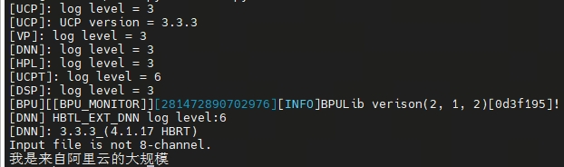
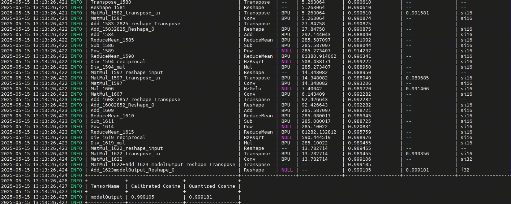

English | [简体中文](./README_cn.md)

# ASR Model Evaluation

This directory records performance and functional validation notes for the ASR (Automatic Speech Recognition) model on RDK S100/S600.

## Performance Data

Use `hrt_model_exec` to test HBM model performance:

```bash
hrt_model_exec perf --model_file asr.hbm --frame_count 100
```

Reference result on RDK S100:

| Metric | Value |
|---|---|
| Frames | 100 |
| Average Latency | 34.426 ms |
| FPS | 29.008 |

Reference screenshot from the original demo:


## Functional Check

Run the Python runtime on the sample audio file `chi_sound.wav`:

```bash
cd runtime/python
bash run.sh
```

The last line of the output is the transcription result for the first 3 seconds of the audio. A correct run should output recognizable Chinese characters.

Reference output screenshot from the original demo:



## Accuracy

Reference cosine similarity after quantization:



## Notes

- The model processes audio in fixed-length chunks (streaming). Longer audio is processed iteratively.
- Results depend on audio quality. The provided `chi_sound.wav` is a clean Chinese voice sample.
