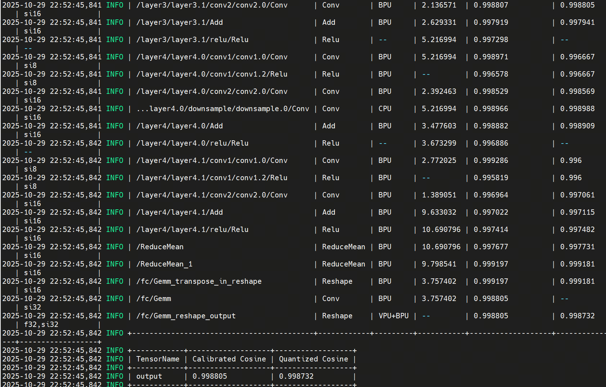

English | [简体中文](./README_cn.md)

# Model Conversion

This directory documents the original R3D-18 conversion notes for the S100 model artifact used by this sample.

## Source Model

The conversion flow exports the PyTorch `r3d_18` video action classification model to ONNX. The model input is a short video clip tensor and the output is a 400-class Kinetics logits tensor.

The original ONNX graph is shown in:


## Toolchain

The original conversion notes used the RDK S algorithm toolchain OpenExplorer 3.5.0.

During conversion, the toolchain supported `Conv3D`, but the original `GlobalAveragePooling` 3D operation was not supported. The model was therefore adjusted by replacing the 3D pooling path with a 2D `ReduceMean` equivalent before compiling the HBM artifact.

Original conversion screenshots are preserved for traceability:




## Quantization Notes

The original record reports that most operator similarity values were greater than 0.99 after conversion, and the final quantization similarity was approximately 0.99.

## Artifact Used by Runtime

The runtime sample uses the prebuilt HBM artifact downloaded by:

```bash
cd ../model
bash download_model.sh s100
```

The downloaded file is:

```text
model/s100/r3d_18.hbm
```

## OE Toolchain

Run model conversion on an x86 Linux host with the RDK S100 OpenExplore environment. Model conversion is not intended to run on the board.

- OE Docker documentation: <https://developer.d-robotics.cc/rdk_doc/rdk_s/Advanced_development/toolchain_development/overview>
- OE toolchain download: <https://toolchain.d-robotics.cc/>

Download the OpenExplore CPU Docker image for RDK S100/S100P from the OE Docker documentation, then load the actual image file:

```bash
sudo docker load -i ai_toolchain_ubuntu_22_s100_xxx.tar
sudo docker images
```

Start the container with the repository mounted and enough shared memory for compilation:

```bash
sudo docker run -it --rm \
  --network host \
  --shm-size=15g \
  -v "$(pwd)":/workspace \
  --workdir /workspace \
  <docker-image-name> /bin/bash
```
