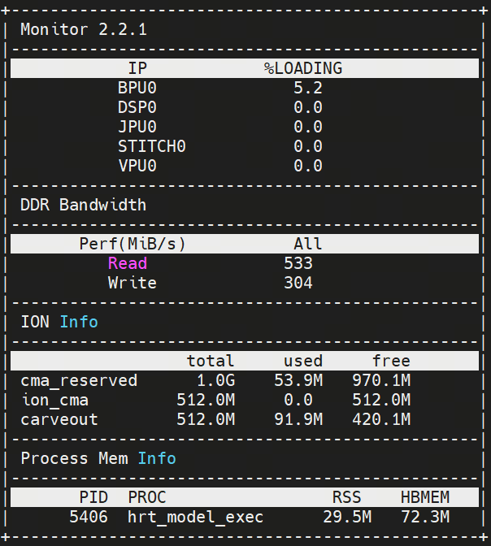

[English](./README.md) | 简体中文

# 模型评估说明

本目录记录原始 3DResNet demo 中保留的评估信息。

## 功能检查

本示例使用一段射箭视频作为测试输入。视频被预处理为 `video0.npy`，runtime sample 会输出 Kinetics-400 Top-5 预测结果。对于当前测试片段，合理的功能结果应包含 `archery` 作为 Top-1 类别。

参考图片如下：

## 性能记录

本示例使用 `hrt_model_exec` 进行性能测试，记录如下：

| 线程数 | 总帧数 | 总耗时 (ms) | 平均耗时 (ms) | FPS |
| ------ | ------ | ----------- | ------------- | --- |
| 1 | 100 | 18267.76 | 182.68 | 5.47 |
| 2 | 100 | 18291.76 | 182.93 | 10.82 |
| 4 | 100 | 18501.06 | 185.03 | 21.07 |
| 8 | 100 | 24743.56 | 249.19 | 30.74 |

原始附加性能指标截图保留如下：

原始记录中 BPU 占用约 5.2%，ION 内存约 91.9 MB，读带宽约 533，写带宽约 304。
