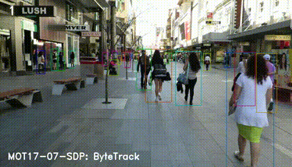

[English](./README.md) | 简体中文

# ByteTrack 模型评估说明

本目录记录 ByteTrack 的评估指标、性能记录、结果检查和调参建议。

## MOT 指标

ByteTrack 通常使用 MOT（Multiple Object Tracking）指标评估，例如：

- `MOTA`：综合衡量漏检、误检和 ID switch；
- `IDF1`：衡量轨迹身份保持能力；
- `FPS`：跟踪系统吞吐。

ByteTrack 论文在 MOT17 测试集上报告了 `MOTA 80.3`、`IDF1 77.3`，并可在 V100 GPU 上达到约 `30 FPS`。

## 跟踪器性能记录

RDK S100 上 ByteTrack 跟踪器平均更新一次耗时约 `2.37 ms`。整体吞吐主要取决于前级 YOLO 检测模型。

## 结果检查

运行 `runtime/python/run.sh` 后会生成 `result.mp4`。结果正确性检查应确认：

- 视频中的行人被稳定框出；
- 每个行人框旁有唯一 ID；
- 输出视频不是空文件，且帧数与输入视频一致或接近；
- 目标被短暂遮挡时轨迹 ID 不应频繁断裂。

示例 MOT 效果参考：

## 参数调优

- `--score-thres`：YOLO 检测置信度阈值，默认 `0.25`。检测框过少时可适当降低。
- `--track-thresh`：ByteTrack 轨迹匹配阈值，默认 `0.3`。过高会过滤较多低分框。
- `--match-thresh`：IoU 匹配严格程度，默认由 tracker 配置控制。
- `--track-buffer`：轨迹丢失缓冲时长，默认由 tracker 配置控制。

若需要多类别跟踪，可以为每个类别维护独立 `BYTETracker`，或扩展 `STrack` 以携带 `class_id` 并在 `BYTETracker.update()` 中处理类别信息。

## License

本目录遵循 [Apache 2.0 License](../../../../LICENSE)。
