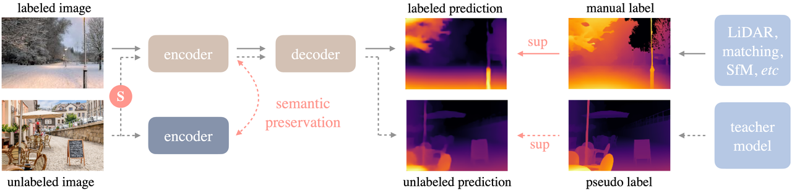

[English](./README.md) | 简体中文

# Depth Anything V2 模型说明

Depth Anything V2 是单目深度估计模型。本 sample 提供 RDK S100/S100P 上的 HBM 模型下载、Python 推理、转换说明和评估记录，示例输入为 `furseal.jpg`，输出为彩色深度图。

## 算法介绍

Depth Anything 是一种实用的单目深度估计方案，目标是在不引入复杂新模块的前提下构建可处理任意图像的基础模型。Depth Anything V2 相比 V1 通过三项关键实践得到更精细且稳健的深度预测：用合成图像替换所有标注真实图像、提升教师模型容量，并使用大规模伪标注真实图像训练学生模型。



- 项目网页：<https://depth-anything.github.io/>
- 论文：<https://arxiv.org/abs/2406.19675>
- 官方仓库：<https://github.com/DepthAnything/Depth-Anything-V2>

## 算法功能

- 单目深度估计
- 密集深度图输出
- 彩色深度图可视化保存

## 算法特点

- 输入为 NCHW RGB 图像张量；
- 输出为单通道深度图；
- 后处理使用双线性插值恢复到原图尺寸，并归一化到 `[0, 255]`。

## 目录结构

```text
depth_anything_v2/
├── conversion/
├── evaluator/
├── model/
├── runtime/
│   └── python/
├── test_data/
│   ├── furseal.jpg
│   └── readme_img/
├── README.md
└── README_cn.md
```

## 快速体验

```bash
cd samples/vision/depth_anything_v2/runtime/python
bash run.sh
```

脚本会下载 `../../model/s100/depth_any.hbm`，读取 `../../test_data/furseal.jpg`，并保存 `result.jpg`。

## 模型转换

ONNX 输入输出、算子说明、int16 量化精度和 OE 工具链入口见 [conversion/README_cn.md](./conversion/README_cn.md)。

## 模型推理

Python 运行参数和直接 `python3 main.py` 示例见 [runtime/python/README_cn.md](./runtime/python/README_cn.md)。

## 模型评估

性能数据、深度图参考结果和板端监控指标见 [evaluator/README_cn.md](./evaluator/README_cn.md)。

## 推理结果

HBM 模型输出的深度图应与输入图像空间结构一致，且可看到明显的前景与背景深度差异。


## License

本 sample 遵循 [Apache 2.0 License](../../../LICENSE)。
