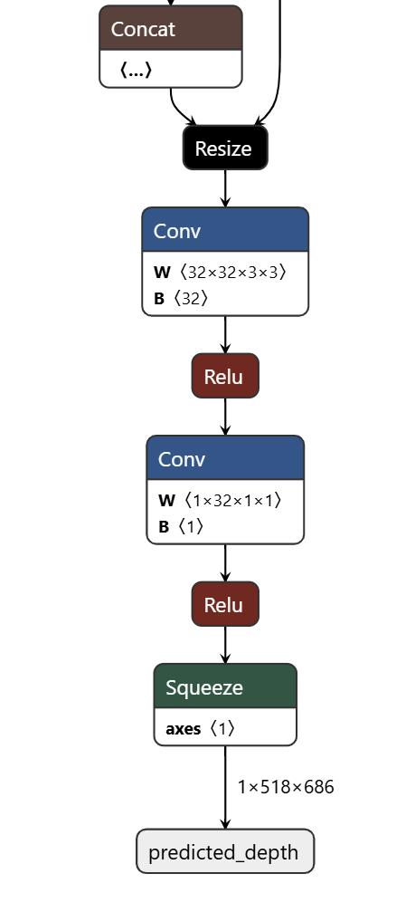
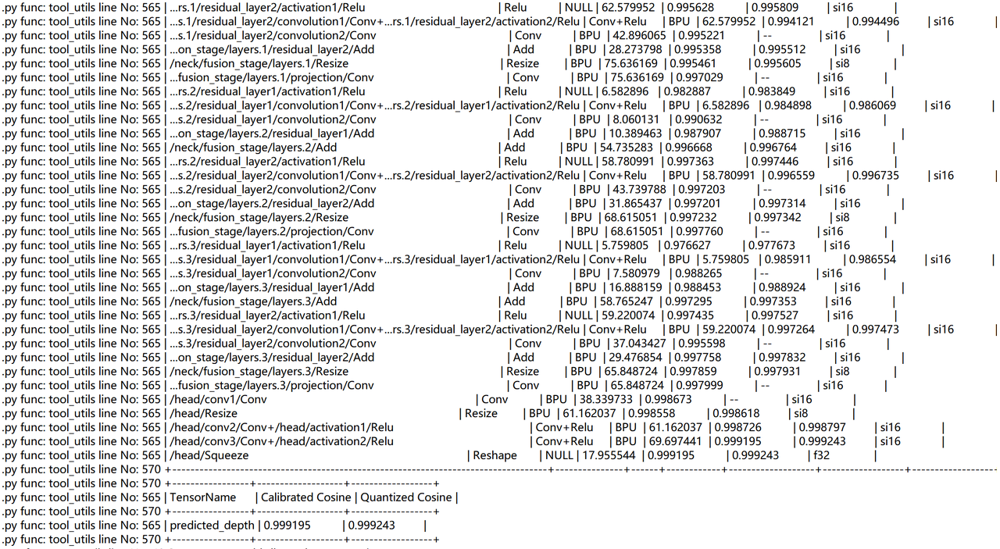

[English](./README.md) | 简体中文

# Depth Anything V2 模型转换说明

本目录记录 Depth Anything V2 单目深度估计模型的 ONNX 结构、量化说明和 OE 工具链入口。

## ONNX 模型

该 ONNX 模型包含一个输入和一个输出：

- 输入：图像张量，shape 为 `1x3x518x686`
- 输出：预测深度图，shape 为 `1x518x686`




模型主要包含 `Add`、`Conv`、`Mul`、`MatMul` 等常规算子。由于网络包含 Transformer 注意力机制，也包含 `Softmax` 等量化敏感算子。

## 量化说明

使用 RDK S100 工具链对 ONNX 模型进行转换，并采用 int16 量化。量化记录显示大部分算子精度大于 0.99，最终量化精度约为 0.999。



## 模型产物

转换完成后得到 `.hbm` 格式异构模型，可在 RDK S100/S100P 上使用 BPU 推理。当前 runtime 使用的模型文件路径为：

```text
samples/vision/depth_anything_v2/model/s100/depth_any.hbm
```

## OE 资源

模型转换请在 x86 Linux 主机的 RDK S100 OpenExplore 环境中完成，不建议在板端执行转换。

- OE 资源入口（docker+OE开发包）：<https://developer.d-robotics.cc/rdk_doc/rdk_s/Advanced_development/toolchain_development/overview>
- OE 工具链在线手册：<https://toolchain.d-robotics.cc/>

## License

本目录遵循 [Apache 2.0 License](../../../../LICENSE)。
