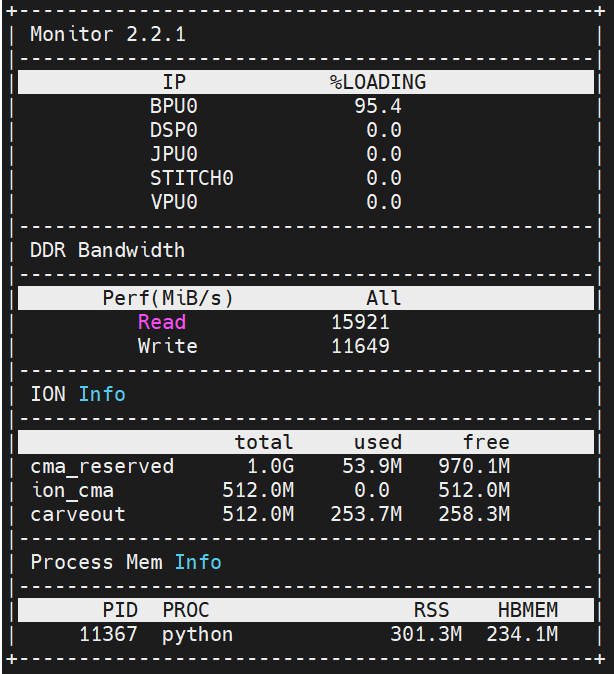

[English](./README.md) | 简体中文

# Depth Anything V2 模型评估说明

本目录记录 Depth Anything V2 的性能数据、深度图结果检查和板端监控指标。

## 性能数据

使用 `hrt_model_exec` 对 HBM 模型进行性能测试：

```bash
hrt_model_exec perf --model_file depth_any.hbm --frame_count 100 --thread_num 1
```

| 线程数 | 总帧数 | 总时延 (ms) | 平均时延 (ms) | FPS |
| --- | --- | --- | --- | --- |
| 1 | 100 | 13738.43 | 137.38 | 7.27 |
| 2 | 100 | 26375.53 | 263.74 | 7.54 |
| 4 | 100 | 52214.07 | 521.90 | 7.54 |
| 8 | 100 | 102309.64 | 1020.35 | 7.54 |

## 结果检查

测试图像：


HBM 模型推理后的深度图参考结果：


结果正确性检查应确认：

- 输出深度图与输入图像空间结构一致；
- 深度图不是全黑、全白或固定单一颜色；
- 保存结果图能看到明显的前景和背景深度差异。

## 板端监控指标

使用以下命令查看板端运行指标：

```bash
hrt_ucp_monitor
```

参考记录：



- BPU 占用率：95.4%
- ION 内存占用：约 300 MB
- 带宽读：约 15920
- 带宽写：约 11650

## License

本目录遵循 [Apache 2.0 License](../../../../LICENSE)。
