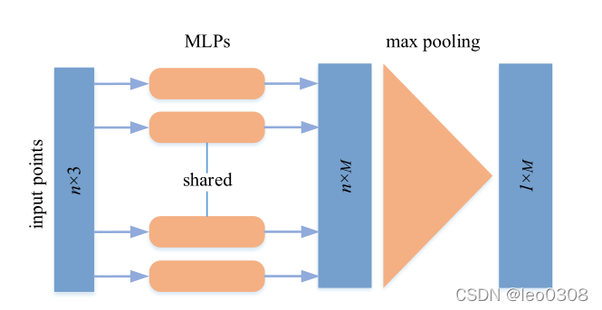
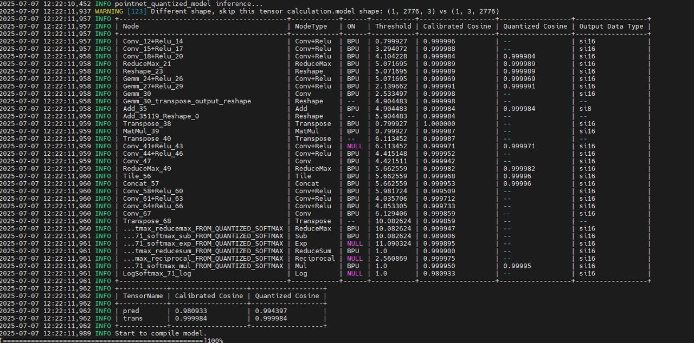

[English](./README.md) | 简体中文

# PointNet 模型转换说明

本目录提供 PointNet 椅子部件分割模型的转换信息、网络结构说明、ONNX 算子说明和量化精度记录。

## 源模型

PointNet 实现参考：

```text
https://gitee.com/chenguanzhong/rdk_-s100_-point-net_-official
```

PointNet 直接处理无序点云坐标。包含 `N` 个点的点云可表示为 `N x 3` 数组，每个点包含三维坐标 `(x, y, z)`；部分点云数据还会包含法向量 `(nx, ny, nz)`。点云的点顺序不影响语义，因此网络需要使用 max、sum 等顺序无关的对称操作。

当前部署的椅子部件分割模型接收归一化点云，并输出 `back`、`seat`、`leg`、`arm` 四类椅子部件的逐点预测结果。

## 网络结构

PointNet 通过共享 MLP 对每个点提取特征，再使用 max 操作聚合全局特征。对于分割任务，网络结合局部点特征和全局特征，输出每个点的部件类别。




## ONNX 说明

PointNet ONNX 图主要包含 `Conv`、`BatchNorm`、`ReLU` 等常规算子，这些算子在 RDK S100 上均有支持。


## 量化说明

本模型使用 int16 量化。量化精度记录中，`trans` 精度大于 0.9999，`pred` 精度大于 0.98。



## Runtime 使用的模型产物

Runtime 示例使用以下路径加载 HBM 模型：

```text
samples/vision/pointnet/model/s100/pointnet.hbm
```

该 HBM 模型文件随 [model](../model/README_cn.md) 目录提供。

## OE 资源

模型转换请在 x86 Linux 主机的 RDK S100 OpenExplore 环境中完成，不建议在板端执行转换。

- OE 资源入口（docker+OE开发包）：<https://developer.d-robotics.cc/rdk_doc/rdk_s/Advanced_development/toolchain_development/overview>
- OE 工具链在线手册：<https://toolchain.d-robotics.cc/>

## License

本目录遵循 [Apache 2.0 License](../../../../LICENSE)。
