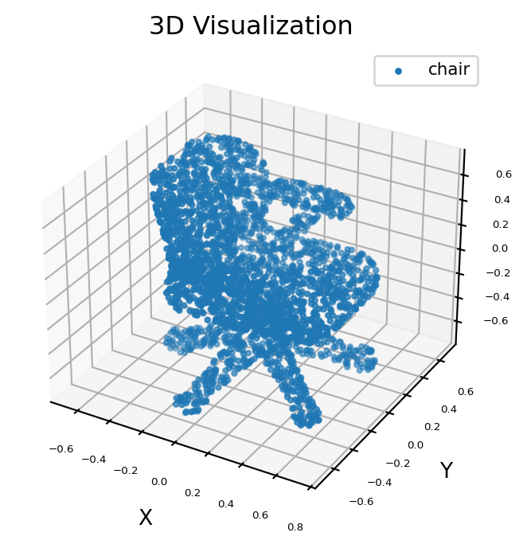

[English](./README.md) | 简体中文

# PointNet 模型评估说明

本目录记录 PointNet 椅子部件分割模型的功能检查方式、性能数据和结果正确性检查要点。

## 功能检查

本示例使用 `chair.pts` 作为测试点云。runtime 会保存：

- `result_orig.png`：归一化输入点云可视化
- `result.png`：预测的椅子部件分割可视化

合理输出应包含 `back`、`seat`、`leg`、`arm` 四类椅子部件；预测不应塌缩为单一类别，保存的分割图应能看到不同椅子区域。

参考图片如下：

## 性能记录

使用 `hrt_model_exec` 进行性能测试，记录如下：

| 线程数 | 总帧数 | 总耗时 | 平均耗时 | FPS |
| ------ | ------ | ------ | -------- | --- |
| 1 | 100 | 143.63 | 1.43 | 689.61 |
| 2 | 100 | 216.20 | 2.16 | 914.32 |
| 4 | 100 | 429.76 | 4.30 | 910.70 |
| 8 | 100 | 839.86 | 8.35 | 910.84 |

## 精度记录

模型量化精度见 [conversion/README_cn.md](../conversion/README_cn.md) 中的 int16 量化说明。`trans` 精度大于 0.9999，`pred` 精度大于 0.98。

## License

本目录遵循 [Apache 2.0 License](../../../../LICENSE)。
