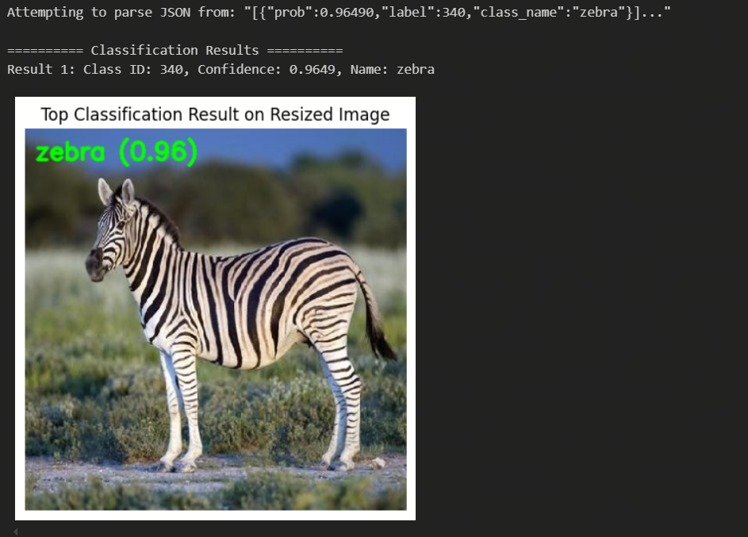

English | [简体中文](./README_cn.md)

# ResNet152 Model Description

ResNet152 is a deep residual convolutional network for image classification. This sample runs a ResNet152 ImageNet classifier with an NV12 HBM model and prints Top-K classification results.


## Algorithm Overview

ResNet uses residual connections to reduce the optimization difficulty of deep networks. ResNet152 is a 152-layer residual network for ImageNet image classification.

- **Paper**: [Deep Residual Learning for Image Recognition](https://arxiv.org/abs/1512.03385)
- **Reference Implementation**: [torchvision ResNet](https://pytorch.org/vision/main/models/resnet.html)

### Algorithm Capabilities

- ImageNet 1000-class image classification
- Top-K class ID and confidence output

### Algorithm Features

- **Residual connections**: use shortcut connections to reduce deep-network optimization difficulty.
- **Deep feature extraction**: the 152-layer design improves representational capacity.
- **NV12 input**: runtime feeds Y and UV planes as two HBM input tensors.

## Directory Structure

```text
resnet152/
|-- conversion/
|   |-- README.md
|   |-- README_cn.md
|   |-- get_calibration_data.py
|   |-- resnet152_config.yaml
|   `-- x86_inference.py
|-- evaluator/
|   |-- README.md
|   `-- README_cn.md
|-- model/
|   |-- README.md
|   |-- README_cn.md
|   `-- download_model.sh
|-- runtime/
|   `-- python/
|       |-- README.md
|       |-- README_cn.md
|       |-- main.py
|       |-- resnet152.py
|       `-- run.sh
|-- test_data/
|   |-- resnet_architecture.png
|   |-- resnet_architecture2.png
|   |-- result.png
|   `-- zebra_cls.jpg
|-- README.md
`-- README_cn.md
```

## Quick Start

Download the model into the sample-local model directory (pass `s100` or `s600` for the target SoC):

```bash
cd model
bash download_model.sh s100   # or: bash download_model.sh s600
```

Run the Python sample:

```bash
cd ../runtime/python
bash run.sh
```

Run the entry script directly:

```bash
python3 main.py \
  --model-path ../../model/s100/resnet152_224x224_nv12.hbm \
  --test-img ../../test_data/zebra_cls.jpg \
  --label-file ../../../../../datasets/imagenet/imagenet_classes.names \
  --top-k 5
```

## Model Conversion

- Prebuilt HBM models are provided through the [model](./model/README.md) directory.
- Conversion notes are available in [conversion/README.md](./conversion/README.md).

## Runtime

This sample currently maintains the Python runtime path. See [runtime/python/README.md](./runtime/python/README.md) for details.

| Model | Input | Runtime input type | Output | Download path |
| --- | --- | --- | --- | --- |
| ResNet152 | 224x224 | NV12 Y/UV planes | ImageNet 1000-class logits | `model/s100/resnet152_224x224_nv12.hbm` (S100) <br/> `model/s600/resnet152_224x224_nv12.hbm` (S600) |

This sample uses the public RDK ResNet152 HBM model downloaded into the sample-local `model/<soc>` directory.

## Model Evaluation

Evaluation notes and result-check methods are available in [evaluator/README.md](./evaluator/README.md).

## Inference Result

The included test image:


Expected Top-5 classification results:

```text
Top-5 Classification Results:
  [0] zebra: ...
```

Visualization of the classification result:



## License

Follow the top-level Model Zoo License.
