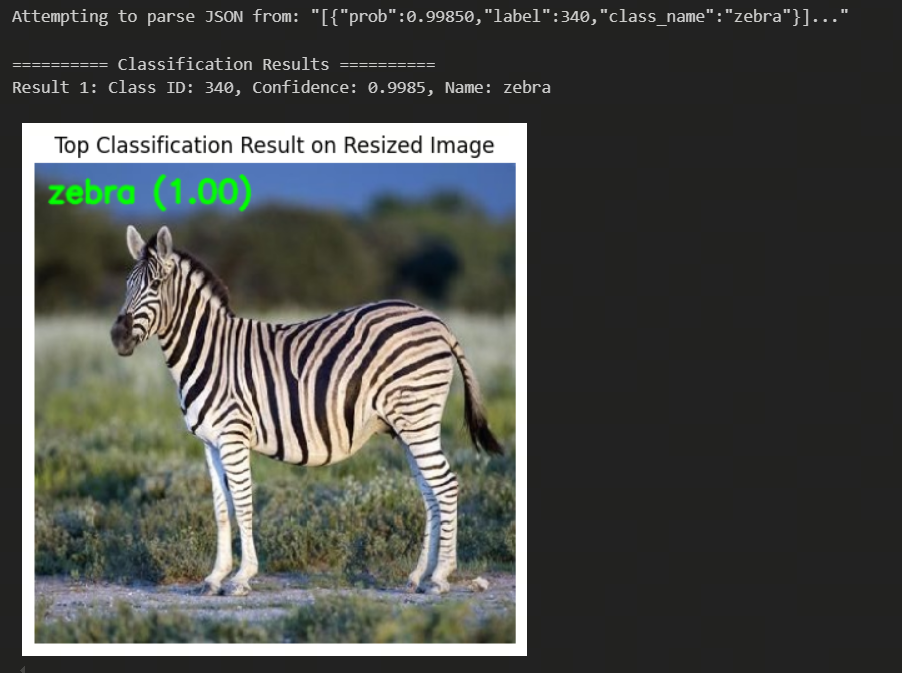

[English](./README.md) | 简体中文

# ResNet18 模型说明

ResNet18 是 RDK Model Zoo 的 ImageNet 分类 sample，已支持 RDK S100 与 RDK S600。
本目录提供 sample 内模型下载、Python 和 C++ runtime、保留的原始文档资产以及验证说明。

## 算法介绍

ResNet 由 Kaiming He、Xiangyu Zhang、Shaoqing Ren 和 Jian Sun 提出。核心思想
是通过 shortcut connection 进行残差学习，降低深层卷积网络的优化难度，并避免
网络加深时出现退化。


资源：

- 论文：[Deep Residual Learning for Image Recognition](https://arxiv.org/abs/1512.03385)
- PyTorch 实现：[torchvision.models.resnet](https://github.com/pytorch/vision/blob/main/torchvision/models/resnet.py)
- TorchVision ResNet18 模型：[torchvision ResNet18](https://pytorch.org/vision/main/models/generated/torchvision.models.resnet18.html)

### 算法功能

- ImageNet 1000 类图像分类
- Top-K 类别 ID 与置信度输出

### 算法特点

- **残差连接**：使用 shortcut connection 降低深层网络优化难度。
- **轻量残差网络**：18 层结构适合快速验证分类流程。
- **NV12 输入**：runtime 使用 Y/UV 双输入适配 HBM 模型。

## 目录结构

```text
.
|-- README.md
|-- README_cn.md
|-- conversion
|   |-- README.md
|   `-- README_cn.md
|-- evaluator
|   |-- README.md
|   `-- README_cn.md
|-- model
|   |-- README.md
|   |-- README_cn.md
|   `-- download_model.sh
|-- runtime
|   |-- cpp
|   |   |-- CMakeLists.txt
|   |   |-- README.md
|   |   |-- README_cn.md
|   |   |-- inc
|   |   |   `-- resnet18.hpp
|   |   |-- run.sh
|   |   `-- src
|   |       |-- main.cpp
|   |       `-- resnet18.cpp
|   `-- python
|       |-- README.md
|       |-- README_cn.md
|       |-- main.py
|       |-- resnet18.py
|       `-- run.sh
`-- test_data
    |-- resnet_architecture.png
    |-- resnet_architecture2.png
    |-- result.png
    `-- zebra_cls.jpg
```

## 快速体验

Python：

```bash
cd runtime/python
bash run.sh
```

C++：

```bash
cd runtime/cpp
bash run.sh
```

Python 直接入口：

```bash
python3 main.py \
  --model-path ../../model/s100/resnet18_224x224_nv12.hbm \
  --test-img ../../test_data/zebra_cls.jpg \
  --label-file ../../../../../datasets/imagenet/imagenet_classes.names \
  --top-k 5
```

## 模型转换

- 预编译 HBM 模型通过 [model](./model/README_cn.md) 目录提供。
- 转换说明请参考 [conversion/README_cn.md](./conversion/README_cn.md)。

## 模型推理

本 sample 当前维护 Python 和 C++ 推理路径，详细说明请参考：

- [runtime/python/README_cn.md](./runtime/python/README_cn.md)
- [runtime/cpp/README_cn.md](./runtime/cpp/README_cn.md)

| 模型 | 输入 | 运行模型 |
| --- | --- | --- |
| ResNet18 | 224x224 NV12 | `model/s100/resnet18_224x224_nv12.hbm`（S100）<br/>`model/s600/resnet18_224x224_nv12.hbm`（S600）|

## 模型评估

评测说明和结果检查方法请参考 [evaluator/README_cn.md](./evaluator/README_cn.md)。

## 推理结果

随附的测试图像：


预期的 Top-5 分类输出：

```text
Top-5 Classification Results:
  [0] zebra: ...
```

分类结果可视化图：



## License

遵循 Model Zoo 顶层 License。
