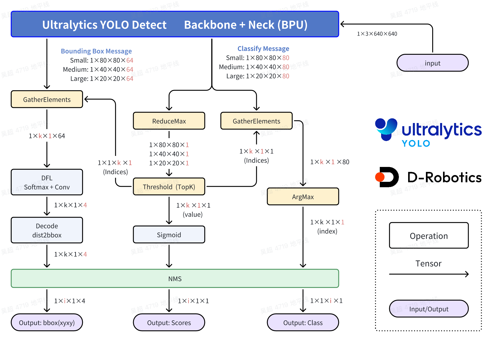
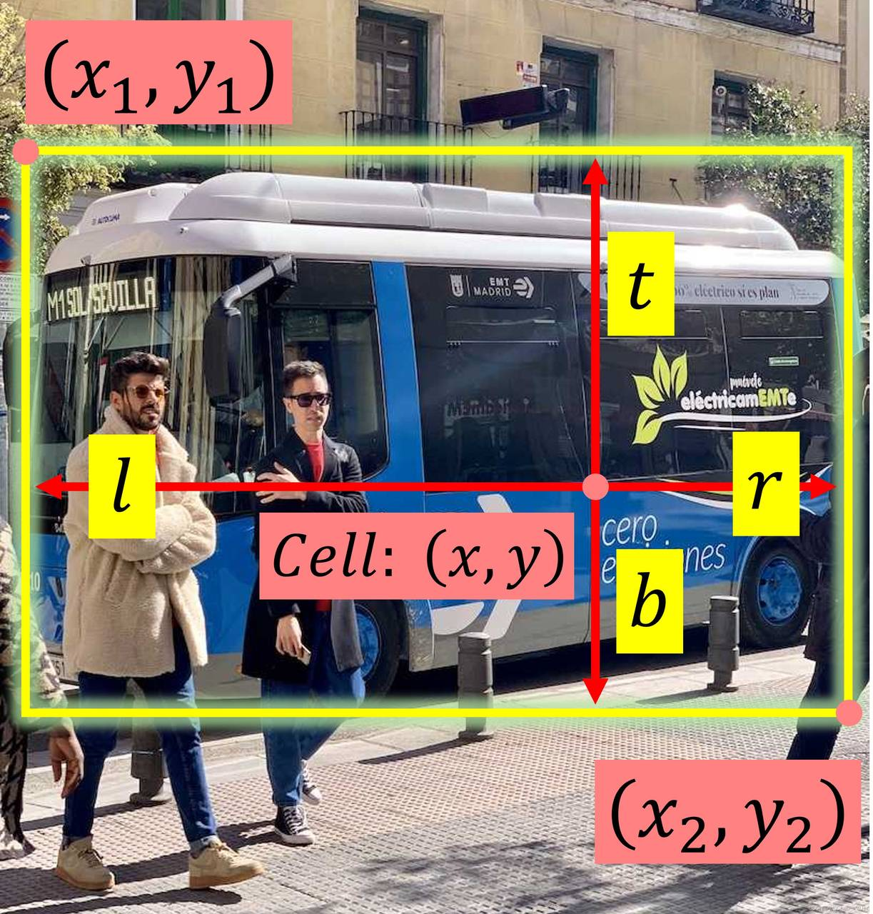
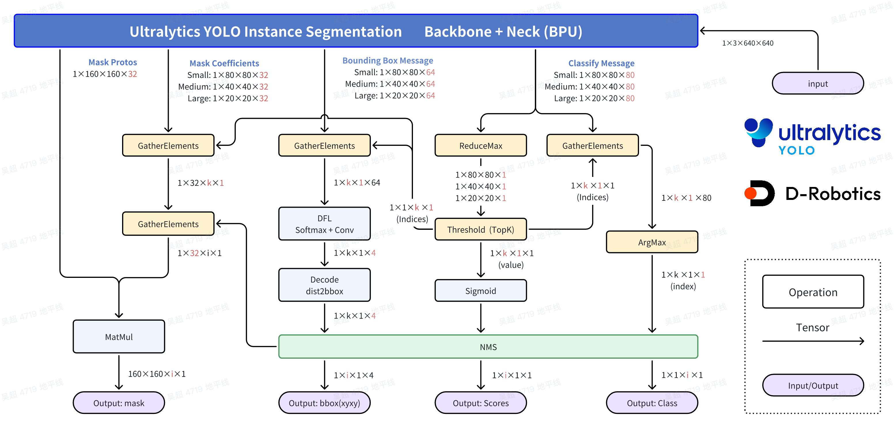
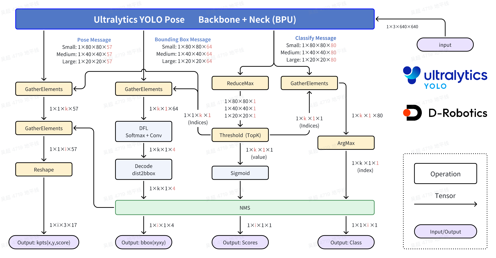

English | [简体中文](./README_cn.md)

# Ultralytics YOLO Model Conversion and Compilation Guide

This directory provides the scripts, resources, and instructions required to export Ultralytics YOLO models, compile quantized models, and check BIN artifacts. The target artifact is an RDK X5 BPU quantized `.bin` model.

## Directory Structure

```text
.
├── export_monkey_patch.py          # Ultralytics YOLO ONNX export script
├── mapper.py                       # Prepare calibration data and invoke the OpenExplorer compiler
├── imgs/                           # Data-flow diagrams used by this guide
├── config.yaml                     # Reference Mapper configuration
├── requirements.txt                # Python dependencies
├── README.md
└── README_cn.md
```

## Model Compilation Environment

Run model compilation on an x86 Linux host. Installing or running the compiler toolchain on an RDK X5 board is not recommended. RDK X5 supports both a lightweight pip-installed toolchain and an OpenExplorer Docker offline image.

### 1. Pip Toolchain Installation

Ubuntu 22.04 with Python 3.10 is recommended. Use Conda or another virtual environment to isolate dependencies.

```bash
conda create -n rdk_env python=3.10 -y
conda activate rdk_env
pip install rdkx5-yolo-mapper
hb_mapper --version
```

If downloading from PyPI is slow, use a PyPI mirror:

```bash
pip install rdkx5-yolo-mapper -i https://mirrors.aliyun.com/pypi/simple/ --trusted-host mirrors.aliyun.com
```

### 2. Download and Load the Offline Docker Image

If Docker is preferred, download the RDK X5 OpenExplorer 1.2.8 offline image package. The CPU image is used for common model conversion, while the GPU image is optional for extended environments with GPU dependencies.

```bash
# CPU image
wget https://d-robotics-aitoolchain.oss-cn-beijing.aliyuncs.com/oe_x5/1.2.8/docker_openexplorer_ubuntu_20_x5_cpu_v1.2.8.tar.gz
docker load -i docker_openexplorer_ubuntu_20_x5_cpu_v1.2.8.tar.gz

# GPU image (download and load only when needed)
wget https://d-robotics-aitoolchain.oss-cn-beijing.aliyuncs.com/oe_x5/1.2.8/docker_openexplorer_ubuntu_20_x5_gpu_v1.2.8.tar.gz
docker load -i docker_openexplorer_ubuntu_20_x5_gpu_v1.2.8.tar.gz

docker images
```

You can also get the offline Docker image from the D-Robotics Developer Community: [https://forum.d-robotics.cc/t/topic/35229](https://forum.d-robotics.cc/t/topic/35229)

### 3. Start the Container

Use the following command to start the container, mount the current repository into the container, and increase shared memory to reduce the chance of memory or IPC issues during compilation.

```bash
# Assume the current directory is the rdk_model_zoo_mc_rdkx5 repository root
docker run -it --rm \
  --network host \
  --shm-size=15g \
  -v "$(pwd)":/workspace \
  --workdir /workspace \
  openexplorer/ai_toolchain_ubuntu_20_x5_cpu:v1.2.8 /bin/bash
```

Use `docker images` to check the loaded image name and tag for `openexplorer/ai_toolchain_ubuntu_20_x5_cpu:v1.2.8`.

## Conversion Workflow

### High-Performance Computing Process Introduction

#### Object Detection



In the standard processing flow, the scores, categories, and xyxy coordinates of all 8400 Bounding Boxes (bbox) are fully computed so that loss can be calculated together with GT during training. During deployment, only bbox results that meet the threshold need to be preserved, so there is no need to fully compute all 8400 bbox results.

The optimization mainly uses the monotonicity of the Sigmoid function to filter candidates before computation. The same idea is also used in the DFL and feature decoding stages: filter first, then compute. This saves a large amount of computation and reduces inference latency.

- **Classification branch: ReduceMax operation**

ReduceMax obtains the maximum value on a specified dimension. In the YOLO detection head, it is used to find the maximum value among the 80 class scores for each of the 8400 Grid Cells. The operation is performed on the C dimension and outputs the maximum value, not the class index corresponding to the maximum value.

The Sigmoid function is monotonic, so the relative ordering of the 80 scores does not change before and after Sigmoid:

$$Sigmoid(x)=\frac{1}{1+e^{-x}}$$

$$Sigmoid(x_1) > Sigmoid(x_2) \Leftrightarrow x_1 > x_2$$

Therefore, the maximum-value position directly output by the `.bin` model is the same as the position of the final maximum score. After Sigmoid, this maximum value is the same as the maximum score in the original ONNX model.

- **Classification branch: Threshold(TopK) operation**

Threshold(TopK) filters Grid Cells that meet the threshold requirement. The operation is applied to the 8400 Grid Cells and filters along the H/W dimensions. The implementation may flatten H/W for convenience, but the underlying meaning is unchanged.

Assume the original score of one class on a Grid Cell is $x$, the value after Sigmoid is $y$, and the threshold is $C$. The necessary and sufficient condition for this score to meet the threshold is:

$$y=Sigmoid(x)=\frac{1}{1+e^{-x}}>C$$

This can be transformed into:

$$x > -ln\left(\frac{1}{C}-1\right)$$

This operation obtains the indices of Grid Cells that meet the threshold and their corresponding maximum values. After Sigmoid, each maximum value is the class score of that Grid Cell.

- **Classification branch: GatherElements and ArgMax operations**

Using the indices produced by Threshold(TopK), GatherElements extracts the Grid Cells that meet the requirement. ArgMax then determines the class corresponding to the maximum value among the 80 classes and produces the class id for each selected Grid Cell.

- **Bounding Box branch: GatherElements operation**

Using the Grid Cell indices produced by Threshold(TopK), GatherElements extracts the corresponding bbox information and obtains bbox features with shape `1×64×k×1`.

- **Bounding Box branch: DFL: SoftMax + Conv operation**

Each Grid Cell uses 4 numbers to describe the bbox position. The DFL structure provides 16 estimates for the offset of one side relative to the anchor position. These 16 estimates are passed through SoftMax, and the expected value is calculated by convolution. This structure is a core Anchor-Free design, where each Grid Cell predicts only one Bounding Box. For one side offset, assume the 16 estimates are $l_p$, where $p=0,1,...,15$. The offset is calculated as:

$$\hat{l} = \sum_{p=0}^{15}{\frac{p·e^{l_p}}{S}}, S =\sum_{p=0}^{15}{e^{l_p}}$$

- **Bounding Box branch: Decode: dist2bbox(ltrb2xyxy) operation**

This operation decodes the ltrb description of each Bounding Box into an xyxy description. ltrb represents the distances from the left, top, right, and bottom sides to the Grid Cell center. After the relative position is restored to an absolute position and multiplied by the downsampling factor of the corresponding feature level, xyxy coordinates can be obtained.



#### Instance Segmentation



Instance segmentation extends the object detection flow. After bbox results that meet the requirement are selected from the detection branch, the corresponding mask coefficients are extracted and multiplied with the proto branch output to generate instance masks. Therefore, the ReduceMax, Threshold(TopK), GatherElements, DFL, and Decode optimizations in the detection branch still apply.

#### Pose Estimation



Ultralytics YOLO Pose keypoints are based on object detection results. COCO keypoint definitions are listed below:

```python
COCO_keypoint_indexes = {
    0: 'nose',
    1: 'left_eye',
    2: 'right_eye',
    3: 'left_ear',
    4: 'right_ear',
    5: 'left_shoulder',
    6: 'right_shoulder',
    7: 'left_elbow',
    8: 'right_elbow',
    9: 'left_wrist',
    10: 'right_wrist',
    11: 'left_hip',
    12: 'right_hip',
    13: 'left_knee',
    14: 'right_knee',
    15: 'left_ankle',
    16: 'right_ankle'
}
```

The object detection part of Ultralytics YOLO Pose is the same as the Detect model. An additional feature map with Channel = 57 is added, corresponding to 17 keypoints. Each keypoint contains x and y coordinates relative to the feature-map downsampling factor, plus the score for that point.

After the object detection part determines that Key Points at a certain position meet the requirement, multiplying them by the corresponding receptive-field downsampling factor produces keypoint coordinates based on the input size.

### 1. Environment Preparation and Model Training

This step is performed on an x86 machine. A CUDA-capable GPU machine is recommended for model training and validation. Make sure `torch.cuda.is_available()` returns True. Ubuntu 22.04 and Python 3.10 are recommended.

Download the `ultralytics/ultralytics` repository and configure the training environment by following the official documentation:

```bash
git clone https://github.com/ultralytics/ultralytics.git
```

For model training, refer to the official Ultralytics documentation. Source `.pt` weights should be trained with the `ultralytics/ultralytics` repository, or use officially released Ultralytics pretrained weights. No program changes are required during training, and the model `forward` method should not be modified.

Official Ultralytics documentation:

- Quick Start: [https://docs.ultralytics.com/quickstart/](https://docs.ultralytics.com/quickstart/)
- Model Training: [https://docs.ultralytics.com/modes/train/](https://docs.ultralytics.com/modes/train/)

### 2. Export ONNX

This step is performed on an x86 machine. Ubuntu 22.04 and Python 3.10 are recommended.

Enter the local Ultralytics repository and download an official Ultralytics pretrained weight, or use a `.pt` weight produced by the training flow. YOLO11n-Detect is used as the example below:

```bash
cd ultralytics
wget https://github.com/ultralytics/assets/releases/download/v8.3.0/yolo11n.pt
```

In the Ultralytics YOLO training environment, run `export_monkey_patch.py` from this directory to export the model. This step depends on `ultralytics.YOLO`, PyTorch, and export-related dependencies, so it should be executed in the training/export environment and not on the board. The script loads the YOLO `.pt` model through the `ultralytics.YOLO` class, replaces the model computation flow at the PyTorch layer by monkey patching, and then calls `ultralytics.YOLO.export` to export ONNX. The exported ONNX model is saved next to the `.pt` model.

```bash
python3 export_monkey_patch.py --pt yolo11n.pt
```

### 3. Model Compilation (mapper)

Run model compilation in the RDK X5 OpenExplorer toolchain environment. You can use the pip-installed `rdkx5-yolo-mapper` package or the OpenExplorer Docker offline image. Do not install or run the compiler toolchain on the board.

Run `mapper.py` from this directory in the OpenExplorer toolchain environment. Prepare calibration images and the ONNX model before running it. The script automatically prepares calibration data and the compilation YAML configuration. The converted `.bin` model is saved next to the ONNX model or under the directory specified by `--output-dir`.

```bash
cd samples/vision/ultralytics_yolo/conversion

python3 mapper.py \
  --onnx yolo11n.onnx \
  --cal-images ./cal_images \
  --output-dir ./output
```

This script exposes common parameters. The defaults already cover most use cases.

```bash
$ python3 mapper.py -h
usage: mapper.py [-h] [--cal-images CAL_IMAGES] [--onnx ONNX] [--output-dir OUTPUT_DIR] [--quantized QUANTIZED] [--jobs JOBS] [--optimize-level OPTIMIZE_LEVEL]
                 [--cal-sample CAL_SAMPLE] [--cal-sample-num CAL_SAMPLE_NUM] [--save-cache SAVE_CACHE] [--cal CAL] [--ws WS]

options:
  -h, --help                        show this help message and exit
  --cal-images CAL_IMAGES           *.jpg, *.png calibration images path, 20 ~ 50 pictures is OK.
  --onnx ONNX                       origin float onnx model path.
  --output-dir OUTPUT_DIR           output directory for converted model.
  --quantized QUANTIZED             int8 first / int16 first
  --jobs JOBS                       model combine jobs.
  --optimize-level OPTIMIZE_LEVEL   O0, O1, O2, O3
  --cal-sample CAL_SAMPLE           sample calibration data or not.
  --cal-sample-num CAL_SAMPLE_NUM   num of sample calibration data.
  --save-cache SAVE_CACHE           remove bpu output files or not.
  --cal CAL                         calibration_data_temporary_folder
  --ws WS                           temporary workspace
```

Recommended `.bin` file name pattern:

- `*_bayese_*_nv12.bin`

Place model files under the sample `model/` directory so that `runtime/python/run.sh` and `runtime/python/main.py` can use them directly.

## Input and Output Protocol

### Input Protocol

The Ultralytics YOLO runtime uses NV12 input. Converted models must keep the NV12 runtime input protocol and align with the training-side RGB/NCHW input and the `data_scale=1/255` compilation configuration.

### Output Protocol

The Python runtime parses outputs by fixed indices:

- Detection: `[cls, box] * 3`
- YOLOv10 Detection: `[bbox, score, class_id]`
- Segmentation: `[cls, box, mask_coeff] * 3 + proto`
- Pose: `[cls, box, keypoints] * 3`
- Classification: a single classification output tensor

The current runtime covers the following model families and task combinations:

| Model Family | Detection | Segmentation | Pose | Classification |
| :--- | :---: | :---: | :---: | :---: |
| YOLOv5u | Supported | Not supported | Not supported | Not supported |
| YOLOv8 | Supported | Supported | Supported | Supported |
| YOLOv9 | Supported | Supported | Not supported | Not supported |
| YOLOv10 | Supported | Not supported | Not supported | Not supported |
| YOLO11 | Supported | Supported | Supported | Supported |
| YOLO12 | Supported | Not supported | Not supported | Not supported |
| YOLO13 | Supported | Not supported | Not supported | Not supported |

See `runtime/python/ultralytics_yolo_*.py` for the post-processing implementation.

## Check Compilation Results

```bash
hb_model_info ./output/yolo11n_bayese_640x640_nv12.bin
hrt_model_exec model_info --model_file ./output/yolo11n_bayese_640x640_nv12.bin
hrt_model_exec perf --model_file ./output/yolo11n_bayese_640x640_nv12.bin --thread_num 1
```

## FAQ

- **Permission errors**: If permission errors occur when copying files back from the host, check file ownership or use `sudo chown -R`.
- **Memory or IPC errors**: Add `--shm-size=15g` when starting the Docker container.
- **Optimization level errors**: If the current model or toolchain does not support `O3`, try `O0`, `O1`, or `O2`.

## License

The tools in this directory follow the [Apache 2.0 License](../../../../LICENSE).