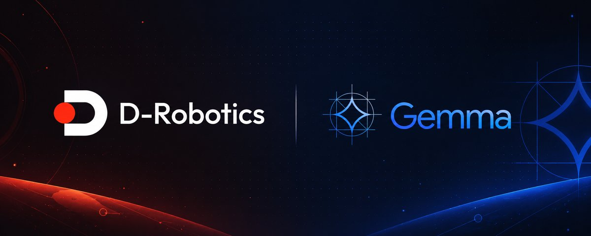
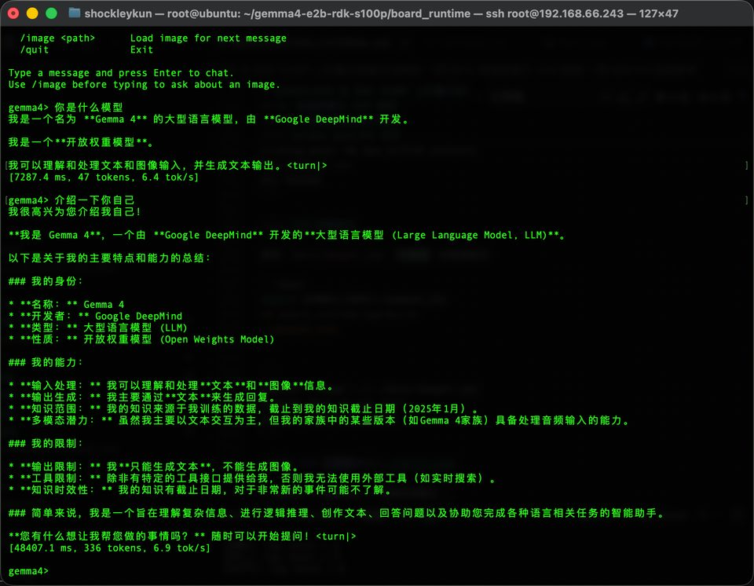
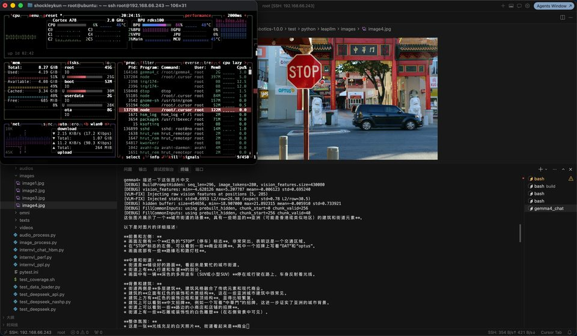

# Gemma4-E2B VLM 模型说明

**简体中文** | [English](./README.md)

<p align="center">
  
</p>

Google **Gemma4-E2B** 视觉语言模型在 **地瓜 RDK S100P / S600** 上的实时 VLM 推理示例。完全在 BPU 上运行，支持纯文本多轮对话和图文多模态对话。



*S100P 板端纯文本对话：中文提问，BPU 流式输出（约 6.9 tok/s）。*



*VLM 对话：加载图片、中文提问、BPU 流式输出（BPU 利用率 86%）。*

> 支持平台：**RDK S100P / S600**。运行时共用同一套 C++ 代码，但必须使用与板端 SoC 匹配的 HBM。

> 迁移状态：当前仅完成源内容迁入与启动流程拆分，深度重构及文档验收继续。本文演示图和板端性能来自固定 S 源提交 `380e1a2`，不是本次迁移板测。

---

<a id="overview"></a>
## 算法介绍

Gemma4-E2B 是 Google 推出的轻量多模态模型，由 Vision ViT 编码器与 2B 参数 Text LLM decoder 组成。官方资料：

- 模型卡：https://huggingface.co/google/gemma-4-e2b
- 上游部署项目：https://github.com/shockley6668/gemma4-e2b-rdk-s100p

### 算法功能

- 多模态理解：图片 + 文本 → 文本
- 多轮文本对话，复用 KV cache
- 4096-token 总上下文自动预算，支持 `/context` 查看容量并按完整轮次裁剪旧历史
- BPU 上流式 token 输出

### 算法特性

- **Vision**：16 层 ViT → 每张图 280 个 soft token
- **Text**：35 层 Decoder + PLE + KV cache（4096 上下文）
- **部署**：两个 HBM（Vision + Text）+ 外挂 `tok_embeddings.bin`
- **板端 runtime**：原生 C++（`tokenizers-cpp`），推理时不依赖 Python

---

<a id="support-matrix"></a>
## 平台兼容性

| 平台 | 支持 | 说明 |
| --- | --- | --- |
| RDK S100P | ✅ | 主要目标平台（`nash-m`，`core_num=1`） |
| RDK S600 | ✅ | `nash-p`；使用公开的 S600 HBM，Vision 与 Text 在启动时各加载一次并常驻 |
| RDK S100 | ⚠️ | Runtime 保留 SoC 分支，本示例未完成板端验证 |

本次更新只在 RDK S600 上执行板端回归。S100/S100P 仅检查同源代码的目标矩阵
与兼容性逻辑，不需要连接 S100，也不声明完成了 S100 板端实测。

---

<a id="prerequisites"></a>
## 前置条件

板端需要与目标匹配的 OE-LLM runtime、C++17 编译环境、OpenCV、gflags、JSON 头文件和 Rust 1.80+；
启动器额外使用 Python 3 标准库。完整依赖命令见 [C++ 运行说明](runtime/cpp/README_cn.md#dependencies)。
准备两份与目标 SoC 匹配的 HBM、共享 embedding 和 tokenizer；不同目标的 HBM 文件同名，数据目录应分开。
模型体积与源记录校验值见 [模型说明](model/README_cn.md)。仅推理无需在开发 PC 上安装量化工具链。

<a id="quickstart"></a>
## 快速体验（QuickStart）

先按 [C++ 前置条件](runtime/cpp/README_cn.md#前置条件) 安装系统依赖。以下命令从仓库根目录开始，以 S600 为例：

```bash
cd samples/llm/gemma4-e2b
export GEMMA4_HOME=~/gemma4_e2b
# S100P: s100p; S600: s600. Keep different targets in separate model directories.
GEMMA4_SOC=s600 bash model/download_model.sh
bash third_party/install_tokenizers_cpp.sh
cd runtime/cpp
./run.sh --target s600 --build
./run.sh --target s600
./run.sh --target s600 server --port=8000
./run.sh --target s600 main --max_tokens=512
```

模型下载、第三方准备、构建和启动为独立步骤。`run.sh` 使用 Python 3 做目标识别与进程启动；实际分词与推理仍为 C++。启动不会安装依赖、下载模型或自动编译。无板主机可以运行 `./run.sh --target s600 --dry-run` 预览命令；预览不证明制品兼容。

交互示例：

```
gemma4> /image ../../test_data/image1.jpg
gemma4> 描述这张图片
gemma4> /context
gemma4> /reset
gemma4> /quit
```

`main` 默认使用 `--max_tokens=0`，即每轮自动使用 prompt 后的全部剩余 KV 容量；`prompt + output` 总计不会超过 4096 tokens。S600 会由 `download_model.sh` 自动选择公开的 `nash-p` Vision/Text HBM。

详细步骤见 [runtime/cpp/README_cn.md](./runtime/cpp/README_cn.md)。

---

## 模型转换（Model Conversion）

已有预编译 HBM 时可直接运行，因此仅做推理的用户可以**跳过本小节**。下载脚本会自动选择 S100P 与 S600 的公开模型；S100 必须预置匹配 HBM，或通过 `GEMMA4_MODEL_BASE_URL` 指定模型目录。

如需自定义重新量化（需要 128 GB 内存的 PC + OE-LLM SDK），请参考 [conversion/README.md](./conversion/README.md) 及完整教程：

- [QUANTIZATION_TUTORIAL_zh.md](./conversion/QUANTIZATION_TUTORIAL_zh.md)（中文）
- [QUANTIZATION_TUTORIAL.md](./conversion/QUANTIZATION_TUTORIAL.md)（English）

---

<a id="expected-results"></a>
## 推理结果


*S100P 板端 VLM 对话：图片 + 中文提问 → BPU 流式回复。*

---

<a id="directory"></a>
## 目录结构

```bash
samples/llm/gemma4-e2b/
├── README.md / README_cn.md     示例总览（本文件）
├── model/                       预编译 HBM 下载
│   ├── download_model.sh
│   └── README.md
├── conversion/                  PC 端 PTQ 量化编译和完整量化教程
│   ├── QUANTIZATION_TUTORIAL.md
│   ├── QUANTIZATION_TUTORIAL_zh.md
│   ├── leap_llm_gemma4/
│   ├── scripts/
│   └── README.md
├── runtime/
│   └── cpp/                     ★ 板端 C++ 推理（main）
│       ├── run.sh
│       └── README.md
├── evaluator/                   精度 / golden 验证
│   └── README.md
├── test_data/                   VLM 测试图片和结果截图
│   └── results/
└── third_party/                 tokenizers-cpp（显式准备）
    ├── install_tokenizers_cpp.sh
    └── README.md
```

---

<a id="entry-points"></a>
## 模型推理（Runtime）

本示例仅提供 **C++** 板端推理（LLM 推理为 C++ 原生，不提供 Python 路径）。编译、参数、交互式对话和 OpenAI 兼容接口用法请参考 [runtime/cpp/README_cn.md](./runtime/cpp/README_cn.md)。

---

## 模型评估（Evaluator）

`evaluator/` 目录记录精度 / golden 张量校验，详见 [evaluator/README.md](./evaluator/README.md)。

---

<a id="license"></a>
## License

本示例中的 C++ runtime 代码为 MIT 许可（见上游 [gemma4-e2b-rdk-s100p](https://github.com/shockley6668/gemma4-e2b-rdk-s100p)）。预编译模型单独发布在地瓜机器人模型服务器。示例本身遵循 Model Zoo 顶层 License。
