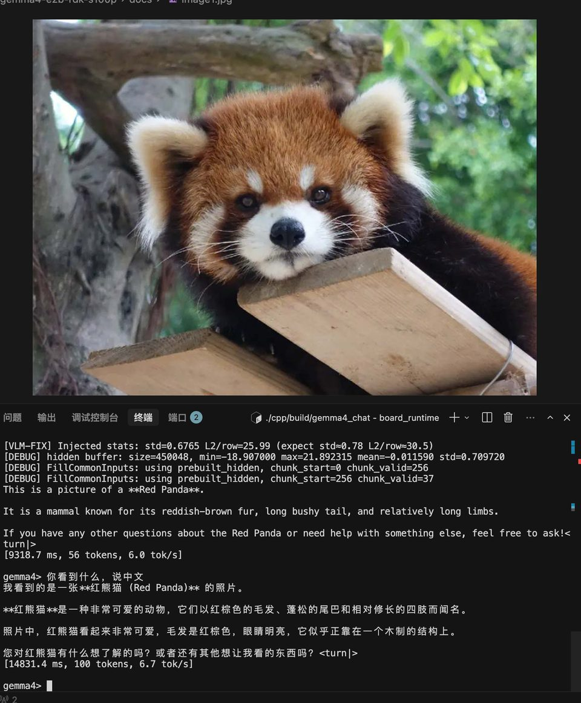

# Gemma4-E2B 在 RDK S100P 上的量化部署实战教程

[English](./QUANTIZATION_TUTORIAL.md) | **中文**

> 从零到板端 VLM 推理通过的完整指南。  
> 基于 Google Gemma4-E2B（Vision + Text，不含 Audio）+ 地瓜 OE-LLM 1.0.0 + RDK S100P（`march=nash-m`）。  
> 最后更新：2026-06-25

---

## 效果展示


*S100P 板端纯文本对话：中文提问，BPU 流式输出（约 6.9 tok/s）。*


*S100P 板端 VLM 对话：加载图片、中文提问、BPU 流式输出（截图中 BPU 利用率 86%）。*

---

## 0. 前言

本文记录将 Gemma4-E2B 多模态模型量化编译并部署到 RDK S100P 的完整过程，包含环境搭建、模型分析、校准数据准备、编译、精度验证、打包交付等所有步骤，以及我们在实践中踩过的坑和解决方案。

**目标读者**：有 Linux/Python 基础、对地瓜 RDK 平台有一定了解的开发者。

**读完你将得到**：

- 理解 Gemma4-E2B 的 Vision + Text 双分支架构与融合机制
- 能够在自己的 PC 上完成 PTQ 量化编译
- 掌握校准数据选择对精度的影响
- 知道如何验证量化精度（包括端到端融合验证）
- 产出可直接部署到 S100P 的 HBM 模型包

---

## 1. 项目全景

### 1.1 什么是 Gemma4-E2B

Google Gemma4 是 2026 年3月31日发布的多模态模型家族，E2B 是其中的轻量版本：


| 规格                 | 值                                  |
| ------------------ | ---------------------------------- |
| Vision Encoder     | 16 层 ViT，hidden=768，约 150M 参数      |
| Audio Encoder      | 12 层 Conformer（本教程不涉及）             |
| Text LLM           | 35 层 Decoder，hidden=1536，约 2B 有效参数 |
| Vocab              | 262,144                            |
| Vision soft tokens | 每张图 280 个                          |


E2B 的 Vision 和 Text 是**独立定义**的（`Gemma4Config`），这与 12B 的统一架构（`Gemma4UnifiedConfig`）不同，适配方式也不同。

### 1.2 RDK S100P 硬件约束

本文量化与板端部署均在 **RDK S100P** 上完成，编译参数 `--march nash-m`。


| 项      | 值              | 量化影响                          |
| ------ | -------------- | ----------------------------- |
| RAM    | 12 GB LPDDR5   | 模型+KV+系统需控制在 ~10GB            |
| BPU    | Nash-M，80 TOPS | `march=nash-m`                |
| BPU 核数 | **1**          | `core_num=1`、`vit_core_num=1` |


### 1.3 OE-LLM 工具链

OE-LLM 是地瓜官方的 LLM 量化编译框架，核心组件：


| 组件               | 作用                                      |
| ---------------- | --------------------------------------- |
| `leap_llm`       | PyTorch 模型定义、校准 forward、compile mode 导出 |
| `hbdk4_compiler` | MLIR 转换 + HBO 编译（BPU 指令生成）              |
| `oellm_build.py` | 一键入口：校准 → 导出 → 编译 → 链接                  |
| `hbdk4_runtime`  | 板端 BPU 推理 C++ runtime                   |


### 1.4 端到端数据流

```
原始图像 (任意尺寸)
    │
    ▼  Resize 672×960 + [0,1] 归一化 + 16×16 patchify
[2520, 768] f16  (patch embeddings)
    │
    ▼  Vision HBM (ViT 16层 + Pooler + Projector)
[280, 1536] f32  (soft tokens，已投影到 text hidden 空间)
    │
    ▼  替换 input_ids 中 249560 位置的 embedding (masked_scatter)
inputs_embeds [seq_len, 1536]  (文本 embedding + 视觉 soft tokens)
    │
    ▼  Text HBM (35层 Decoder + PLE + LM Head)
logits [1, seq_len, 262144]
    │
    ▼  采样 → 下一 token
```

**两个 HBM，一个外挂 embedding 表，这就是部署的全部模型文件。**

---

## 2. 模型架构解读

量化前必须理解模型结构，否则编译参数会设错、板端推理对不齐。

### 2.1 Gemma4 家族差异


| 模型      | 架构                    | Vision  | Text layers | Text hidden | 本教程    |
| ------- | --------------------- | ------- | ----------- | ----------- | ------ |
| **E2B** | `Gemma4Config`        | 16层 ViT | 35          | 1536        | ✅      |
| E4B     | `Gemma4Config`        | 16层 ViT | 42          | 2048        | 可推广    |
| 12B     | `Gemma4UnifiedConfig` | 统一架构    | —           | —           | 不同适配方式 |


E2B 和 E4B 同属 `Gemma4Config`，适配代码可复用，主要差异是 Text 层数和 hidden_size。

### 2.2 Vision Encoder

Vision 的完整链路：**PatchEmbed → 16 层 ViT Encoder → Pooler → Projector**

```
输入: pixel_values [num_patches, patch_dim]   即 [2520, 768] f16
  │
  ├─ PatchEmbedding
  │   x = 2*(pixel_values - 0.5)        ← [0,1] → [-1,1]
  │   x = ConstFakeQuant(8)(x)
  │   hidden = Linear(768, 768)(x)       ← input_proj
  │   hidden += position_embeddings      ← 预计算的 2D 位置编码
  │
  ├─ 16 层 ViT Encoder Layer
  │   每层: RMSNorm → Attention(12 heads) → Residual → RMSNorm → MLP → Residual
  │   使用 2D RoPE (rope_theta=100)
  │
  ├─ Pooler (3×3 average pooling)
  │   2520 patches → 280 patches (42/3 × 60/3 = 14 × 20)
  │   pooled *= sqrt(768)                ← hidden_size^0.5 缩放
  │
  └─ Projector (RMSNorm + Linear)
      768 → 1536                         ← 投影到 text hidden 空间

输出: [280, 1536] f32
```

**关键参数（从 E2B 的 config.json 自动推断）**：

```python
# vision_config 中的关键字段
default_output_length = 280    # → 决定 h_patches, w_patches
patch_size = 16
pooling_kernel_size = 3        # 3×3 pooling

# 反推 patch grid:
# num_patches_before_pool = 280 * 3 * 3 = 2520
# 找最接近正方形的 h, w 使得 h*w=2520 且 h%3==0, w%3==0
# → h_patches=42, w_patches=60
# → 输入图像 42*16=672 × 60*16=960
```

**注意**：`Gemma4VisionConfig` 默认 `h_patches=w_patches=48`，但 E2B 实际是 42×60。`load_model` 会从 `default_output_length` 和 `pooling_kernel_size` 自动推断正确的值，**不要手动覆盖**。

### 2.3 Text LLM

Text 的核心结构：**Embedding + 35 层 Decoder + RMSNorm + LM Head**

```
输入: inputs_embeds [seq_len, 1536] + input_ids [1, seq_len]
  │
  ├─ 主 Embedding (外挂 tok_embeddings.bin)
  │   embed = weight[token_id] * √1536
  │   √1536 ≈ 39.19
  │
  ├─ Per-Layer Embeddings (PLE) — Gemma4 独有
  │   token_identity = embed_tokens_per_layer(token_id) * √256
  │   context_aware  = RMSNorm(Linear(inputs_embeds)) * (1/√1536)
  │   per_layer_input = (token_identity + context_aware) * (1/√2)
  │   → 送入每层 Decoder
  │
  ├─ 35 层 Decoder
  │   每 5 层一个 full_attention (层 4,9,14,19,24,29,34)
  │   其余为 sliding_attention
  │   KV 共享：后 20 层复用前 15 层中同类型的 KV cache
  │
  ├─ RMSNorm
  └─ LM Head (Linear 1536 → 262144)

输出: logits [1, seq_len, 262144]
```

**关键参数**：


| 参数                      | 值                          | 说明                      |
| ----------------------- | -------------------------- | ----------------------- |
| `chunk_size`            | 256                        | prefill 每次处理的序列长度       |
| `cache_len`             | 4096                       | KV cache 最大长度           |
| `sliding_window`        | 512                        | sliding attention 的窗口大小 |
| `head_dim`              | 256 (sliding) / 512 (full) | 注意力头维度                  |
| `num_attention_heads`   | 8                          |                         |
| `num_key_value_heads`   | 1                          | GQA，1 个 KV head         |
| `num_kv_shared_layers`  | 20                         | 后 20 层共享 KV             |
| `embed_scale`           | √1536 ≈ 39.19              | 主 embedding 缩放          |
| `per_layer_input_scale` | 1/√2 ≈ 0.707               | PLE 合并后缩放               |


**Text HBM 的输入**（5 个主要输入 + 30 个 KV cache）：


| 输入            | 形状                   | 类型   | 说明                                    |
| ------------- | -------------------- | ---- | ------------------------------------- |
| `_input_0`    | `[256, 1536]`        | f32  | inputs_embeds（已含 √1536，Vision 注入后在这里） |
| `_input_1`    | `[1, 256]`           | i64  | input_ids                             |
| `_input_2`    | `[256]`              | i32  | position_ids                          |
| `_input_3`    | `[256, 4096]`        | si16 | full_mask                             |
| `_input_4`    | `[256, 4096]`        | si16 | sliding_mask                          |
| `_input_5~34` | `[4096, 1, 256/512]` | si8  | 15 路 K + 15 路 V cache                 |


**tok_embeddings.bin 为什么外挂**：vocab_size=262144 × hidden_size=1536 × 4 bytes ≈ 1.5GB，编入 HBM 会显著增大模型体积且查表操作在 BPU 上效率不高，所以 OELLM 选择在 runtime 侧做 embedding 查表 + √1536 缩放，再以 `inputs_embeds` 形式喂入 HBM。

### 2.4 Vision-Text 融合机制

这是板端最容易出错的部分。Gemma4 的 VLM 融合分三步：

**Step 1：构建 token 序列**

```
[255999]  [249560]×280  [258882]  [text tokens...]
 <|image>   ── soft     <image|>   "What do you see?"
 BOI       占位符×280    EOI       实际文本
```

其中 `249560` 是 🖼（U+1F5BC）image soft token 的 ID，每个位置对应 ViT 输出的一行。

**Step 2：用 `masked_scatter` 替换 embedding**

HuggingFace 原始代码中，对 `249560` 位置的 `inputs_embeds` 做替换：

```python
# 伪代码
inputs_embeds = embed_tokens(input_ids) * embed_scale  # 全部 token 先查表
image_mask = (input_ids == 249560)                      # 找到 280 个位置
inputs_embeds[image_mask] = vision_features             # 直接替换，不做任何后处理
```

**直接替换，不做 L2-norm，不乘 √1536，不缩放。** Vision HBM 输出已经在 Projector 里投影到 text hidden 空间了。

**Step 3：PLE 对 image 位置**

PLE 的 token-identity 分支对 `249560` 位置**不用** image token 的 per-layer embedding，而是用 **pad embedding（token_id=0）** 的 per-layer 向量。这是 HuggingFace 源码的原始行为。

---

## 3. 环境搭建

### 3.1 系统要求


| 项   | 最低           | 推荐                        |
| --- | ------------ | ------------------------- |
| OS  | Ubuntu 22.04 | 同                         |
| RAM | 64 GB        | 128 GB+（Text 编译峰值 ~100GB） |
| GPU | 无（CPU 可校准）   | CUDA GPU（Vision 校准加速）     |
| 磁盘  | 200 GB 可用    | 300 GB+（Text 中间文件 ~68GB）  |


### 3.2 安装 SDK + conda + 依赖

```bash
# 1. 下载 OE-LLM SDK（从地瓜官方渠道获取）
# Download OE-LLM SDK from D-Robotics official channel
# Refer to: https://developer.d-robotics.cc/
tar xzf D-Robotics_LLM_S100_1.0.0_SDK.tar.gz

# 2. 创建 conda 环境
conda create -n oellm python=3.10 -y
conda activate oellm

# 3. 安装依赖（顺序很重要！）
cd D-Robotics_LLM_S100_1.0.0_SDK/oellm_build
pip install -r requirements.txt
pip install hbdk4_compiler-*.whl
pip install hbdk4_runtime_aarch64*.whl   # 板端 runtime，PC 可选
pip install leap_llm-*.whl
```

**安装顺序为什么重要**：`requirements.txt` 中包含 PyTorch 等基础依赖，必须先装；`hbdk4_compiler` 和 `leap_llm` 之间有版本耦合，按顺序装可避免冲突。

### 3.3 获取社区适配代码

SDK 自带的 `leap_llm` 不含 Gemma4 模型定义，需要从社区仓库获取：

```bash
cd ~/gemma   # 你的工作目录

# 克隆社区参考仓库
git clone https://github.com/xiongqi123123/RDK_OE_LLM_ZOO.git

# 将 leap_llm 软链接到项目目录（方便修改代码）
ln -s $(python -c "import leap_llm; import os; print(os.path.dirname(leap_llm.__file__))") leap_llm
```

社区仓库的 `leap_llm/models/gemma4/` 和 `leap_llm/apis/model/gemma4.py` 是 Gemma4 的核心适配代码，`model_factory.py` 中注册了 `gemma4-e2b-vision` 和 `gemma4-e2b-text`。

### 3.4 下载 Gemma4-E2B 权重

从 HuggingFace 下载（需先申请访问权限）：

```bash
# 方式 A：huggingface-cli
huggingface-cli download google/gemma-4-e2b-pt --local-dir ./gemma4-e2b

# 方式 B：git lfs（需安装 git-lfs）
git lfs install
git clone https://huggingface.co/google/gemma-4-e2b-pt ./gemma4-e2b
```

下载后目录中应包含：`config.json`、`model.safetensors`、`tokenizer.json`、`tokenizer_config.json`、`chat_template.jinja` 等。

---

## 4. 校准数据准备

PTQ（Post-Training Quantization）不训练权重，只根据校准数据的激活分布计算量化 scale。**校准数据的分布越接近真实推理，量化精度越好。**

### 4.1 为什么校准数据重要

PTQ 的工作原理：

1. 用浮点模型跑一遍校准数据（forward pass）
2. 收集每一层激活值的 min/max/分布
3. 根据分布计算 INT8 的 scale 和 zero-point
4. 用这些 scale 量化权重和激活

如果校准数据分布与实际推理差距大（比如用纯色块校准，但推理输入真实照片），量化后的 scale 就不准，特征方向会被扭曲。

### 4.2 Vision 校准

Vision 校准使用 **50 张 COCO val2017 真实图像**，保存到 `calibration_data/images/`。下载脚本：

```bash
python download_coco_calib_images.py
```

也可以手动准备自己的图像，放入 `calibration_data/images/` 目录，支持 jpg/png/bmp/webp。

### 4.3 Text 校准

Text 校准需要多样化的 prompt 文本，OELLM 的格式是 JSON：

```json
[
  {"text": "What is the capital of France?"},
  {"text": "请用一句话介绍中国的长城。"},
  ...
]
```

建议准备 100-200 条，覆盖不同语言、不同长度、不同话题。我们使用了 150 条（703 行 JSON 文件中每条一个 `text` 字段）。

### 4.4 校准数据目录结构

```
calibration_data/
├── images/              # Vision 校准图像（50 张 COCO）
│   ├── coco_00_000000000802.jpg
│   ├── coco_01_000000280325.jpg
│   └── ...
├── text/                # Text 校准文本（150 条）
│   └── calibration.json
└── text_verify/         # Text 精度验证（2 条短 prompt）
    └── calibration.json
```

---

## 5. Vision 编译

### 5.1 编译命令

```bash
cd ~/gemma
conda activate oellm

# 增大栈大小（hbdk4 compile_hbo 需要，否则可能 segfault）
ulimit -s unlimited

python -u $(python -c "import leap_llm; import os; print(os.path.dirname(leap_llm.__file__))")/apis/oellm_build.py \
    --model_name gemma4-e2b-vision \
    --march nash-m \
    --input_model_path ./gemma4-e2b \
    --output_model_path ./output/gemma4_e2b_vision \
    --calib_image_path ./calibration_data/images \
    --device cuda:0 \
    --vit_core_num 1 \
    2>&1 | tee output/vision_compile.log
```

参数说明：


| 参数                    | 值                   | 说明                                |
| --------------------- | ------------------- | --------------------------------- |
| `--model_name`        | `gemma4-e2b-vision` | 已在 model_factory.py 注册            |
| `--march`             | `nash-m`            | S100P 对应 march                    |
| `--input_model_path`  | HuggingFace 权重目录    | 含 config.json + model.safetensors |
| `--output_model_path` | 输出目录                | 编译产出会写到这里                         |
| `--calib_image_path`  | COCO 图目录            | 50 张真实图像                          |
| `--device`            | `cuda:0`            | GPU 加速校准 forward（CPU 也可，更慢）       |
| `--vit_core_num`      | `1`                 | 本文编译使用 1 核                        |


**不要加 `--verifier`**：编译后 verifier 会报 `gemma4-e2b-vision does not support LLM`（它试图用 LLM 验证逻辑验证 VLM），HBM 本身是有效的，单独跑 verifier_cli.py 即可。

### 5.2 编译流程

`oellm_build.py` 内部执行四步：

```
1. Export     — 浮点模型 → BC (计算图，含量化 scale 信息)
2. Convert   — BC → MLIR (目标架构指令)
3. Compile   — MLIR → HBO (BPU 二进制)      ← 最耗时，约 100 分钟
4. Link      — HBO → HBM (最终模型文件)
```

典型日志输出：

```
[Gemma4VisionApi] Loaded 50 calibration images
[Gemma4VisionApi] Running calibration...
Calibrating: 100%|██████████| 50/50 [02:30<00:00]
[Gemma4Vision] Exporting...
Function 'export_module' done in 5.3s
[Gemma4Vision] Converting MLIR...
Function 'convert_mlir' done in 19.3s
[Gemma4Vision] Compiling HBO (core_num=1)...
Function 'compile_hbo' done in 6620.3s     ← 约 110 分钟
[Gemma4Vision] Linking HBM...
Function 'link_models' done in 10.5s
[Gemma4Vision] Done: ./output/gemma4_e2b_vision/gemma4-e2b_vit_ptq.hbm
```

`compile_hbo` 是纯 CPU 单核运算（ViT 模型特性），`HBDK_JOBS` 参数对它基本无影响。

### 5.3 编译产出

```
output/gemma4_e2b_vision/
├── gemma4-e2b_vit_ptq.bc              # 620 MB  导出的 BC 计算图
├── gemma4-e2b_vit_ptq.convert.bc      # 202 MB  MLIR 转换后
├── gemma4-e2b_vit_ptq.hbo             # 363 MB  HBO 二进制
└── gemma4-e2b_vit_ptq.hbm             # 329 MB  ← 最终部署文件
```

板端只需要 `.hbm` 文件，其余是中间文件可后续删除。

### 5.4 常见问题

**Q：`compile_hbo` 期间 segfault**

```bash
ulimit -s unlimited   # 必须在运行前执行
```

**Q：`--verifier` 报错 `gemma4-e2b-vision does not support LLM`**

HBM 已正常生成，verifier 的逻辑是把 VLM 当 LLM 验证导致报错。单独用 `verifier_cli.py` 验证即可，不影响编译结果。

**Q：`conda run` 日志长时间无输出**

`conda run` 会缓冲 stdout，改为 `conda activate oellm` + `python -u ... | tee log`：

```bash
conda activate oellm
PYTHONUNBUFFERED=1 python -u ... | tee output/vision_compile.log
```

**Q：Vision HBM 的输入输出是什么？**

```
输入: _input_0  [2520, 768]   float16   (patchify 后的图像)
输出: _output_0 [280, 1536]   float32   (投影后的 soft tokens)
```

可以用脚本确认：

```python
from hbdk4.compiler import load
bc = load("output/gemma4_e2b_vision/gemma4-e2b_vit_ptq.bc")
for inp in bc.functions[0].inputs:
    print(inp.name, list(inp.type.shape), inp.type.np_dtype)
for out in bc.functions[0].outputs:
    print(out.name, list(out.type.shape), out.type.np_dtype)
```

---

## 6. Text 编译

### 6.1 编译命令

Text 分 prefill 和 decode 两个阶段，OELLM 会自动编译两阶段并 link 成一个 `.hbm`：

```bash
conda activate oellm
ulimit -s unlimited

python -u $(python -c "import leap_llm; import os; print(os.path.dirname(leap_llm.__file__))")/apis/oellm_build.py \
    --model_name gemma4-e2b-text \
    --march nash-m \
    --input_model_path ./gemma4-e2b \
    --output_model_path ./output/gemma4_e2b_text \
    --calib_text_path ./calibration_data/text \
    --chunk_size 256 \
    --cache_len 4096 \
    --device cpu \
    --core_num 1 \
    2>&1 | tee output/text_compile.log
```

参数说明：


| 参数             | 值                 | 说明                       |
| -------------- | ----------------- | ------------------------ |
| `--model_name` | `gemma4-e2b-text` | Text 分支                  |
| `--chunk_size` | `256`             | prefill 每次处理 256 tokens  |
| `cache_len`    | `4096`            | KV cache 最大长度            |
| `--device`     | `cpu`             | Text 校准无 GPU 加速优势，CPU 即可 |
| `--core_num`   | `1`               | 本文编译使用 1 核               |


编译会自动导出 `tok_embeddings.bin`：

```python
# 在 Gemma4TextApi.__init__ 中自动执行
tok_embs = model.embed_tokens.weight.data * model.embed_tokens.embed_scale
tok_embs.detach().cpu().numpy().tofile("output/gemma4_e2b_text/tok_embeddings.bin")
```

### 6.2 编译产出

```
output/gemma4_e2b_text/
├── gemma4-e2b_lm_chunk_256_cache_4096_ptq.prefill.bc          # 18.5 GB
├── gemma4-e2b_lm_chunk_256_cache_4096_ptq.prefill_convert.bc  # 4.7 GB
├── gemma4-e2b_lm_chunk_256_cache_4096_ptq.prefill.hbo          # 4.8 GB
├── gemma4-e2b_lm_chunk_256_cache_4096_ptq.decode.bc            # 18.5 GB
├── gemma4-e2b_lm_chunk_256_cache_4096_ptq.decode_convert.bc    # 4.7 GB
├── gemma4-e2b_lm_chunk_256_cache_4096_ptq.decode.hbo           # 4.7 GB
├── gemma4-e2b_lm_chunk_256_cache_4096_ptq.hbm                  # 4.5 GB  ← 最终部署文件
└── tok_embeddings.bin                                           # 1.5 GB  ← 外挂 embedding
```

**总计约 68 GB**，但板端只需要 `.hbm`（4.5 GB）和 `tok_embeddings.bin`（1.5 GB）。

### 6.3 内存管理

Text decode 编译峰值内存约 **100 GB RSS**，如果机器内存不够：

**方案 1：创建 swap 文件**

```bash
sudo bash setup_swap.sh   # 创建 64GB swap
```

**方案 2：限制虚拟内存**

```bash
export HBDK_JOBS=29       # 开发机编译并行度
export HBDK_OPT=0
export HBDK_CACHE_MODE=enable

# 限制进程虚拟内存 110GB（防 OOM 拖垮整机）
prlimit --as=$((110 * 1024**3)) python -u compile_text_decode_resume.py 2>&1 | tee log
```

**注意**：`HBDK_JOBS=29` 是开发机 hbdk 编译的并行度，**不是板端 BPU 核数**。

### 6.4 调整上下文长度与编译参数

Text HBM 的几个关键参数是**编译时固定**的，决定了板端推理的上下文容量。默认值如下：


| 参数           | 在哪改               | 默认值  | 说明                                    |
| ------------ | ----------------- | ---- | ------------------------------------- |
| KV cache 长度  | 环境变量 `CACHE_LEN`  | 4096 | 输入 + 输出 token 共享这个预算。越大越占 DDR、编译越久。   |
| Prefill 分块大小 | 环境变量 `CHUNK_SIZE` | 256  | 每次 prefill 处理的 token 数。越大步数越少、峰值显存越高。 |


这两个参数对应板端的 `gemma4_config.h` 里的 `kCacheLen` / `kChunkSize`，改了 HBM 编译参数后必须同步改源码配置，否则推理会错位。

**示例：把上下文从 4096 扩到 8192**

```bash
# 1. 重新编译 Text HBM（PC 上，耗时数小时）
CHUNK_SIZE=512 CACHE_LEN=8192 bash conversion/scripts/compile/run_text_compile.sh
```

```cpp
// 2. 更新板端 runtime 配置（runtime/cpp/gemma4_config.h）
constexpr int kChunkSize = 512;   // 必须和上面的 CHUNK_SIZE 一致
constexpr int kCacheLen  = 8192;  // 必须和上面的 CACHE_LEN 一致
```

```bash
# 3. 重新编译 runtime
cd runtime/cpp && mkdir build && cd build
cmake .. && make -j$(nproc)
```

**仅 runtime 可调的参数**（无需重编 HBM）：


| 参数         | 在哪改                   | 默认值         | 说明                                   |
| ---------- | --------------------- | ----------- | ------------------------------------ |
| 滑动窗口       | `kSlidingWindow`      | 512         | decode 时滑动注意力的窗口大小，必须 ≤ `kCacheLen`。 |
| 最大输出 token | `--max-tokens N` 启动参数 | `kCacheLen` | 限制每轮生成长度，运行时传入即可。                    |


> **内存代价**：`CACHE_LEN` 翻倍，KV cache 占用的 DDR 也会翻倍。请先确认板端空闲内存足够再加大。
> HBM 文件名 `gemma4-e2b_lm_chunk_256_cache_4096_ptq.hbm` 里的数字只是命名习惯，改参数后实际产出的文件名不会自动变化，但内容已经是新参数编译的。

---

## 7. 精度验证

在 PC 上用量化模型（BC）和原始浮点模型对比，指标为 **cosine similarity**（1 表示完全一致，越接近 1 越好）。

### 7.1 本模型量化精度


| 模型                                                     | 精度         |
| ------------------------------------------------------ | ---------- |
| Vision HBM（`gemma4-e2b_vit_ptq.hbm`）                   | **0.9888** |
| Text HBM（`gemma4-e2b_lm_chunk_256_cache_4096_ptq.hbm`） | **0.9540** |


分别验证 Vision、Text 量化输出与浮点模型的接近程度。

### 7.2 如何验证

**Vision BC**

```bash
cd ~/gemma && conda activate oellm

python -u leap_llm/apis/verifier_cli.py \
    --model_name gemma4-e2b-vision \
    --model_dir ./gemma4-e2b \
    --quant_vlm_model_path ./output/gemma4_e2b_vision/gemma4-e2b_vit_ptq.bc \
    --input_image_path ./calibration_data/images/coco_00_000000000802.jpg
```

**Text BC**（纯文本，不含 Vision）

```bash
python -u quick_text_verify.py
# 结果：output/e2b_text_verify_quick.json
```

若开发机与板端同网段，还可在板端 BPU 上跑 HBM 对比：

```bash
bash run_remote_hbm_verify.sh   # 需 --remote_ip 指定板子 IP
```

---

## 8. 打包部署文件

### 8.1 部署目录结构

```bash
mkdir -p gemma4_e2b_deploy/{model,tokenizer}

# 模型文件（3 个大文件）
cp output/gemma4_e2b_vision/gemma4-e2b_vit_ptq.hbm \
   gemma4_e2b_deploy/model/

cp output/gemma4_e2b_text/gemma4-e2b_lm_chunk_256_cache_4096_ptq.hbm \
   gemma4_e2b_deploy/model/

cp output/gemma4_e2b_text/tok_embeddings.bin \
   gemma4_e2b_deploy/model/

# Tokenizer 文件
cp gemma4-e2b/tokenizer.json \
   gemma4-e2b/tokenizer_config.json \
   gemma4-e2b/chat_template.jinja \
   gemma4-e2b/config.json \
   gemma4_e2b_deploy/tokenizer/
```

最终结构：

```
gemma4_e2b_deploy/
├── model/
│   ├── gemma4-e2b_vit_ptq.hbm                              # 329 MB  Vision
│   ├── gemma4-e2b_lm_chunk_256_cache_4096_ptq.hbm          # 4.5 GB  Text
│   └── tok_embeddings.bin                                  # 1.5 GB  Token embedding
└── tokenizer/
    ├── tokenizer.json                                      # 31 MB
    ├── tokenizer_config.json
    ├── chat_template.jinja
    └── config.json
```

### 8.2 要打包 vs 不打包


| 文件                   | 大小     | 是否打包 | 原因     |
| -------------------- | ------ | ---- | ------ |
| Vision `.hbm`        | 329 MB | ✅    | 部署必需   |
| Text `.hbm`          | 4.5 GB | ✅    | 部署必需   |
| `tok_embeddings.bin` | 1.5 GB | ✅    | 部署必需   |
| Tokenizer            | ~32 MB | ✅    | 部署必需   |
| Vision/Text `.bc`    | ~37 GB | ❌    | 编译中间文件 |
| Vision/Text `.hbo`   | ~5 GB  | ❌    | 编译中间文件 |
| `compile_cache/`     | ~26 GB | ❌    | 编译缓存   |


打包后约 **4.3 GB**（gzip），解压后约 **6.3 GB**。

---

## 9. 板端部署与 VLM 推理

本节介绍如何将编译好的 HBM 模型部署到 S100P 板端，并运行 Gemma4-E2B VLM 推理。

### 9.1 两条路径：直接跑 vs 自己编译


|        | 路径 A：直接跑（推荐）                       | 路径 B：从源码编译                                              |
| ------ | ---------------------------------- | ------------------------------------------------------- |
| **适合** | 想快速体验 VLM 推理的用户                    | 想修改 runtime 代码或移植到其他平台的开发者                              |
| **需要** | 下载预编译 HBM + 编译 C++ runtime（~1 min） | 完整 OE-LLM SDK + 本仓库全部代码                                 |
| **步骤** | 见下方 9.2                            | 见 [runtime/cpp/README.md](../runtime/cpp/README.md) |


> 大多数用户只需要**路径 A**：下载模型 → 编译 runtime（板端 gcc 即可，不需要 OE-LLM 编译工具链）→ 直接跑。

### 9.2 路径 A：快速部署（板端 5 分钟）

#### Step 1：下载预编译模型

在 S100P 板端执行：

```bash
pip install huggingface_hub
hf download ShockleyWong/gemma4-e2b-rdk-s100p --local-dir ~/gemma4_e2b
```

下载完成后检查文件完整性：

```bash
# 验证 SHA256（可选）
sha256sum ~/gemma4_e2b/model/*.hbm

# 预期输出：
# 470791849d21cffadb388cc61c8f4b1452078c1722d302fd8a8ac775ee9769f1  ...vit_ptq.hbm
# 3e4d4940051e4e8dc0cb434e972e7aae75d49504da3fac435e303f68af73a25f  ...lm_..._ptq.hbm
```

#### Step 2：编译 C++ runtime

需要 `cmake`、`g++`、`libopencv-dev` 和 `cargo`（仅首次编译，用于构建自带的 `tokenizers-cpp`）。

```bash
cd samples/llm/gemma4-e2b/runtime/cpp
mkdir build && cd build
cmake ..
make -j$(nproc)
# 产出：gemma4_chat, gemma4_server, gemma4_demo, gemma4_text_bench, gemma4_golden_verify
```

> **注意**：板端编译只需要 `gcc`、`cmake`、`libopencv-dev` 和 Horizon BPU runtime 头文件（`/usr/hobot/`），**不需要** PC 端的 `hbdk4_compiler` 或 `leap_llm`。分词走原生 C++ `tokenizers-cpp`，**不依赖 Python**。

#### Step 3：运行 VLM 推理

```bash
export GEMMA4_HOME=~/gemma4_e2b
./gemma4_chat
```

交互示例：

```
gemma4> /image /path/to/red_panda.jpg
Processing image... Image loaded (430080 features).
gemma4> Describe this image
This is a photograph of a Red Panda resting on a wooden structure.
It has reddish-brown fur, white accents on its face and chest...
```

### 9.3 VLM 融合机制（板端实现要点）

板端 runtime 在 Vision→Text 融合时必须严格遵守以下规则，否则会导致输出乱码：

#### ① Vision 特征原样注入

```cpp
// 正确：直接 std::copy，不做任何后处理
for (int t = 0; t < 280; ++t) {
    std::copy(vision_output + t * 1536,
              vision_output + (t+1) * 1536,
              inputs_embeds + image_pos[t] * 1536);
}
```

#### ② PLE 对 image 位置用 pad embedding

Gemma4 Text 的 Per-Layer Embedding（PLE）有两条路径：

- **token-identity**：`embed_tokens_per_layer(token_id)`
- **context-aware**：依赖 `inputs_embeds`

对 image soft token（`token_id=249560`）位置，**token-identity 用 pad（token_id=0）**，不是 249560 的 per-layer embedding。

```cpp
// Text HBM input[1] (input_ids) 中，image 位置应为 0 (pad)，不是 249560
for (auto& id : input_ids) {
    if (id == 249560) id = 0;  // pad_token_id
}
```

#### ③ Chat template 格式

Prompt 必须走 `chat_template.jinja`，不能直接拼裸文本：

```
<bos><|turn>user
<|image>[249560×280]<image|>What do you see?<turn|>
<|turn>model
```

C++ `TokenizerBridge`（原生 `tokenizers-cpp`）会自动处理这个格式化，**无需 Python**。

### 9.4 验证板端推理正确性

#### Golden mask/KV 对齐

```bash
# 将 golden_mask_kv/ 放到 $GEMMA4_HOME/golden_mask_kv/
# （来源：pc_delivery/golden_mask_kv.tar.gz）

export GEMMA4_HOME=~/gemma4_e2b
./gemma4_golden_verify --prompt prompt_0
```

预期输出：

```
input_ids: OK
position_ids: OK
inputs_embeds: OK max_diff=0 cosine=1
full_mask: OK max_diff=0 cosine=1
sliding_mask: OK max_diff=0 cosine=1
=== Summary ===
ALL PASSED
```

#### VLM 图像测试

使用 `docs/image1.jpg`（红熊猫）在板端验证：

```bash
export GEMMA4_HOME=~/gemma4_e2b
cd runtime/cpp/build
./gemma4_chat
```

```
gemma4> /image ../../test_data/image1.jpg
gemma4> What do you see?
gemma4> 你看到什么，说中文
```



| 测试图 | 预期输出 | 板端实际输出 |
| ------ | -------- | ------------ |
| 红熊猫 (`image1.jpg`) | 识别为 Red Panda / 红熊猫，并描述外观 | ✅ 正确识别（见上图） |
### 9.5 性能参考

S100P 单核 BPU 上的典型性能（`core_num=1`）：


| 阶段           | 耗时          | 说明                         |
| ------------ | ----------- | -------------------------- |
| Vision 推理    | ~300 ms     | 单张图，ViT 16 层               |
| Text prefill | ~500 ms     | 294 token prompt（VLM）      |
| Text decode  | ~200 ms/tok | 单 token 生成                 |
| 端到端 VLM      | ~50 s       | 294 prompt + 250 输出 tokens |


### 9.6 常见问题

**Q：板端编译报错 `Horizon BPU SDK not found`**

```bash
# 检查 BPU runtime 是否安装
ls /usr/hobot/lib/libdnn.so
ls /usr/include/hobot/dnn/hb_dnn.h
```

如果缺失，安装 OE-LLM board runtime 包（`hbdk4_runtime_aarch64*.whl` 或板端 image 自带）。

**Q：VLM 输出乱码 / 语义错误**

按以下顺序排查：

1. 确认 Vision HBM SHA256 = `47079184...`（COCO 重校准版）
2. 确认注入后 vision features std ≈ 0.65~0.79（不是 1.0）
3. 确认 `input_ids` 中 image 位置为 `0`（pad），不是 `249560`
4. 确认 prompt 走 chat template（含 `<|turn>user` / `<|turn>model`）
5. 跑 `gemma4_golden_verify` 确认 mask/KV 对齐

**Q：输出被截断（只生成 256 tokens）**

KV cache 容量 `kCacheLen=4096` 是 HBM 编译时固定的。prompt + 输出 ≤ 4096。VLM prompt 约 294 tokens，所以最多输出约 3800 tokens。模型遇到 `<turn|>` 会自动停止。

---

## 附录：模型文件下载

预编译 HBM 模型已上传 HuggingFace：

```bash
pip install huggingface_hub
hf download ShockleyWong/gemma4-e2b-rdk-s100p --local-dir ./gemma4_e2b_deploy
```

| 文件 | 说明 |
| --- | --- |
| `gemma4-e2b_vit_ptq.hbm` | Vision HBM（329 MB） |
| `gemma4-e2b_lm_chunk_256_cache_4096_ptq.hbm` | Text HBM（4.5 GB） |
| `tok_embeddings.bin` | Token embedding 表（1.5 GB） |
| `tokenizer/` | Tokenizer 文件 |

校验完整性：

```bash
sha256sum gemma4_e2b_deploy/model/*.hbm
```

