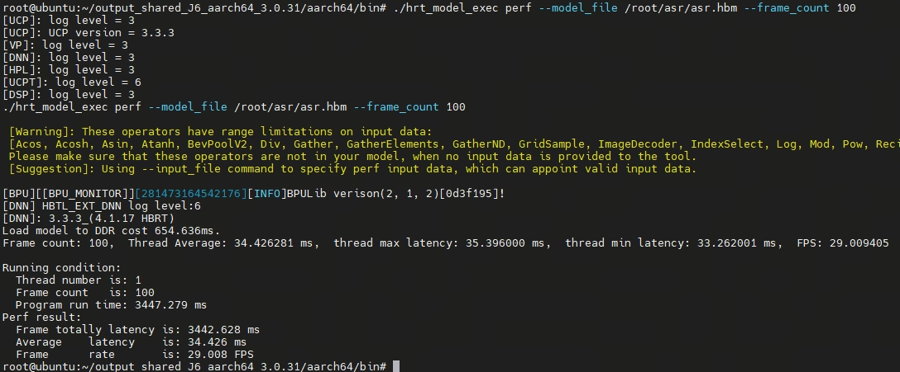
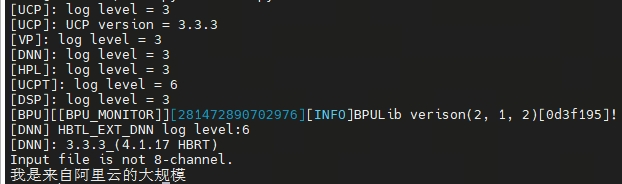
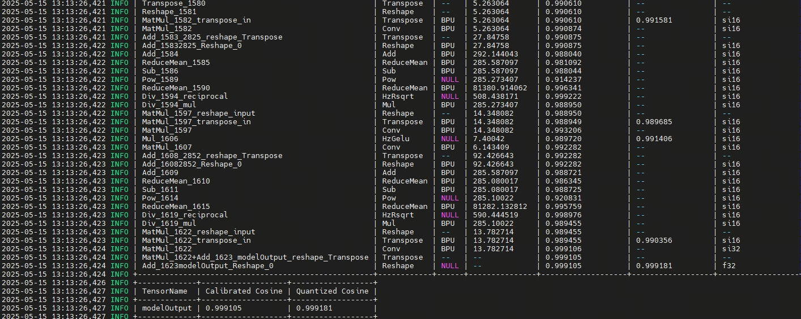

[English](README.md) | 简体中文

# ASR transcript evaluation

<a id="dataset"></a>
## 数据集
本评测器根据已保存的参考文本/预测文本配对计算字符错误率。每条语音使用唯一 ID，并保留数据集版本、划分、许可、模型与解码元数据。对分块运行结果，先合并为完整转录并与独立参考文本配对，再添加记录。

<a id="directory"></a>
## 目录结构

```text
evaluator/
├── README.md  # 英文说明
├── README_cn.md  # 中文说明
├── evaluate.py  # Python 脚本
└── basic.py  # 内置音频前缀与解码协议检查
```

<a id="environment"></a>
## 环境
仅需 Python 3.10+ 标准库。评测器读取转录 JSON 并写入指标，不运行模型推理；输入的来源对象会复制到结果报告。

<a id="command"></a>
## 命令

`basic.py` 检查内置音频的原生 runtime `result.json`。参照是 `../test_data/readme_img/print.jpg` 展示的前缀 `我是来自阿里云的大规模`。检查项目包括完成状态、音频身份、各块文本拼接、已发布前缀、`ctc` 模式下的词分隔符解码和特殊 token。

```bash
# Repository root; result.json comes from the ASR runtime.
python3 samples/speech/asr/evaluator/basic.py \
  --run-report outputs/asr/result.json \
  --output outputs/asr/basic-check.json
```

输出通过 SHA-256 绑定运行报告和前缀截图，并记录全文、前缀与逐项检查。检查通过时返回 0；未通过时返回 1。输出文件必须尚不存在。可选 `--crosscheck-text-file <file.txt>` 添加独立运行的另一识别器文本及序列匹配比例，不影响前缀检查。使用 `evaluate.py` 计算 CER 时，其余字符需要独立完整参照文本。

```bash
# 从仓库根目录运行；示例输入含两条转录记录。
asr_eval_dir=$(mktemp -d)
cat > "$asr_eval_dir/transcripts.json" <<'JSON'
{
  "schema": "rdk-model-zoo/asr-transcripts/v1",
  "provenance": {"dataset": "synthetic-example", "model": "none", "decode_mode": "ctc"},
  "records": [
    {"id": "one", "reference": "你好", "hypothesis": "你号"},
    {"id": "two", "reference": "世界", "hypothesis": "世界"}
  ]
}
JSON
python3 samples/speech/asr/evaluator/evaluate.py --predictions "$asr_eval_dir/transcripts.json" --output "$asr_eval_dir/metrics.json"
# Expected: count=2, reference_characters=4, substitutions=1, cer=0.25
```
`--predictions` 与 `--output` 均为必需路径，无默认值。已有输出文件会被拒绝，避免覆盖旧报告。输入需符合上述 schema，provenance 的 `dataset`、`model`、`decode_mode` 必须为非空字符串；records 必须为非空列表。每条记录需唯一非空 `id`，以及字符串 `reference`、`hypothesis`；文本本身允许为空。

<a id="metrics"></a>
## 指标
CER 为全部语音的 `(替换 + 删除 + 插入) / 参考字符总数`，不是逐条 CER 的平均值。字符按 Python Unicode 码点计算，保留空白、标点、大小写；不归一化、不删除 token、不转换词边界，组合字符的各码点单独计数。所有参考文本为空时 CER 为 `null`，插入错误仍计数。CER 可以大于 1。编辑距离平局优先对角线，其次删除、最后插入，以保证错误分解可复现。

<a id="outputs"></a>
## 输出
独占创建的 JSON 使用 `rdk-model-zoo/asr-metrics/v1`，包含 `count`、`reference_characters`、`exact_matches`、`cer`、汇总 `errors`、逐条 `utterances`、归一化政策、输入 SHA-256 与原文 provenance。schema 字段 `inference_executed=false` 和 `provenance_independently_verified=false`。退出 0 表示输入已计分且报告已写入；输入错误或输出已存在返回 2。

<a id="reference-results"></a>
## 参考结果
S 源记录了 S100 命令 `hrt_model_exec perf --model_file asr.hbm --frame_count 100`：模型执行 100 帧，平均延迟 34.426 ms，29.008 FPS。这些数值描述模型执行，不是端到端音频延迟。





图示分别展示模型执行性能、转写示例和量化对照。随仓 4.59 秒 WAV 按三个独立窗口处理。计算语料 CER 时，按上述格式将完整转写与独立的逐条参考文本对应。

<a id="boundaries"></a>
## 适用范围
CTC 和 legacy 对相同 logits 的解码结果不同，应分别报告。分块、重采样和末块补零都会影响转录。比较系统时使用完整转录与对应参考文本，并记录目标、模型、解码方式、数据集划分和运行时配置。
