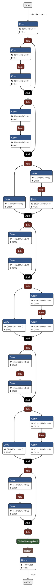
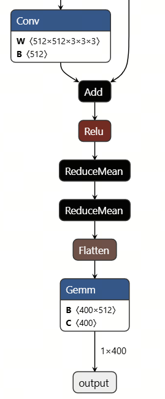

English | [简体中文](./README_cn.md)

# R3D-18 Conversion Notes

<a id="source-model"></a>
## Source Model

The source notes describe a PyTorch `torchvision.models.video.r3d_18` action-classification model exported to ONNX for a 400-class Kinetics output. The network input is the prepared clip `(1,3,16,112,112)`; the runtime sample consumes the already normalized clip in `test_data/video0.npy`.

The official paper and reference implementation are linked from the [sample overview](../README.md#overview). No source checkpoint filename, checkpoint hash, export script, or source-weight acquisition record is present in this directory.

The original graph screenshot is retained:



<a id="toolchain-targets"></a>
## Toolchain and Targets

The source record names the RDK S algorithm toolchain OpenExplorer 3.5.0 and the S100 target. It reports that `Conv3D` was supported while the original 3D `GlobalAveragePooling` path was not. The recorded workaround replaced that pooling path with an equivalent 2D `ReduceMean` before HBM compilation.

Only `s100/r3d_18.hbm` is published in the active manifest. No S100P, S600, or x5 conversion target is claimed.

The source mentions an x86 Linux OE Docker environment. Its setup sketch is retained as historical environment guidance, not as a complete reproducible conversion recipe:

```bash
sudo docker load -i ai_toolchain_ubuntu_22_s100_xxx.tar
sudo docker images
sudo docker run -it --rm --network host --shm-size=15g \
  -v "$(pwd)":/workspace --workdir /workspace \
  <docker-image-name> /bin/bash
```

<a id="export"></a>
## Export

The source README describes an ONNX export concept but provides no executable export script, Python environment lock, checkpoint path, or command with verifiable output. This migration does not invent one. The export stage is therefore **not reproducible from repository contents** and is listed as a known gap.

<a id="calibration"></a>
## Calibration

No calibration dataset, sample count, quantization configuration, calibration command, or generated calibration artifact is present. The source notes historically report most operator similarity values above 0.99 and final quantization similarity around 0.99; those are preserved as source documentation only and are not a current measurement.

<a id="compile"></a>
## Compile

No compiler YAML, mapper, compile command, workspace, or checkpoint-to-HBM recipe is present. The only executable preparation path in this repository downloads the already published HBM artifact:

```bash
# cwd: repository root
bash samples/vision/3dresnet/model/download.sh s100
# expect: samples/vision/3dresnet/model/s100/r3d_18.hbm
```

This command prepares a published artifact; it does not perform conversion.

<a id="validation"></a>
## Post-conversion Validation

Unified host validation is available through the fixture tests, which verify the source preprocessing and source `visualize.get_topk_predictions` numerical behavior:

```bash
# cwd: repository root
.venv/bin/python -m unittest discover -s samples/vision/3dresnet/tests -v
# expect: all discovered tests OK; no HBM or board execution is performed
```

S100 HBM smoke execution and output comparison are **not-run**. Host tests do not establish conversion accuracy, board compatibility, or performance.

<a id="artifacts"></a>
## Artifacts

| Artifact | Target | Path after preparation | Status |
| --- | --- | --- | --- |
| `r3d_18.hbm` | S100 | `model/s100/r3d_18.hbm` | published/downloadable; conversion recipe unavailable |

No ONNX, checkpoint, calibration, or compiler workspace artifact is supplied.

<a id="known-gaps"></a>
## Known Gaps

- No executable ONNX export script or pinned source checkpoint.
- No calibration dataset, sample count, quantization YAML, or calibration command.
- No OE compile YAML, mapper, or output-generation command.
- No reproducible conversion output hash; the active HBM manifest SHA is `null`.
- No S100P, S600, or x5 artifact.
- No board validation in this migration.

The four source conversion screenshots remain available for traceability:




