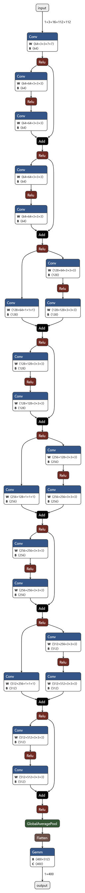
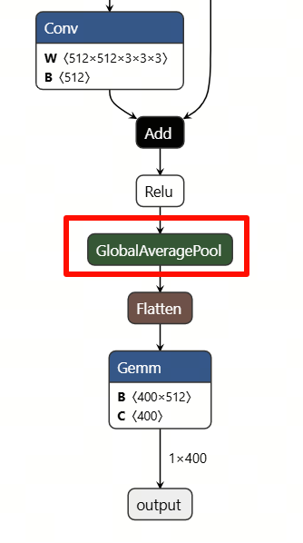
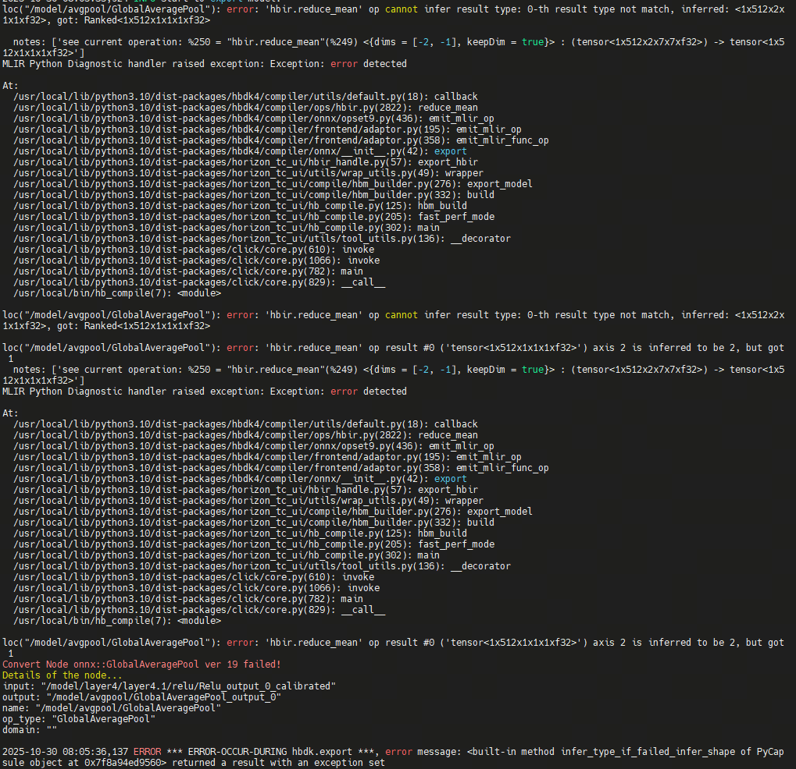
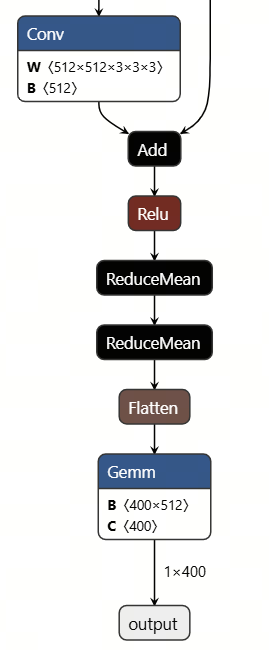
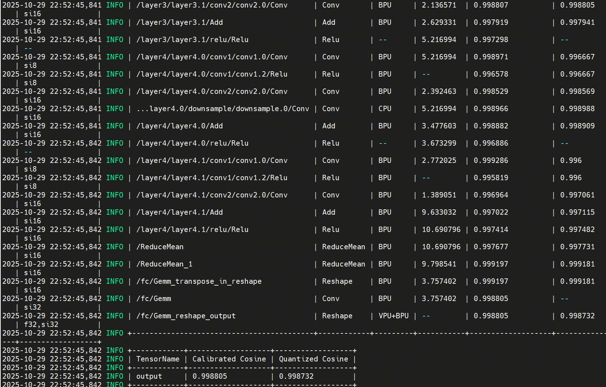

[English](./README.md) | 简体中文

# R3D-18 转换说明

<a id="source-model"></a>
## 源模型

source 文档描述了将 PyTorch `torchvision.models.video.r3d_18` 动作分类模型导出为 ONNX，再生成 Kinetics 400 类输出。模型输入是 `(1,3,16,112,112)` 的准备片段；runtime 使用 `test_data/video0.npy` 中已经归一化的片段。

官方论文和参考实现见[样例总览](../README_cn.md#overview)。本目录没有 source checkpoint 文件名、checkpoint hash、导出脚本或源权重获取记录。

模型图结构：



<a id="directory"></a>
## 目录结构

```text
conversion/
├── README.md  # 英文说明
└── README_cn.md  # 中文说明
```

<a id="toolchain-targets"></a>
## 工具链与目标

source 记录使用 RDK S 算法工具链 OpenExplorer 3.5.0 和 S100 目标。记录显示工具链支持 `Conv3D`，但不支持原始 3D `GlobalAveragePooling` 路径；因此将该 pooling 路径替换为等价的 2D `ReduceMean` 后再编译 HBM。

当前 manifest 只发布 `s100/r3d_18.hbm`，不提供 S100P、S600 或 x5 转换目标。

模型转换在 x86 Linux 主机上的 RDK S100 OpenExplore 环境中执行，不在板卡上运行：

- OE Docker 文档：<https://developer.d-robotics.cc/rdk_doc/rdk_s/Advanced_development/toolchain_development/overview>
- OE 工具链下载：<https://toolchain.d-robotics.cc/>

从 OE Docker 文档下载 RDK S100/S100P 的 OpenExplore CPU Docker 镜像，然后加载镜像文件：

```bash
sudo docker load -i ai_toolchain_ubuntu_22_s100_xxx.tar
sudo docker images
```

启动容器，挂载仓库并分配足够的共享内存用于编译：

```bash
sudo docker run -it --rm --network host --shm-size=15g \
  -v "$(pwd)":/workspace --workdir /workspace \
  <docker-image-name> /bin/bash
```

<a id="export"></a>
## 导出

source README 描述了 ONNX 导出的概念，但没有可执行导出脚本、Python 环境锁定、checkpoint 路径或可核对产物的命令。因此导出阶段**无法从仓库内容复现**，列为已知缺口。

<a id="calibration"></a>
## 校准

没有校准数据集、样本数量、量化配置、校准命令或生成的校准制品。source 转换记录称多数算子相似度大于 0.99、最终量化相似度约为 0.99。

<a id="compile"></a>
## 编译

没有 compiler YAML、mapper、编译命令、workspace 或 checkpoint 到 HBM 的完整配方。仓库中唯一可执行的准备路径是下载已经发布的 HBM：

```bash
# cwd：仓库根目录
bash samples/vision/3dresnet/model/download.sh s100
# 预期：samples/vision/3dresnet/model/s100/r3d_18.hbm
```

该命令准备已发布制品，不执行转换。

<a id="validation"></a>
## 转换后验证


在板端执行已下载制品时，使用 [Python runtime](../runtime/python/README_cn.md) 在 S100 板卡上运行。

<a id="artifacts"></a>
## 产物

| 产物 | Target | 准备后路径 | 可用性 |
| --- | --- | --- | --- |
| `r3d_18.hbm` | S100 | `model/s100/r3d_18.hbm` | 已发布/可下载；转换配方缺失 |

没有提供 ONNX、checkpoint、校准或 compiler workspace 制品。

<a id="known-gaps"></a>
## 补充准备

- 没有可执行 ONNX 导出脚本或固定 source checkpoint。
- 没有校准数据集、样本数量、量化 YAML 或校准命令。
- 没有 OE 编译 YAML、mapper 或产物生成命令。
- 没有可复现的转换输出 hash；当前 HBM manifest SHA 为 `null`。
- 没有 S100P、S600 或 x5 制品。

转换结果截图：





