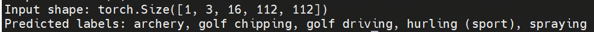
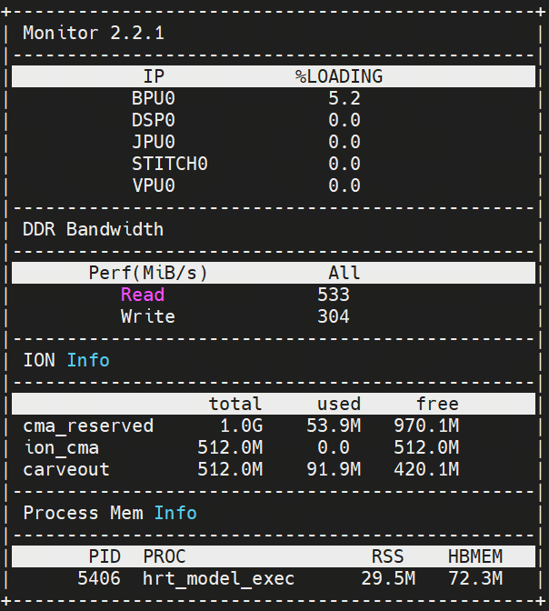

English | [简体中文](./README_cn.md)

# R3D-18 Evaluation Record

<a id="dataset"></a>
## Dataset

The supplied functional input is the preprocessed `test_data/video0.npy` clip, shape `(1,3,16,112,112)`, dtype float32. It represents a 16-frame archery sample. `test_data/kinetics_classnames.json` contains the 400-entry Kinetics name-to-id mapping used by the CLI; labels are decoded into id-to-name form with the embedded quote characters stripped from the names.

This directory does not contain the full Kinetics-400 dataset, a video decoder, frame extraction code, or a dataset download command. The clip's original acquisition and preprocessing command are not recorded.

<a id="directory"></a>
## Directory structure

```text
evaluator/
├── README.md  # English instructions
└── README_cn.md  # Chinese instructions
```

<a id="environment"></a>
## Environment

- Host check: Python 3.10+ with NumPy and PyYAML (a repository `.venv` works); no HBM or board is needed for the fixture tests.
- Board functional check: RDK S100 with the matching `hbm_runtime`, prepared `model/s100/r3d_18.hbm`, and recognized S100 identity.
- The performance table below is a published record measured with `hrt_model_exec`; the exact invocation, image, runtime version and raw outputs were not included with it, so record those conditions when reproducing the benchmark.

<a id="command"></a>
## Evaluation Commands

Host contract check:

```bash
# cwd: repository root
.venv/bin/python -m unittest discover -s samples/vision/3dresnet/tests -v
# expect: all discovered tests OK (host fixtures)
```

S100 functional smoke command:

```bash
# cwd: repository root; prerequisites: explicit model download and S100 board
bash samples/vision/3dresnet/model/download.sh s100
python3 samples/vision/3dresnet/runtime/python/main.py \
  --target s100 \
  --asset-id s:3dresnet:s100/r3d_18.hbm \
  --model-path samples/vision/3dresnet/model/s100/r3d_18.hbm \
  --test-clip samples/vision/3dresnet/test_data/video0.npy \
  --label-file samples/vision/3dresnet/test_data/kinetics_classnames.json \
  --top-k 5 --priority 0 --bpu-cores 0
# expect: exit code 0 and JSON with five predictions
```

The performance record was produced with `hrt_model_exec`; no complete command with its input/output file arguments was recorded with it, so no reproduction command is provided.

<a id="metrics"></a>
## Metrics

- **Top-1:** the class ID at rank one after numerically stable softmax and descending probability order.
- **Top-K:** the first `K` class IDs and float32 probabilities, with `K` controlled by `--top-k` (default 5).
- **Functional label check:** the reference Top-1 class for `video0.npy` is `archery` (source record).
- **Performance:** thread-performance record (S100, `hrt_model_exec`). “Total Latency” and “Average Latency” are milliseconds; FPS is throughput.

| Threads | Frames | Total Latency (ms) | Average Latency (ms) | FPS |
| --- | --- | --- | --- | --- |
| 1 | 100 | 18267.76 | 182.68 | 5.47 |
| 2 | 100 | 18291.76 | 182.93 | 10.82 |
| 4 | 100 | 18501.06 | 185.03 | 21.07 |
| 8 | 100 | 24743.56 | 249.19 | 30.74 |

The record additionally notes approximate BPU occupancy 5.2%, ION memory 91.9 MB, read bandwidth 533, and write bandwidth 304; units and measurement setup are not fully recorded.

<a id="outputs"></a>
## Outputs

The functional command writes its JSON report to stdout and does not create a result file. Each prediction contains `class_id`, `score`, and `label`; raw model output is not saved by the CLI. Host test output is the unittest log. The screenshots show the archery frame and the Top-5 display:




<a id="reference-results"></a>
## Reference Results

| Reference | Provenance |
| --- | --- |
| `video0.npy` Top-1 `archery` | source evaluator README and screenshot |
| Four-row thread-performance table (above) | source evaluator README |
| BPU/ION/bandwidth notes (above) | source evaluator README and screenshot |

<a id="boundaries"></a>
## Boundaries

- There is no full-dataset evaluator implementation in this sample; evaluation is the single-clip functional command above.
- There is no complete source `hrt_model_exec` command, so the performance record cannot be reproduced from repository contents alone.
- Host tests validate preprocessing, finite/shape/dtype guards, dynamic tensor names, softmax/Top-K decoding, labels, CLI gates, and mocked download delegation; they do not execute the HBM on a board.

Additional-metrics screenshot from the same record:


