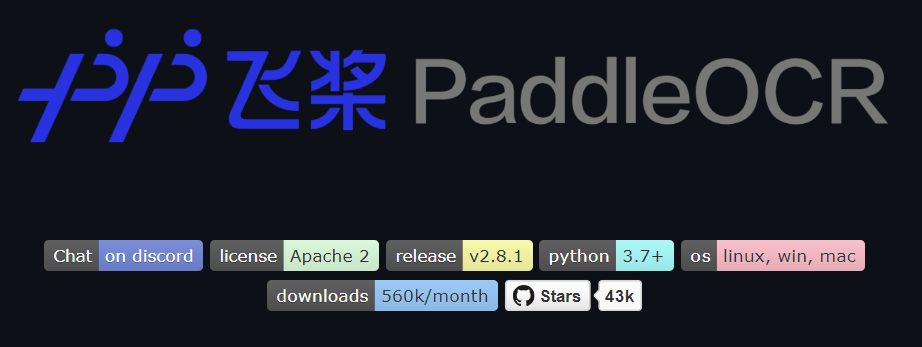
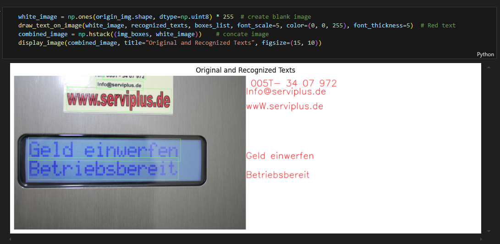

[English](./README.md) | [简体中文](./README_cn.md) | 日本語

# PaddleOCR 文字認識

- [PaddleOCR 文字認識](#paddleocr-文字認識)
  - [1. PaddleOCR 概要](#1-paddleocr-概要)
  - [2. 性能データ](#2-性能データ)
  - [3. モデルダウンロードアドレス](#3-モデルダウンロードアドレス)
  - [4. デプロイとテスト](#4-デプロイとテスト)


## 1. PaddleOCR 概要

PaddleOCRは、百度の飛桨（PaddlePaddle）に基づく深層学習を使用した光学文字認識（OCR）ツールであり、PaddlePaddleフレームワークを利用して画像中の文字認識タスクを実行します。このリポジトリは、画像前処理、文字検出、文字認識などの複数の段階を経て、画像中の文字を編集可能なテキストに変換します。PaddleOCRは多言語および多フォントの認識をサポートし、様々な複雑なシナリオにおける文字抽出タスクに適しています。PaddleOCRはカスタムトレーニングもサポートしており、ユーザーは特定のニーズに合わせてトレーニングデータを準備し、モデルのパフォーマンスをさらに最適化できます。

実際のアプリケーションでは、PaddleOCRのワークフローは以下のステップを含みます：

- **画像前処理**：入力画像に対してノイズ除去、サイズ調整などの処理を行い、后续の検出と認識に適した状態にします。
- **文字検出**：深層学習モデルを通じて画像中の文字領域を検出し、検出ボックスを生成します。
- **文字認識**：検出ボックス内の文字内容を認識し、最終的な文字結果を生成します。

本リポジトリで提供されるサンプルは、PaddleOCR公式が提供するアルゴリズム構造に基づいており、モデル変換と量子化を経て、高精度なエッジ側での文字検出と認識を実現しています。`runtime/python` に移動して Python スクリプトを実行することで、モデル推論の実際の結果を得ることができます。

**GitHubアドレス**：https://github.com/PaddlePaddle/PaddleOCR



## 2. 性能データ

**RDK X5 & RDK X5 モジュール**

データセット ICDAR2019-ArT

| モデル(公版)    | サイズ(ピクセル) | パラメータ数 | BPUスループット |
| --------------- | -------------- | ---------- | ------------- |
| PP-OCRv3_det    | 640x640        | 3.8 M      | 158.12 FPS    |
| PP-OCRv3_rec    | 48x320         | 9.6 M      | 245.68 FPS    |


**RDK X3 & RDK X3 モジュール**

データセット ICDAR2019-ArT

| モデル(公版)    | サイズ(ピクセル) | パラメータ数 | BPUスループット |
| --------------- | -------------- | ---------- | ------------- |
| PP-OCRv3_det    | 640x640        | 3.8 M      | 41.96 FPS     |
| PP-OCRv3_rec    | 48x320         | 9.6 M      | 78.92 FPS     |


## 3. モデルダウンロードアドレス

**.bin ファイルのダウンロード**：

スクリプト [download_model.sh](./model/download_model.sh) を使用して、このモデル構造のすべての .bin モデルファイルを一括ダウンロードできます：

```shell
cd model
bash download_model.sh
```

## 4. デプロイとテスト

.bin ファイルのダウンロードが完了した後、`runtime/python` ディレクトリに移動して Python スクリプトを実行し、実機でのテスト効果を体験してください。

```shell
# 実行ディレクトリに移動
cd runtime/python

# プリセットスクリプトを使用して実行
bash run.sh

# または、必要に応じてパラメータを指定して手動で実行
python3 main.py --det_model_path ../../model/en_PP-OCRv3_det_640x640_nv12.bin \
                --rec_model_path ../../model/en_PP-OCRv3_rec_48x320_rgb.bin \
                --image_path ../../test_data/paddleocr_test.jpg \
                --output_folder ../../test_data/output/predict.jpg
```

テスト画像を変更する場合は、カスタム画像を `test_data` フォルダに配置し、実行コマンドの `image_path` パラメータを変更してください。

