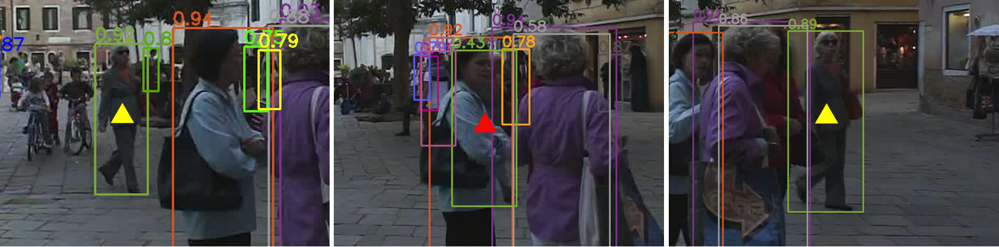
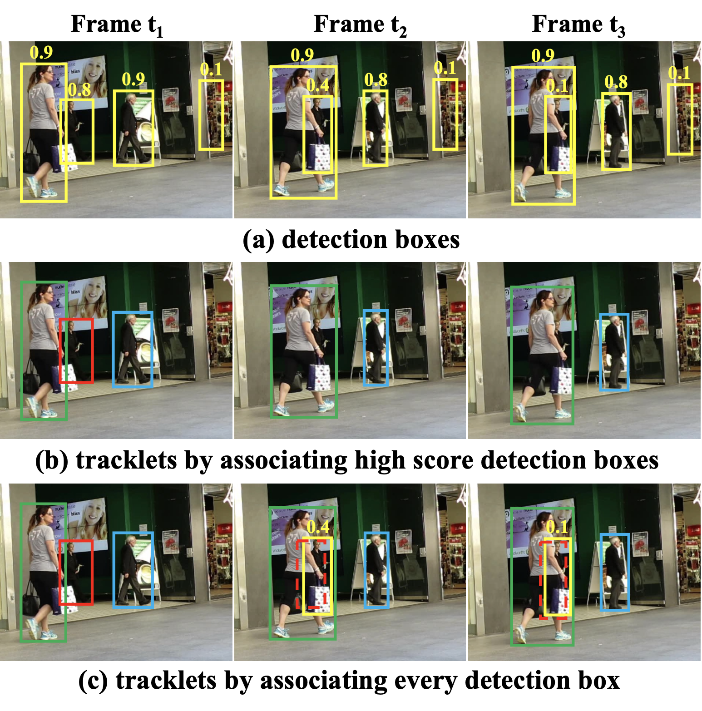

[English](README.md) | 简体中文

# ByteTrack

<a id="overview"></a>
## 算法与来源

ByteTrack 通过关联高置信度和低置信度检测框，在视频帧之间跟踪目标。恢复低分检测有助于在行人被遮挡时保持身份连续。本示例组合 YOLOv5x 行人检测器与 CPU BYTETracker。

参考：[ByteTrack: Multi-Object Tracking by Associating Every Detection Box](https://arxiv.org/abs/2110.06864).

<a id="directory"></a>
## 目录结构

```text
bytetrack/
├── conversion/  # 导出与量化配置
├── evaluator/  # 评估程序与指标
├── model/  # 模型文件与下载脚本
├── runtime/  # 推理程序
├── test_data/  # 示例输入
├── tests/  # 自动化测试
├── README.md  # 英文说明
├── README_cn.md  # 中文说明
└── requirements-host.txt  # 源码或数据文件
```

<a id="support-matrix"></a>
## 支持矩阵

| 目标 | 变体 | Python | C++ | 说明 |
|---|---|---|---|---|
| S100 | YOLOv5x 672 | 支持 | 不支持 | |
| S100P | YOLOv5x 672 | 支持 | 不支持 | 见下方下载说明 |
| S600 | YOLOv5x 672 | 支持 | 不支持 | |
| X5 | — | 不支持 | 不支持 | 无 ByteTrack 制品 |

S100P 的 manifest 行存在，但其发布下载 URL 曾被观测到返回 HTTP 404；若下载失败，请手动获取 YOLOv5x HBM 并放到 `--list-models` 显示的路径。

tracker 有状态：同一个 `ByteTrackTask` 必须按顺序处理帧。`reset` 清除流历史和 frame index，但故意不把进程级 track ID 计数器归零。

<a id="prerequisites"></a>
## 环境前提

主机 tracker 检查需要 Python、NumPy、SciPy、OpenCV、`lap==0.5.12` 和 `cython-bbox==0.1.5`。板端还需要目标 `hbm_runtime` 和精确 HBM。测试视频未随 `test_data` 提供，需显式从 `https://archive.d-robotics.cc/downloads/rdk_model_zoo/rdk_s100/ByteTrack/track_test.mp4` 准备。

<a id="quickstart"></a>
## 快速体验

在仓库根目录显式准备 S100 模型和视频，然后运行：

```bash
python3 -m samples.vision.bytetrack.model.download --target s100 \
  --output-dir samples/vision/bytetrack/model
curl -L 'https://archive.d-robotics.cc/downloads/rdk_model_zoo/rdk_s100/ByteTrack/track_test.mp4' \
  -o samples/vision/bytetrack/test_data/track_test.mp4
python3 -m samples.vision.bytetrack.runtime.python.main \
  --target s100 --asset-id s:bytetrack:s100/yolov5x_672x672_nv12.hbm \
  --model-path samples/vision/bytetrack/model/s100/yolov5x_672x672_nv12.hbm \
  --input samples/vision/bytetrack/test_data/track_test.mp4 \
  --output samples/vision/bytetrack/test_data/result_unified.mp4 \
  --records samples/vision/bytetrack/test_data/result_unified.jsonl
```

公开 `track_test.mp4` 的记录 SHA-256 为 `4bbe5bf11fe8967b28a900fd2add4949aba89b62076eaa03d0c55cdf7dd41397`；需要校验完整性时执行 `sha256sum track_test.mp4`（macOS：`shasum -a 256 track_test.mp4`）。成功推理会写出可解码 MP4 和可选逐帧 JSONL，打印帧数并退出 `0`。`run.sh` 不会安装或下载。

<a id="expected-results"></a>
## 预期结果

每帧输出零个或多个 person track，字段为 `track_id`、原图 `tlbr`、score 和 frame index，并写出指定视频。空检测仍推进 `frame_index` 并更新 tracker。若框完全落在 letterbox padding，clip 后可能出现零面积，XYAH 初始化会产生 NaN；task 在更新前剔除宽或高不正的 person 框。

适用条件与调参。`--score-thres`（默认 `0.25`）在 tracker 之前过滤检测框：检出框过少时调低它——调低 `--track-thresh` 找不回被 detector 丢弃的框。`--track-thresh`（`0.3`）只划分 tracker 输入：高于它的框进入第一次关联，(0.1, `track-thresh`) 区间的框与仍在跟踪的目标进行第二次关联，新轨迹只从得分不低于 `track_thresh + 0.1` 的第一次关联框初始化。若 track ID 频繁切换，可考虑调大 `--match-thresh`（`0.8`，第一次关联接受的最大代价——1 − IoU，默认模式与检测分数融合，`--mot20` 时不融合；越大允许越不相似的匹配）或加长 `--track-buffer`（`60`，丢失轨迹窗口，按 `frame_rate / 30` 缩放）。这些是调参方向，不是重新标定的阈值。当前流程只跟踪 COCO `person`；多类别跟踪需要每类一个 tracker 或扩展 tracker 使其感知类别（见 [evaluator 说明](evaluator/README_cn.md)）。

检测器保留 COCO `person` 类别 `0`。BYTETracker 先关联高分框，再用 IoU 将剩余轨迹与低分框关联；只有未匹配的高分框会初始化新轨迹。




<a id="entry-points"></a>
## 入口索引

- [`model/README_cn.md`](./model/README_cn.md)：三个 target 的 HBM 和显式准备。
- [`runtime/python/README_cn.md`](./runtime/python/README_cn.md)：有状态 Task API 与完整 CLI。
- [`conversion/README_cn.md`](./conversion/README_cn.md)：仅 detector 的转换边界。
- [`evaluator/README_cn.md`](./evaluator/README_cn.md)：评测命令、输出与对照说明。

<a id="historical-performance"></a>
## 源性能参考

源记录 RDK S100 tracker update 约 `2.37 ms`。论文报告 V100 GPU 上 `80.3 MOTA`、`77.3 IDF1`、约 `30 FPS`。

<a id="license"></a>
## 许可

仓库 脚本 遵循 Apache-2.0。随附 tracker 源码树没有单独的 license 文件；其来源记录在 `TRACKER_SOURCE_MAP.json`。上游 ByteTrack 与模型权重遵循各自许可。
