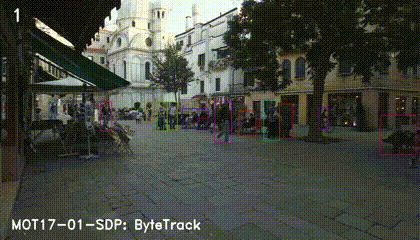
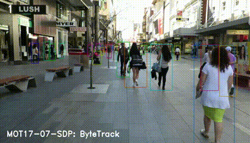

# ByteTrack 评估器

<a id="dataset"></a>
## 数据集

源有静态图和参考 GIF/PNG，但没有 `track_test.mp4` 或 MOT ground-truth 目录。需从 `https://archive.d-robotics.cc/downloads/rdk_model_zoo/rdk_s100/ByteTrack/track_test.mp4` 显式准备，本轮未下载。评估器比较两次完整源/统一 capture，不计算带标签数据集的 MOTA/IDF1。

<a id="environment"></a>
## 环境

真实 capture 需要已识别的 S 板卡、准备好的 HBM/视频、`hbm_runtime`、OpenCV、NumPy、SciPy、`lap==0.5.12` 和 `cython-bbox==0.1.5`。`compare.py` 为 legacy 和 unified 启动新进程，使进程级 ID 从相同起点开始。主机测试使用 fake detector runtime 和真实 CPU tracker 依赖，不能作为板端证据。

<a id="command"></a>
## 评估命令

从仓库根目录准备模型/视频并选择新的输出目录后：

```bash
python3 samples/vision/bytetrack/evaluator/compare.py \
  --target s100 \
  --asset-id s:bytetrack:s100/yolov5x_672x672_nv12.hbm \
  --model-path samples/vision/bytetrack/model/s100/yolov5x_672x672_nv12.hbm \
  --input samples/vision/bytetrack/test_data/track_test.mp4 \
  --output-dir /tmp/bytetrack-evidence-unique \
  --max-frames 30
```

命令保存每帧图片、native detector 输入/输出、track 记录、metadata、模型/视频/代码 hash 和子进程日志到 `legacy/`、`unified/`、`comparison.json`。只有 frame/input/track ID 在声明容差内全部一致才返回 `0`，已有输出目录会拒绝。本轮没有板端运行。

<a id="metrics"></a>
## 指标

输入要求精确一致；native 输出要求 shape/dtype 相同并使用 `rtol=0, atol=1e-5`；track ID 精确，boxes `atol=1e-4`，score `1e-5`。这是源/统一一致性检查，不是 MOT 精度。空帧也必须对齐。源非有限 track 会记录 error 并失败，不用 `allclose` 放宽。

<a id="outputs"></a>
## 输出

每侧保留完整 `.npy` 图片/输入/输出数组和 `capture.json`；顶层 `comparison.json` 保留两个子进程结果和全部检查。失败运行也保留 error。因为 ID 是进程级计数，必须使用新进程；单进程 `reset()` 只清除 frame 状态，不重置 ID。

<a id="reference-results"></a>
## 参考结果

| 参考 | 条件 | 数值 | 状态 |
|---|---|---:|---|
| 源 tracker update | RDK S100 | 2.37 ms average | 历史/not-run |
| ByteTrack 论文 MOTA | MOT17 test / V100 | 80.3 | 论文参考 |
| ByteTrack 论文 IDF1 | MOT17 test / V100 | 77.3 | 论文参考 |
| ByteTrack 论文吞吐 | V100 GPU | about 30 FPS | 论文参考 |

这些是源/论文历史参考。当前板端 capture 和 MOT benchmark 状态为 `not-run`。

### 参考跟踪效果（历史）

固定 S 源 evaluator 嵌入了两段 MOT17 `SDP` 序列上的 ByteTrack 动态参考效果。此处逐字保留，作为上游方法在这些序列上的历史可视化；本迁移没有在板端重跑：



`MOT17-01-SDP` 序列，源参考 GIF（`../test_data/readme_img/MOT17-01-SDP.gif`，S pin `380e1a2`，sha256 `6b7a613f…`）。



`MOT17-07-SDP` 序列，源参考 GIF（sha256 `ff99c85a…`）。

### tracker 参数调优与适用条件

沿用源调参说明，并已对照本 sample 的 tracker 代码核实：

- `--score-thres`（默认 `0.25`）：在 tracker 之前生效的检测置信度过滤；检出框过少时调低。调低 `--track-thresh` 不能找回 detector 已丢弃的框。
- `--track-thresh`（默认 `0.3`）：每帧划分 tracker 输入——高于它的分数进入第一次关联；(0.1, track-thresh) 区间的分数以固定代价上限 `0.5` 与仍在跟踪的目标进行第二次关联；新轨迹只从首次关联中未匹配且分数 ≥ `track_thresh + 0.1`（`det_thresh`）的框初始化。
- `--match-thresh`（默认 `0.8`）：第一次关联分配接受的最大代价（代价 = 1 − IoU，默认模式与检测分数融合；`--mot20` 开关（默认 `false`）关闭融合，此时代价即 1 − IoU）。调大允许更不相似的匹配，调小则只允许更接近的重叠。第二次关联保持固定 `0.5` 上限。
- `--track-buffer`（默认 `60`）：丢失轨迹保留窗口，以 30 fps 帧数表示，并按 `frame_rate / 30` 缩放（`--frame-rate`，默认 `30`）。

多类别跟踪时，可为每个类别各维护一个 tracker，或扩展 tracker 携带 `class_id` 并在关联时处理类别信息。当前流程只保留 COCO `person`（class `0`）。

<a id="boundaries"></a>
## 边界

对照器不下载模型/视频、不转换模型，也不会把 fake-runtime 测试写成板端支持。源和统一必须使用相同 target HBM 与视频。源 letterbox 零面积/NaN 边界会作为失败证据暴露；统一过滤非正 person 框的行为已在 runtime 文档说明。
