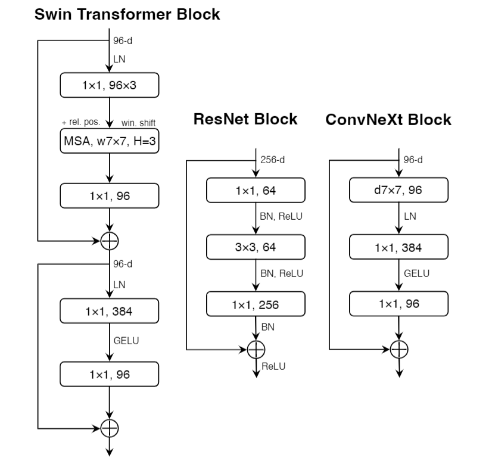
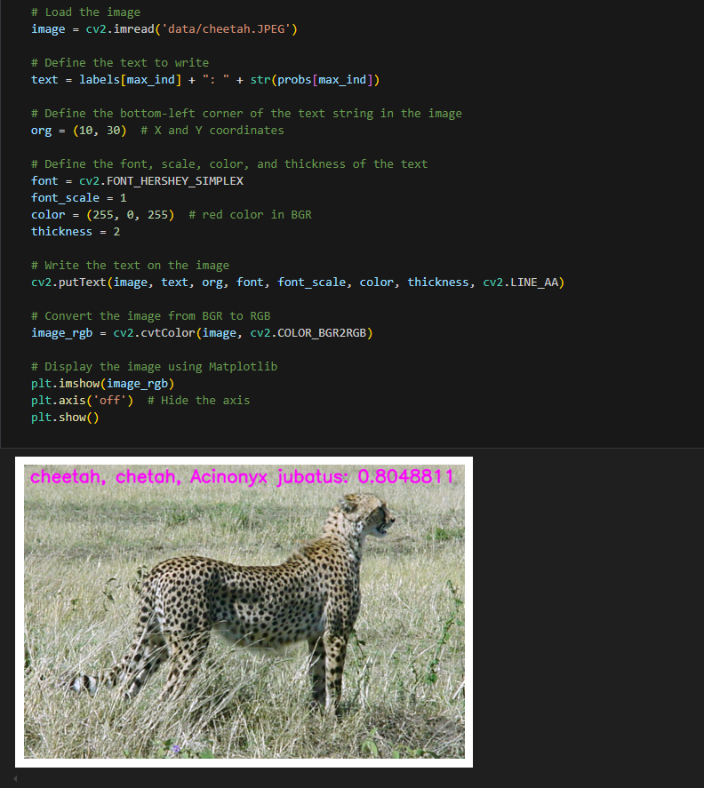

[English](./README.md) | 简体中文

# ConvNeXt 模型说明

本目录描述 ConvNeXt 在本 Model Zoo 中的完整使用流程，包括：算法介绍、模型转换、运行时推理（Python）、可复用的前后处理接口说明，以及模型评估步骤。

---

## 算法介绍（Algorithm Overview）

ConvNeXt 是一种卷积神经网络，从原始的 ResNet 出发，通过借鉴 Swin Transformer 的 design 来逐步地改进模型。

- **论文**: [A ConvNet for the 2020s](https://arxiv.org/abs/2201.03545)
- **官方实现**: [facebookresearch/ConvNeXt](https://github.com/facebookresearch/ConvNeXt)

### 算法功能

ConvNeXt 能完成以下任务：

- ImageNet 1000 类图像分类
- 输出 Top-K 类别及其置信度

### 算法特性

ConvNeXt 网络结构中使用了更大的卷积核（7x7）、ReLU 替换为 GELU 激活函数、更少的激活函数、LayerNorm 替代 BatchNorm，以及减少了下采样的频率。

- **大核卷积**：使用大核 (7x7) 卷积代替传统的 3x3 卷积，有助于扩大感受野
- **深度可分离卷积**：类似于 MobileNet 和 EfficientNet，显著减少参数量和计算成本
- **归一化层**：用 LayerNorm 替换了传统的 BatchNorm，更适应于小批量数据
- **简化的残差连接**：简化了全连接层的设计，去掉了 ResNet 中的瓶颈结构



---

## 目录结构（Directory Structure）

本目录包含：

```bash
.
├── conversion                          # 模型转换流程
│   ├── ConvNeXt_atto.yaml              # ConvNeXt atto 模型转换配置
│   ├── ConvNeXt_femto.yaml             # ConvNeXt femto 模型转换配置
│   ├── ConvNeXt_nano.yaml              # ConvNeXt nano 模型转换配置
│   ├── ConvNeXt_pico.yaml              # ConvNeXt pico 模型转换配置
│   ├── README.md                       # 使用说明 (英文)
│   └── README_cn.md                    # 使用说明 (中文)
├── evaluator                           # 模型评估相关内容
│   ├── README.md                       # 使用说明 (英文)
│   └── README_cn.md                    # 使用说明 (中文)
├── model                               # 模型文件及下载脚本
│   ├── download.sh                     # BIN 模型下载脚本
│   ├── README.md                       # 使用说明 (英文)
│   └── README_cn.md                    # 使用说明 (中文)
├── runtime                             # 模型推理示例
│   ├── cpp                             # C++ 推理工程（待实现）
│   └── python                          # Python 推理示例
│       ├── main.py                     # Python 推理入口脚本
│       ├── convnext.py                 # ConvNeXt 推理与后处理实现
│       ├── run.sh                      # Python 示例运行脚本
│       ├── README.md                   # 使用说明 (英文)
│       └── README_cn.md                # 使用说明 (中文)
├── test_data                           # 推理结果与示例数据
│   ├── cheetah.JPEG                    # 示例输入图像
│   ├── ConvNeXt_Block.png              # 算法架构图
│   └── inference.png                   # 示例推理结果图像
└── README.md                           # ConvNeXt 示例整体说明与快速指引
```

---

## 快速体验（QuickStart）

为了便于用户快速上手体验，每个模型均提供了 `run.sh` 脚本，用户运行此脚本即可一键运行相应模型。

### Python

- 进入 `runtime` 目录下的 `python` 目录，运行 `run.sh` 脚本，即可快速体验
    ```bash
    cd runtime/python/
    chmod +x run.sh
    ./run.sh
    ```
- 若想了解 `python` 代码的详细使用方法，请参考 [runtime/python/README_cn.md](./runtime/python/README_cn.md)

---

## 模型转换（Model Conversion）

- ModelZoo 已提供适配完成的 BIN 模型文件，用户可直接运行 `model` 目录下的 `download.sh` 脚本下载并使用，如不关心模型转换流程，**可跳过本小节**。

- 如需自定义模型转换参数，或了解完整的模型转换流程，请参考 [conversion/README_cn.md](./conversion/README_cn.md)。

---

## 模型推理（Runtime）

ConvNeXt 模型推理示例提供 Python 实现方式。

### Python 版本

- 以脚本形式提供，适合快速验证模型效果与算法流程
- 示例中展示了模型加载、推理执行、后处理以及结果可视化的完整过程
- 具体使用方法、参数说明及接口说明请参考 [runtime/python/README_cn.md](./runtime/python/README_cn.md)

---

## 模型评估（Evaluator）

`evaluator/` 用于模型精度、性能及数值一致性评估，详细说明请参考 [evaluator/README_cn.md](./evaluator/README_cn.md)。

---

## 性能数据

下表展示 ConvNeXt 系列模型在 RDK X5 平台上的实际测试性能数据。

| 模型 | 尺寸 | 类别数 | 参数量 (M) | 浮点精度 Top-1 | 量化精度 Top-1 | 延迟 (ms) | 帧率 (FPS) |
| --- | --- | --- | --- | --- | --- | --- | --- |
| ConvNeXt_nano | 224x224 | 1000 | 15.59 | 77.37% | 71.75% | 5.71 | 200+ |
| ConvNeXt_pico | 224x224 | 1000 | 9.04 | 77.25% | 71.03% | 3.37 | 364+ |
| ConvNeXt_femto | 224x224 | 1000 | 5.22 | 73.75% | 72.25% | 2.46 | 556+ |
| ConvNeXt_atto | 224x224 | 1000 | 3.69 | 73.25% | 69.75% | 1.96 | 732+ |

**说明：**
1. 测试平台：RDK X5，CPU 8xA55@1.8G，BPU 1xBayes-e@1G (10TOPS INT8)
2. 延迟数据为单帧单线程、单 BPU 核心下的理想情况
3. 帧率数据为 4 线程并发场景，可实现 100% BPU 利用率



---

## License

遵循 Model Zoo 顶层 License。
