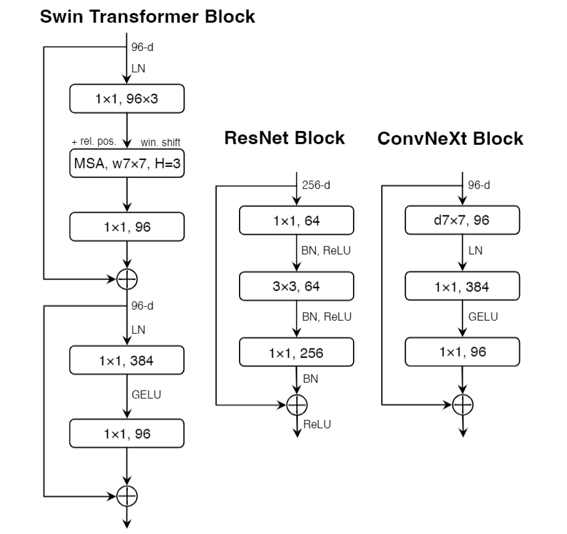

[English](README.md) | 简体中文

# ConvNeXt 图像分类

ConvNeXt 是采用大核深度卷积和 Transformer 风格模块的图像分类网络。

来源：[A ConvNet for the
2020s](https://arxiv.org/abs/2201.03545) · [facebookresearch/ConvNeXt](https://github.com/facebookresearch/ConvNeXt)

<a id="overview"></a>

## 概述

ConvNeXt 是从原始 ResNet 出发、逐步借鉴 Swin Transformer 设计改造而来的纯
卷积网络（"A ConvNet for the 2020s"）。它面向 ImageNet-1k 1000 类图像
分类，输出 Top-K 类别及置信度。相对经典 ResNet 的四项设计改动：

- **大核深度可分离卷积**——用 7×7 深度卷积替代传统 3×3 卷积，在
  MobileNet/EfficientNet 量级的参数与计算成本下扩大感受野。
- **更少的激活函数，GELU 替代 ReLU**——激活层更稀疏，非线性采用
  Transformer 风格。
- **LayerNorm 替代 BatchNorm**——对小批量数据更稳。
- **简化的残差设计**——精简全连接部分，去掉 ResNet 的瓶颈结构。



*图：ConvNeXt 论文的 block 对比——Swin Transformer block（左）、ResNet
block（中）、ConvNeXt block（右）。图中为上游训练结构；X5 上部署的制品
为 INT8 量化的 atto 变体（224×224 NV12，见[支持范围](#support-matrix)）。*

Python 入口见 `runtime/python/main.py`，模型推理流程在 `classify.py`，参数和结果展示在 `cli.py`。
[runtime/python/README_cn.md](runtime/python/README_cn.md)

<a id="directory"></a>
## 目录结构

```text
convnext/
├── conversion/  # 导出与量化配置
├── evaluator/  # 评估程序与指标
├── model/  # 模型文件与下载脚本
├── runtime/  # 推理程序
├── test_data/  # 示例输入
├── tests/  # 自动化测试
├── README.md  # 英文说明
├── README_cn.md  # 中文说明
└── requirements-host.txt  # Python 依赖
```

<a id="support-matrix"></a>
## 支持范围

| Target | 变体 | 语言 | 状态 |
| --- | --- | --- | --- |
| x5 | atto | python | supported |
| s100 / s100p / s600 | 任意 | python | not-supported（按支持矩阵选择目标与变体） |

<a id="prerequisites"></a>
## 环境前提

板端 Python 运行需要镜像中与板卡匹配的 `hbm_runtime`、NumPy 和
OpenCV-Python；只有真正执行模型时才导入 SDK（`--help`、`--list-models`、
`--dry-run` 与主机测试均不需要 SDK）。读取 Manifest 还需要 PyYAML。开发
主机可从 `requirements-host.txt` 安装用户态依赖：

```bash
# cwd：仓库根目录 — 成功判据：输出 "host dependencies: ok"
python3 -m venv .venv-convnext
source .venv-convnext/bin/activate
python3 -m pip install -r samples/vision/convnext/requirements-host.txt
python3 -c "import cv2, numpy, yaml; print('host dependencies: ok')"
```

<a id="quickstart"></a>
## 快速体验

在 X5 板卡上的一条完整路径（命令在仓库根目录执行）。前置条件：带
`hbm_runtime` 的板卡镜像与可访问 Manifest 模型服务器的网络。

```bash
# 1. 准备制品（输入：Manifest 行 x5:convnext:ConvNeXt_atto_224x224_nv12.bin）
#    输出：samples/vision/convnext/model/ConvNeXt_atto_224x224_nv12.bin
#    成功判据：下载器退出码 0 并打印实测摘要
bash samples/vision/convnext/model/download.sh x5

# 2. 运行分类（输入：上一步制品 + 随附测试图）
#    输出：stdout 上的 Top-5 类别 ID、分数、标签
#    成功判据：退出码 0 且打印 Top-5 列表
python3 samples/vision/convnext/runtime/python/main.py \
  --target x5 \
  --asset-id x5:convnext:ConvNeXt_atto_224x224_nv12.bin \
  --model-path samples/vision/convnext/model/ConvNeXt_atto_224x224_nv12.bin \
  --test-img samples/vision/convnext/test_data/cheetah.JPEG \
  --label-file datasets/imagenet/imagenet_classes.names
```

缺省变体（未指定时）为 `atto`，即唯一已发布变体。
完整命令见 [runtime/python/README_cn.md](runtime/python/README_cn.md)。

<a id="expected-results"></a>
## 预期结果

Python 运行打印稳定的 Top-K（默认 5）类别 ID、分数与标签并退出 0；除非
指定 `--img-save-path`，不写任何输出文件。使用随附 `cheetah.JPEG` 时 Top-5
含猎豹相关 ImageNet 类别。按支持矩阵选择目标并准备对应制品；运行时会在加载模型前核验板卡身份。

下图为 X5 发布的参考运行效果：demo 将 top-1 标签画在随附的
`cheetah.JPEG` 上（即 `--img-save-path` 写出的可视化）；该记录运行返回
类别 293 `cheetah, chetah, Acinonyx jubatus`，分数 0.8048811。


<a id="performance"></a>
## 性能数据

ConvNeXt 系列在 RDK X5 上的发布性能（X5 发布 x5-v1.1.3；Float Top-1 为
量化前 ONNX 结果，Quant Top-1 为部署模型结果；延迟为单帧单线程单核，
FPS 为 4 线程并发；CPU 8xA55@1.8GHz 性能模式、BPU 1xBayes-e@1GHz）：

| 模型 | 尺寸 | 类别数 | 参数量 (M) | Float Top-1 | Quant Top-1 | 延迟 (ms) | FPS |
| --- | --- | --- | --- | --- | --- | --- | --- |
| ConvNeXt_nano | 224x224 | 1000 | 15.59 | 77.37% | 71.75% | 5.71 | 200+ |
| ConvNeXt_pico | 224x224 | 1000 | 9.04 | 77.25% | 71.03% | 3.37 | 364+ |
| ConvNeXt_femto | 224x224 | 1000 | 5.22 | 73.75% | 72.25% | 2.46 | 556+ |
| ConvNeXt_atto | 224x224 | 1000 | 3.69 | 73.25% | 69.75% | 1.96 | 732+ |

全部数值引自 X5 发布的同一张性能表。仅 atto 提供可下载制品（见
[model/README_cn.md](model/README_cn.md)）；nano 与 femto 对应
[conversion/](conversion/README_cn.md) 中的参考 PTQ 配方，无已发布制品。

<a id="entry-points"></a>
## 入口

- 模型准备：[model/README_cn.md](model/README_cn.md)
- Python 运行时：[runtime/python/README_cn.md](runtime/python/README_cn.md)
- 转换：[conversion/README_cn.md](conversion/README_cn.md)
- 评估：[evaluator/README_cn.md](evaluator/README_cn.md)

<a id="license"></a>
## 许可

样例代码遵循仓库顶层 LICENSE（Apache-2.0）。源模型与权重遵循上游 ConvNeXt 发行版
（[facebookresearch/ConvNeXt](https://github.com/facebookresearch/ConvNeXt)）的许可。已发布制品按平台发布 Manifest 提供。
