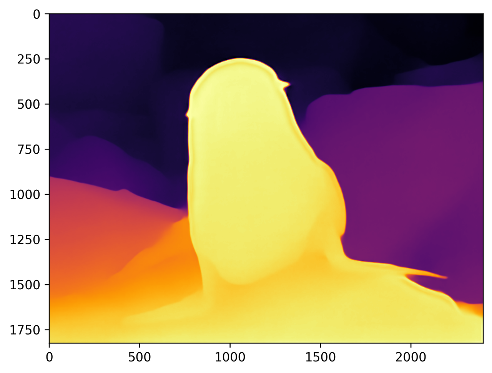

[English](README.md) | [简体中文](README_cn.md)

# Depth Anything V2

<a id="overview"></a>
## 概览

使用已发布的 S100 HBM，从单张图片估计稠密相对深度。样例把前处理、推理、后处理
与 SDK 资源、图片 IO、可视化分离，人和 Agent 使用相同入口。结果包含原图尺寸
浮点深度和 INFERNO 显示图片；深度为相对量，不是校准后的米。

源文档介绍了 V2 使用合成标注训练图、扩大教师模型、利用伪标注真实图片来改善
细节和鲁棒性。保留其框架图及上游引用作为背景，不代表对该编译制品的新验证：


源文档列出的参考：[项目](https://depth-anything.github.io/)、
[论文](https://arxiv.org/abs/2406.19675)、
[上游仓库](https://github.com/DepthAnything/Depth-Anything-V2)。

<a id="support-matrix"></a>
## 支持与验证

| 目标 | 已发布制品 | 实现 | 当前验证 |
| --- | --- | --- | --- |
| S100 | `s100/depth_any.hbm`；发布者摘要未知 | Python | 仅主机替身；板测 not-run |
| S100P | 无独立清单制品 | 显式拒绝 | 源文字提到支持，但兼容性未建立 |
| S600 / X5 | 无清单制品 | 显式拒绝 | 不推测替代制品 |

源中没有 C++ 实现。图内 int16 量化不代表公开张量也是 int16：源 IO 契约为 RGB
float32 `[1,3,518,686]` 和 float32 深度 `[1,518,686]`，加载时检查元数据。
本轮主机迁移没有观察实际制品元数据。源声明和历史记录不能证明当前板端验收。

<a id="prerequisites"></a>
## 前提

使用具有兼容厂商 `hbm_runtime` 的 S100 Linux 镜像，以及 Python、NumPy、OpenCV、
PyYAML。主机检查无需 SDK。推理不会安装依赖或下载模型，需显式准备。源实现仅为
尺寸恢复依赖 Torch，当前改用 OpenCV 线性插值，不声称与 Torch 逐位相等；参见
[运行时契约](runtime/python/README_cn.md)。

<a id="quickstart"></a>
## 快速开始

在仓库根目录，无模型、无板卡时可先检查：

```bash
python -m samples.vision.depth_anything_v2.runtime.python.main --list-models
python -m samples.vision.depth_anything_v2.runtime.python.main --target s100 --dry-run
```

显式准备模型，然后在实际 S100 执行：

```bash
bash samples/vision/depth_anything_v2/model/download.sh --target s100
bash samples/vision/depth_anything_v2/runtime/python/run.sh --target s100 \
  --output outputs/depth-anything-s100
```

脚本以仓库根目录解析用户相对路径。输出目录必须不存在。默认输入为内置
`furseal.jpg`。可用 `--img-save-path result.jpg` 额外保存源风格彩色图片，该路径也
必须不存在。`auto` 选择唯一 S100 制品，但执行仍验证本机身份；改成 S100 文件名
不能让 S100P 获得兼容性。

<a id="expected-results"></a>
## 预期结果与明确修正

成功时写入 `raw_depth.npy`、`depth_native.npy`、`depth_gray.png`、
`depth_color.png`、`report.json`。报告记录本地模型/输入摘要、选择、运行时元数据
和前处理策略，不测延迟。未知发布者摘要和运行时版本如实保留。



此图是保留的源记录，不是本轮输出。颜色逐图归一化，颜色相似不证明深度相等或
精度合格。恒定深度现在得到全零灰度，避免除零。

源实际前处理为**逐像素 RGB z-score**，不是注释所说的 ImageNet 常量。
默认仍使用最近邻拉伸。可选 letterbox 保留源线性插值/127 填充，但现在先裁去
填充再恢复尺寸。task 返回浮点深度，替代旧 uint8 显示 API；着色另行处理。
这些变化及兼容边界记录在[源审计](../../../docs/releases/unified-migration/2026-09-26-b8-depth-anything-source-review.md)。

<a id="directory"></a>
## 目录

| 目录 | 职责 |
| --- | --- |
| [model](model/README_cn.md) | 精确制品、显式下载、路径和未知摘要 |
| [runtime/python](runtime/python/README_cn.md) | 阶段、SDK runner、CLI、渲染、来源记录 |
| [conversion](conversion/README_cn.md) | 源 ONNX/量化事实及缺失转换前提 |
| [evaluator](evaluator/README_cn.md) | 历史性能、解释与未验证数据集范围 |
| test_data | 原始 furseal 图片与源说明/结果图 |
| tests | 主机替身，不能替代硬件证据 |

<a id="entry-points"></a>
## 入口

先使用上述命令，再看运行时文档的 API 和阶段表。转换/评测说明保留源细节并指出
缺失输入。[原始 S 源](../../../platforms/s/samples/vision/depth_anything_v2/README_cn.md)
仍可查阅，其自动安装/下载脚本和 API 属于历史入口。统一入口不声称完成板测、
数据集评分、模型转换或 SDK 兼容性验收。

<a id="license"></a>
## 许可

样例代码使用仓库 [Apache 2.0 许可](../../../LICENSE)。上游权重、训练数据和编译
制品仍适用各自条款；此页不额外授予相关权利。
