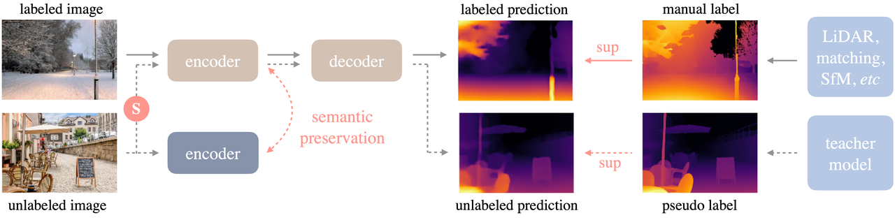

[English](README.md) | [简体中文](README_cn.md)

# Depth Anything V2

<a id="overview"></a>
## 概览

使用已发布的 S100 HBM，从单张图片估计稠密相对深度。样例把前处理、推理、后处理
与 SDK 资源、图片 IO、可视化分离，人和 Agent 使用相同入口。结果包含原图尺寸
浮点深度和 INFERNO 显示图片；深度为相对量，不是校准后的米。

V2 方法使用合成标注训练图、扩大教师模型、利用伪标注真实图片来改善细节和鲁棒性。
框架图来自源记录：



参考：[项目](https://depth-anything.github.io/)、
[论文](https://arxiv.org/abs/2406.19675)、
[上游仓库](https://github.com/DepthAnything/Depth-Anything-V2)。

<a id="directory"></a>
## 目录结构

```text
depth_anything_v2/
├── conversion/  # 导出与量化配置
├── evaluator/  # 评估程序与指标
├── model/  # 模型文件与下载脚本
├── runtime/  # 推理程序
├── test_data/  # 示例输入
├── tests/  # 自动化测试
├── README.md  # 英文说明
└── README_cn.md  # 中文说明
```

<a id="support-matrix"></a>
## 支持矩阵

| 目标 | 已发布制品 | 实现 |
| --- | --- | --- |
| S100 | `s100/depth_any.hbm`；发布者摘要未知 | Python |
| S100P | 无独立清单制品 | 显式拒绝 |
| S600 / X5 | 无清单制品 | 显式拒绝 |

未提供 C++ 实现。图内 int16 量化不改变公开张量契约：RGB float32 `[1,3,518,686]`
输入、float32 深度 `[1,518,686]` 输出，加载时检查张量元数据。

<a id="prerequisites"></a>
## 前提

使用具有兼容厂商 `hbm_runtime` 的 S100 Linux 镜像，以及 Python、NumPy、OpenCV、
PyYAML。主机检查无需 SDK。推理不会安装依赖或下载模型，需显式准备。尺寸恢复
使用 OpenCV 线性插值（源实现依赖 Torch 完成该步骤），与 Torch 结果在浮点舍入内一致；
参见[运行时契约](runtime/python/README_cn.md)。

<a id="quickstart"></a>
## 快速开始

在仓库根目录，无模型、无板卡时可先检查：

```bash
python -m samples.vision.depth_anything_v2.runtime.python.main --list-models
python -m samples.vision.depth_anything_v2.runtime.python.main --target s100 --dry-run
```

显式准备模型，然后在实际 S100 执行：

```bash
bash samples/vision/depth_anything_v2/model/download.sh --target s100
bash samples/vision/depth_anything_v2/runtime/python/run.sh --target s100 \
  --output outputs/depth-anything-s100
```

脚本以仓库根目录解析用户相对路径。输出目录必须不存在。默认输入为内置
`furseal.jpg`。可用 `--img-save-path result.jpg` 额外保存源风格彩色图片，该路径也
必须不存在。`auto` 选择唯一 S100 制品，但执行仍验证本机身份；改成 S100 文件名
不能让 S100P 获得兼容性。

<a id="expected-results"></a>
## 预期结果

成功时写入 `raw_depth.npy`、`depth_native.npy`、`depth_gray.png`、
`depth_color.png`、`report.json`。报告记录本地模型/输入摘要、选择、运行时元数据
和前处理策略，不测延迟。未知发布者摘要和运行时版本如实保留。


颜色按每张图独立归一化，跨图比较深度请使用数组数值。恒定深度得到全零灰度，
避免除零。

前处理为**逐像素 RGB z-score**（不是原始注释中提到的 ImageNet 常量）。默认使用
最近邻拉伸。可选 letterbox 使用线性插值/127 填充，并在恢复尺寸前先裁去填充。
task 返回浮点深度；uint8 显示 API 属于单独的可视化步骤。

<a id="entry-points"></a>
## 入口

先使用上述命令，再看运行时文档的 API 和阶段表。转换说明记录源 ONNX/量化事实与
缺失的转换前提；评测说明记录源性能记录。

<a id="license"></a>
## 许可

样例代码使用仓库 [Apache 2.0 许可](../../../LICENSE)。上游权重、训练数据和编译
制品仍适用各自条款；此页不额外授予相关权利。
