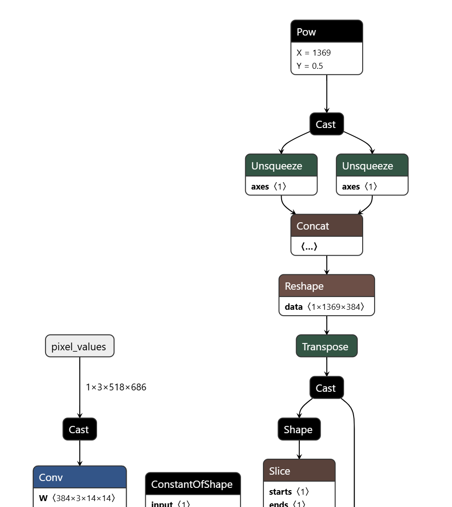

[English](README.md) | [简体中文](README_cn.md)

# Conversion record and missing prerequisites

## Source model

The source provides diagrams and conversion notes, **not an executable recipe**.
It does not pin the original checkpoint/encoder, weights checksum, export script,
exported ONNX checksum or upstream revision. Obtain these before attempting to
reproduce the published HBM. Choosing any similarly named V2 checkpoint is not
evidence that it matches `depth_any.hbm`.

## Toolchain and targets

The source names S100 OpenExplore on an x86 Linux host and int16 quantization.
It does not pin the Docker image/package/compiler versions. Its references are
[OE environment](https://developer.d-robotics.cc/rdk_doc/rdk_s/Advanced_development/toolchain_development/overview)
and [toolchain manual](https://toolchain.d-robotics.cc/). These are source resource
links, not a version lock or a procedure executed here. Only the S100 artifact is
published in the manifest; S100P support in source prose has no separate asset or
compatibility evidence. Do not relabel that artifact for S100P/S600.

## Recorded ONNX boundary

Input is RGB NCHW `[1,3,518,686]`; output is depth `[1,518,686]`.
The runtime expects float32 public IO. The source graph contains Add, Conv, Mul,
MatMul and attention-related Softmax; these facts do not specify export options.

No export command is supplied because its weights, code and options are missing.
Once obtained, inspect names, layouts, dynamic axes and normalization boundaries
against the runtime binding before compilation.

## Calibration

The source provides no calibration images, sample count, random seed, transform
script or preprocessing configuration. Runtime actually uses per-pixel RGB
z-score with epsilon1e-5 after nearest-neighbor stretching; its docstring's
ImageNet-mean claim is wrong. This observation is not proof that the unavailable
calibration recipe used the same transform. Confirm where normalization lives
and avoid adding it twice. Optional letterbox is a different evaluation protocol.

## Compilation

There is no compile YAML or launch script in the source. Before supplying a real
command, pin the compiler version, march, ONNX, input layout/type, normalization
boundary, calibration set and quantization configuration. Preserve tool logs and
file digests. An example command with invented defaults would conceal these gaps;
this directory intentionally contains documentation rather than such a command.

## Validation and historical similarity

The source reports most operator similarities above .99 and final quantization
similarity about .999; the statistic, dataset and reproducible raw logs are not
supplied. This is not dataset depth accuracy or a newly measured result.

A real reproduction needs matching float/quantized inputs, raw output shape and
values, explicit relative-depth metrics and software/artifact identity. Compare
float arrays before per-image display normalization. Internal int16 quantization
cannot be used to infer the exposed output dtype. No export, compilation or
converted-model validation has been run in this migration.

## Artifact

The existing manifest artifact is `model/s100/depth_any.hbm`, with unknown publisher
SHA-256. Use the [model guide](../model/README.md) for explicit download and path
selection. Local hashes identify bytes, not missing publisher provenance.
Generated models must be bound to their actual metadata; identical filenames do
not establish compatible normalization, layout or depth semantics.

## Known gaps

Missing: checkpoint/encoder identity, upstream revision, export code/options,
ONNX checksum, calibration dataset/transform, compiler image/version, compile
configuration, raw similarity logs and real board validation. These are actionable
inputs to collect for a future recipe, not work claimed complete by the current
host migration. No C++ conversion path or extra target is invented.
