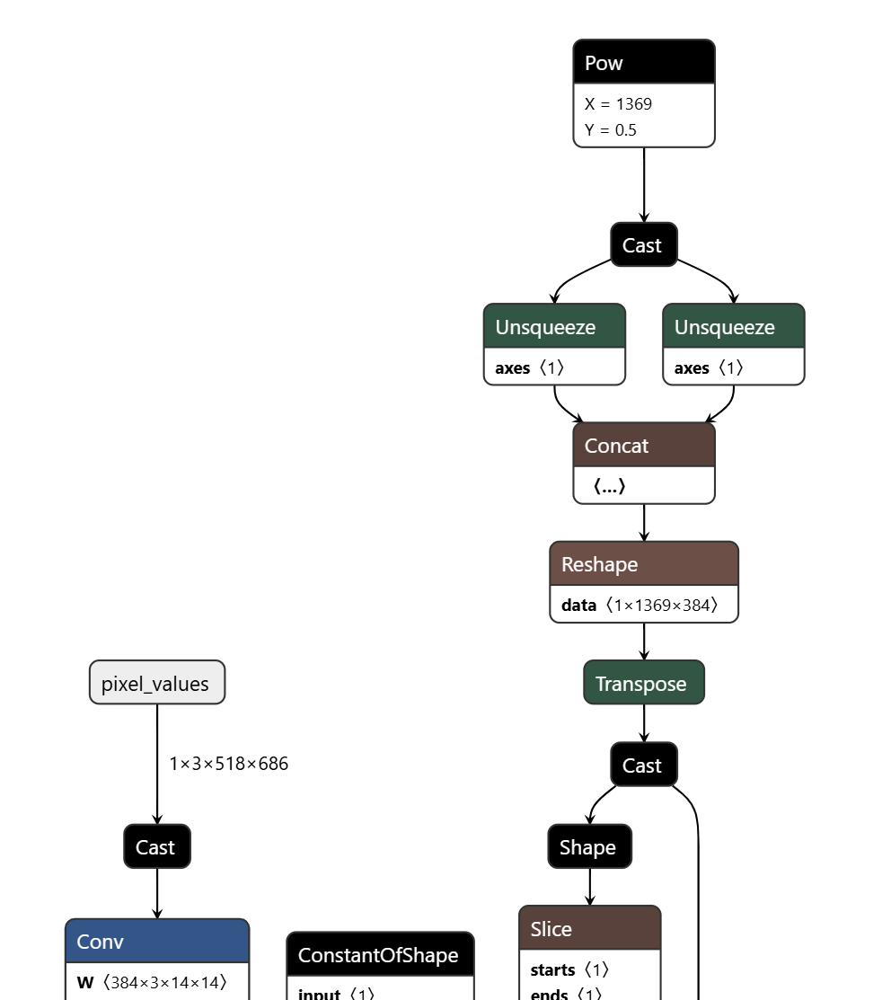
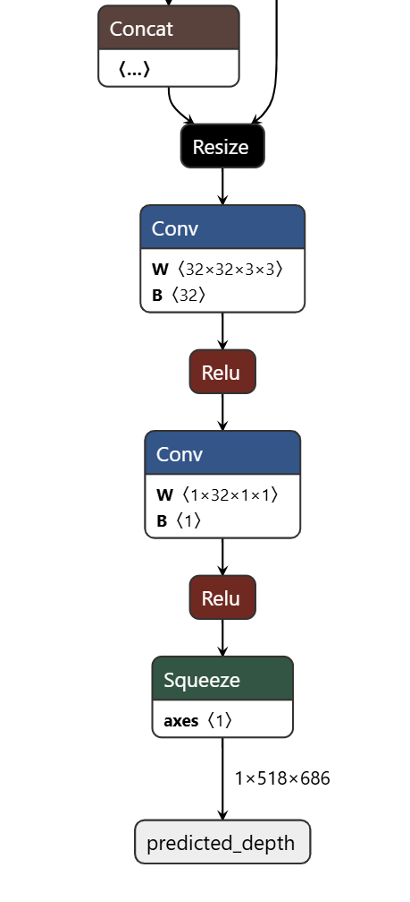
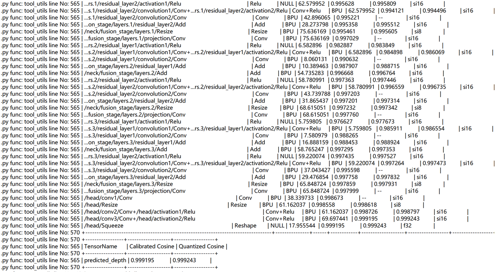

[English](README.md) | [简体中文](README_cn.md)

# 转换记录与缺失前提

<a id="source-model"></a>
## 源模型

源目录提供图示和转换说明，**没有可执行配方**。未固定原始 checkpoint/encoder、
权重摘要、导出脚本、ONNX 摘要或上游版本。复现已发布 HBM 前需取得这些输入；
随便选择同名 V2 权重不能证明与 `depth_any.hbm` 匹配。

<a id="directory"></a>
## 目录结构

```text
conversion/
├── README.md  # 英文说明
└── README_cn.md  # 中文说明
```

<a id="toolchain-targets"></a>
## 工具链与目标

源说明使用 x86 Linux 上的 S100 OpenExplore 和 int16 量化，没有固定 Docker、
开发包或编译器版本。参考入口：[OE 环境](https://developer.d-robotics.cc/rdk_doc/rdk_s/Advanced_development/toolchain_development/overview)
和[工具链手册](https://toolchain.d-robotics.cc/)。清单仅发布 S100 制品；源文档
提到 S100P，但清单没有独立制品，不应把该文件重新标为 S100P/S600。

<a id="export"></a>
## 已记录的 ONNX 边界

输入 RGB NCHW `[1,3,518,686]`，输出深度 `[1,518,686]`。运行时要求公开 IO 为
float32。源图包含 Add、Conv、Mul、MatMul 和注意力中的 Softmax，但这些事实
不能确定导出选项。




由于权重、代码、选项缺失，不提供虚构导出命令。取得后应先核对名称、布局、动态轴
和归一化边界是否符合运行时绑定，再编译。

<a id="calibration"></a>
## 校准

源未提供校准图片、数量、随机种子、变换脚本或前处理配置。运行时实际先最近邻
拉伸，再按像素 RGB 做 epsilon1e-5 的 z-score，注释所说的 ImageNet 均值不符。
校准配方本身未随附；使用前确认校准数据是否已含同一归一化，避免二次处理。
可选 letterbox 属于不同评估协议。

<a id="compile"></a>
## 编译

源无编译 YAML 或执行脚本。给出真实命令前，需固定编译器版本、march、ONNX、输入
布局/类型、归一化边界、校准集和量化配置，并保留日志、摘要。带猜测默认值的示例
命令会掩盖这些缺口，因此当前目录提供说明而非此类命令。

<a id="validation"></a>
## 验证与源记录相似度

源称多数算子相似度大于.99，最终量化相似度约.999；没有提供统计口径、数据集和
可复现原始日志。这是量化相似度记录，不是数据集深度精度。



真实复现需要一致的浮点/量化输入、原始输出形状和值、明确相对深度指标，以及软件/
制品身份。先比较浮点数组，再做逐图显示归一化。图内 int16 不能推断公开输出
dtype。

<a id="artifacts"></a>
## 制品

现有清单制品为 `model/s100/depth_any.hbm`，发布者 SHA-256 未知。显式下载和路径
选择见[模型说明](../model/README_cn.md)。本地摘要识别字节，不能补全发布者来源。
新生成模型需绑定其实际元数据；归一化、布局与深度语义以实际元数据比对为准。

<a id="known-gaps"></a>
## 补充准备

缺少 checkpoint/encoder 身份、上游版本、导出代码/选项、ONNX 摘要、校准数据/
变换、编译镜像/版本、编译配置、原始相似度日志及真实板测。收集这些输入是形成
可复现配方的前提。不提供 C++ 转换路径或额外目标。
