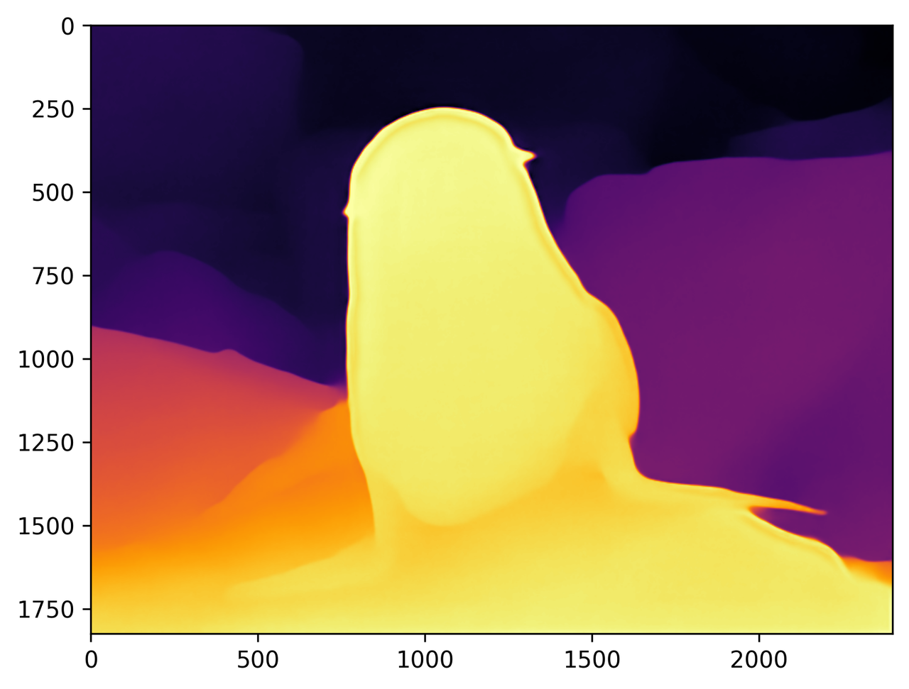
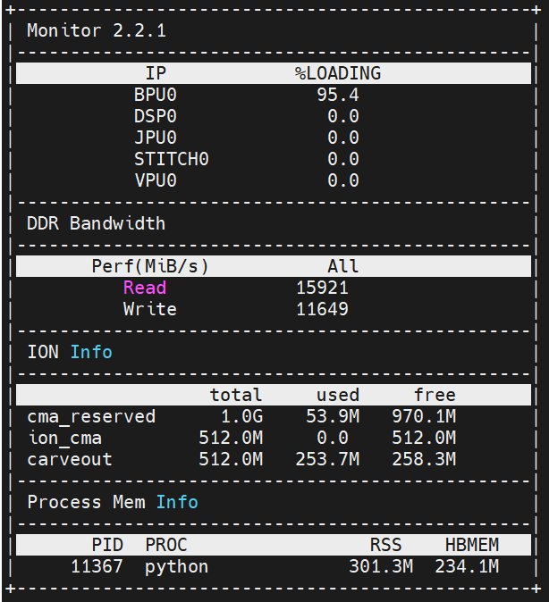

[English](README.md) | [简体中文](README_cn.md)

# 评测记录与复现边界

<a id="dataset"></a>
## 数据集

源仅提供演示图片 `furseal.jpg` 和渲染参考，没有深度真值、划分、数据集许可、
有效深度掩码或相对/米制对齐协议，因此此目录不提供数据集评测器。报告 AbsRel、
RMSE、阈值精度前需取得这些输入，彩图相似不能替代这些指标。


<a id="environment"></a>
## 环境

性能命令依赖兼容板端 SDK 的 `hrt_model_exec`、`hrt_ucp_monitor`。源记录没有固定
固件、SDK、频率、模型摘要或测量来源。运行时依赖见
[Python 说明](../runtime/python/README_cn.md)。

<a id="command"></a>
## 命令与范围

源性能命令，在准备好的 S100 环境执行：

```bash
hrt_model_exec perf --model_file samples/vision/depth_anything_v2/model/s100/depth_any.hbm --frame_count 100 --thread_num 1
hrt_ucp_monitor
```

显式准备模型后，从仓库根目录执行。改变线程数需单独标识测量。

正确性验证应对相同输入执行统一入口，保留 `raw_depth.npy`、`depth_native.npy`、
`report.json`，以及参考实现对应的原始数组和来源。着色前比较相同前处理/缩放
模式；letterbox 模式会在恢复原尺寸前先裁去填充（见
[预期结果](../README_cn.md#expected-results)）。

<a id="metrics"></a>
## 指标与解释

原始数组比较应声明形状、dtype、有限值数量、最大/平均绝对差及明确的相对容差。
不能从一张显示图片推断通用通过阈值。相对深度不是米；数据集指标若使用尺度/
偏移或中位数对齐，需说明协议。

显示时逐图减最小值、除值域，再转 uint8 INFERNO，会丢失尺度和偏移信息。
恒定输出得到零灰度而不是 NaN；这是确定行为，不表示恒定预测准确。
缩放使用 OpenCV 线性插值（源实现为 Torch），与 Torch 结果在浮点舍入内一致。主机解析仿射平面
验证半像素几何；HBM 输出一致性以板端运行验证。

<a id="outputs"></a>
## 应保留的记录

每次测量保留输入/模型摘要、精确板身份、运行时/固件、前处理模式、原始张量元数据、
完整 argv 和 stdout/stderr；保留未归一化浮点数组及真值 ID/协议。统一 CLI 记录
元数据与摘要，但不测延迟。源 HRT 时间、应用端到端时间和显示 IO 应分别报告。
本地摘要不能补全未知的发布者摘要。

<a id="reference-results"></a>
## 源性能记录

| 线程 | 帧数 | 总延迟（ms） | 源报告平均（ms） | FPS |
| --- | --- | --- | --- | --- |
| 1 | 100 | 13738.43 | 137.38 | 7.27 |
| 2 | 100 | 26375.53 | 263.74 | 7.54 |
| 4 | 100 | 52214.07 | 521.90 | 7.54 |
| 8 | 100 | 102309.64 | 1020.35 | 7.54 |

数值来自源记录。现有记录无法完整复原总数、报告平均值及并发/FPS 的关系。
源渲染结果如下：



源监控记录：BPU 占用 95.4%，ION 内存约 300 MB，读带宽约15920、写带宽约11650。
源记录未说明带宽单位、统计区间和完整环境。



<a id="boundaries"></a>
## 适用范围

- 不提供数据集评测实现；主机 fixture 检查契约、几何、恒定图处理、IO 和身份拒绝。
- 支持范围以已发布制品为准：S100 有匹配制品，S100P 暂无。
