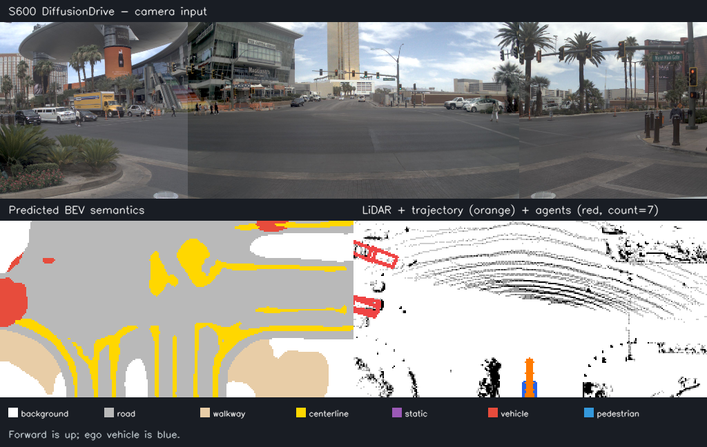
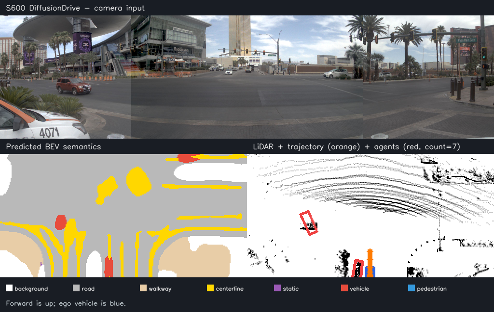
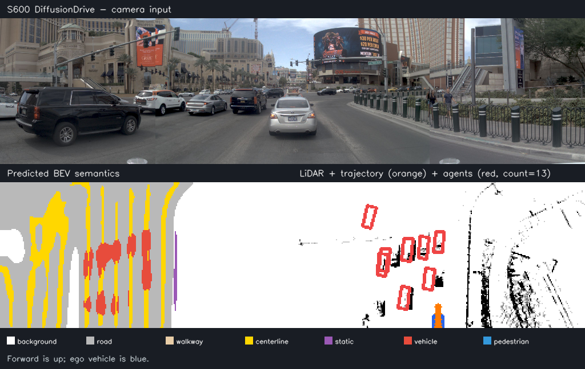
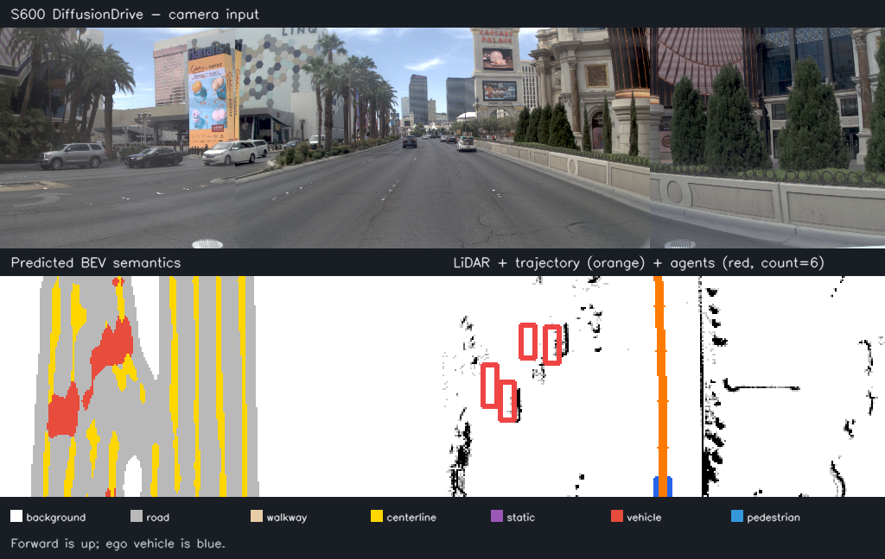
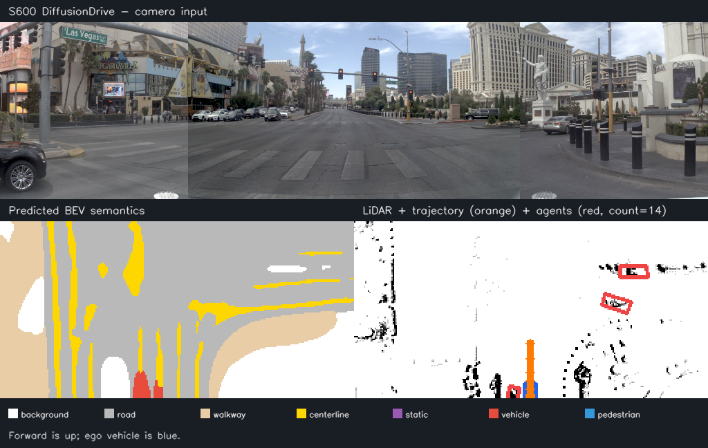

[English](README.md) | [简体中文](README_cn.md)

# DiffusionDrive planning sample

<a id="overview"></a>
## Overview

DiffusionDrive combines a three-camera RGB panorama, LiDAR BEV histogram, ego status and explicit diffusion noise for trajectory planning. The source describes a two-step truncated diffusion decoder producing eight future ego poses, with auxiliary agent-state and seven-class BEV heads. This sample consumes prepared NAVSIM features and provides Python inference, visualization, five-case execution and float-reference comparison. It does not prepare raw sensor data, compute a complete NAVSIM score or execute a vehicle-control command.

Source algorithm references: [official DiffusionDrive project](https://github.com/hustvl/DiffusionDrive), [CVPR2025 paper](https://openaccess.thecvf.com/content/CVPR2025/html/Liao_DiffusionDrive_Truncated_Diffusion_Model_for_End-to-End_Autonomous_Driving_CVPR_2025_paper.html), and [NAVSIM](https://github.com/autonomousvision/navsim). Use them as algorithm references; the deployable artifact identity is defined by the published HBM checksums in the [model guide](model/README.md).

<a id="directory"></a>
## Directory structure

```text
diffusiondrive/
├── conversion/  # Export and quantization configuration
├── evaluator/  # Evaluation commands and metrics
├── model/  # Model files and download scripts
├── runtime/  # Python and native inference implementations
├── test_data/  # Example inputs
├── tests/  # Automated tests
├── README.md  # English instructions
└── README_cn.md  # Chinese instructions
```

<a id="support-matrix"></a>
## Support matrix

| Target | Published HBM | Runtime | Preparation |
| --- | --- | --- | --- |
| S100P / nash-m | `s100p/diffusiondrive_r34_256x1024_s100p.hbm` | Python / hbm_runtime | supported |
| S600 / nash-p | `s600/diffusiondrive_r34_256x1024_s600.hbm` | Python / hbm_runtime | supported |
| S100 / X5 | None | Explicit rejection | No fallback |

There is no native C++ source for this sample. The two published HBM digests are preserved and verified on download/loading. `auto` requires recognized local identity or an explicit asset identity; unknown hosts are rejected instead of silently selecting S600. The bundled host checks validate the float-reference comparison and runtime metadata contracts with synthetic data; real HBM execution requires the prepared S100P/S600 runtime below.

<a id="prerequisites"></a>
## Prerequisites

For real inference prepare the matching S100P/S600 runtime with `hbm_runtime`, Python, NumPy and OpenCV, and explicitly download the target model. The [model guide](model/README.md) documents paths and checksums. Host inspection and offline comparison do not need the SDK. Prepare dependencies and model files with the commands below.

The supplied NPZ inputs already contain camera/LiDAR/status/noise features. Do not substitute raw sensor images or point clouds; no raw NAVSIM feature builder is bundled. Conversion is optional for published artifacts and has missing export/calibration prerequisites described in [conversion](conversion/README.md).

<a id="quickstart"></a>
## Quickstart

From the repository root, inspect available models and a target contract without executing the SDK:

```bash
python3 -m samples.vision.diffusiondrive.runtime.python.main --list-models
python3 -m samples.vision.diffusiondrive.runtime.python.main --target s600 --dry-run
```

Explicitly prepare one model:

```bash
bash samples/vision/diffusiondrive/model/download.sh --target s600
```

On a prepared S600, run the default case with a new directory:

```bash
bash samples/vision/diffusiondrive/runtime/python/run.sh --target s600 --output outputs/diffusiondrive
```

Run all five source cases, or add `--dry-run` for command/input inspection:

```bash
bash samples/vision/diffusiondrive/runtime/python/run_all_cases.sh --target s600 --output outputs/diffusiondrive_cases
```

For S100P, select `--target s100p` in both download and runtime commands. Its HBM is distinct; changing a filename does not retarget a model. See [runtime parameters and integration](runtime/python/README.md) before using external model paths.

<a id="expected-results"></a>
## Expected results

Each run writes physical quantized inputs, raw physical outputs, decoded `outputs.npz`, `result.png` and a provenance report. Decoded results contain trajectory `[1,8,3]`, thirty agent states/scores/masks and a seven-class BEV semantic prediction. All noise remains caller-supplied. Raw and decoded tensors have different schemas; retain both when diagnosing quantization.

The visualization combines the camera panorama, BEV semantics and LiDAR raster with orange trajectory, red filtered agents and blue ego vehicle. Gray denotes road, so a mostly gray BEV is not automatically a palette failure. Coordinate and class details are in [test data](test_data/README.md).

S600 reference visualization:



| Reference case_017 | Reference case_042 |
| --- | --- |
|  |  |
| Reference case_073 | Reference case_099 |
|  |  |

All six input/reference pairs and six result images are retained byte-for-byte. The [evaluator guide](evaluator/README.md#reference-results) preserves the complete original S100P/S600 accuracy/performance table, including one-thread latency, two-thread aggregate throughput and five-case S100P means. The [test-data guide](test_data/README.md) preserves the five-case S600 table. Source-recorded conditions: accuracy comparisons use case_000 and profiling uses case_017; the source records all segments at CPU 0.0 ms with full-BPU execution.

<a id="entry-points"></a>
## Entry points for people and agents

Use `DiffusionDriveTask.predict`, or the stages `preprocess` → `infer` → `postprocess` that it composes; the `pre_process`/`forward`/`post_process` spellings remain importable aliases of the same implementation. The task handles planning tensor semantics only; SDK loading/scheduling, NPZ IO, download, rendering and metrics are outside it. The shared `NamedArrayRunner` preserves all named physical tensors and checks board/artifact identity. A [complete API example](runtime/python/README.md#integration-example) shows variables and input loading.

Quantization checks per-axis scales and scalar zero points, rejects malformed or negative scales, and clips integer values before casting. The evaluator requires matching shapes; cosine similarity is undefined when either vector has zero norm.

<a id="license"></a>
## License

Sample code follows the repository [Apache-2.0 license](../../../LICENSE). DiffusionDrive and NAVSIM assets remain subject to their own original terms. The included examples do not constitute a complete licensed NAVSIM dataset or a certified driving system.
