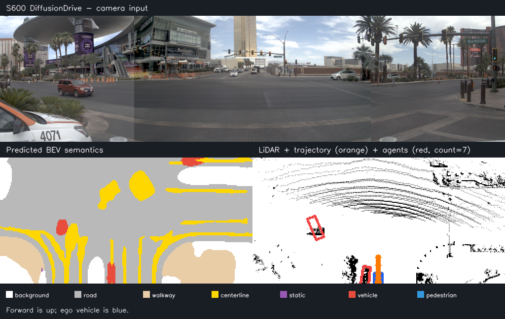
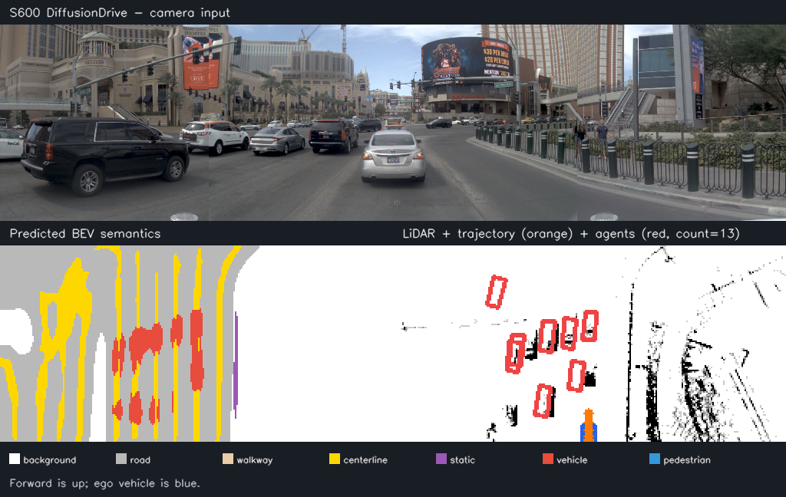
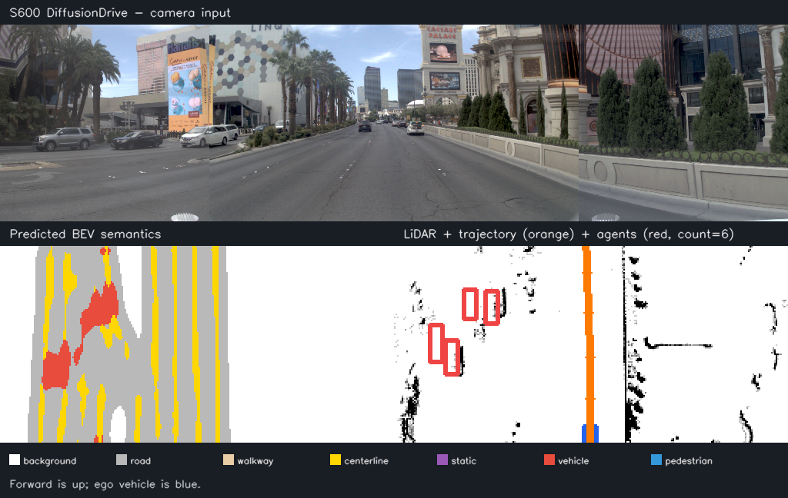
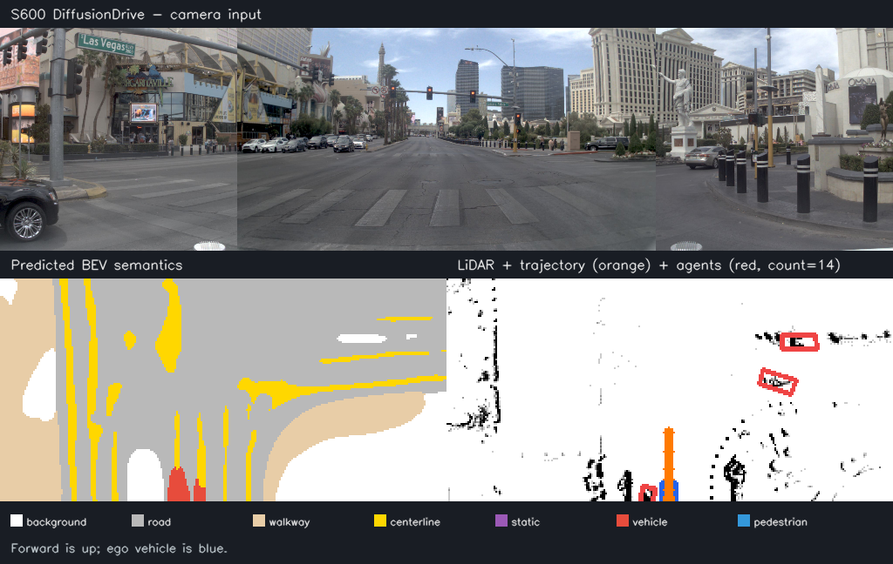
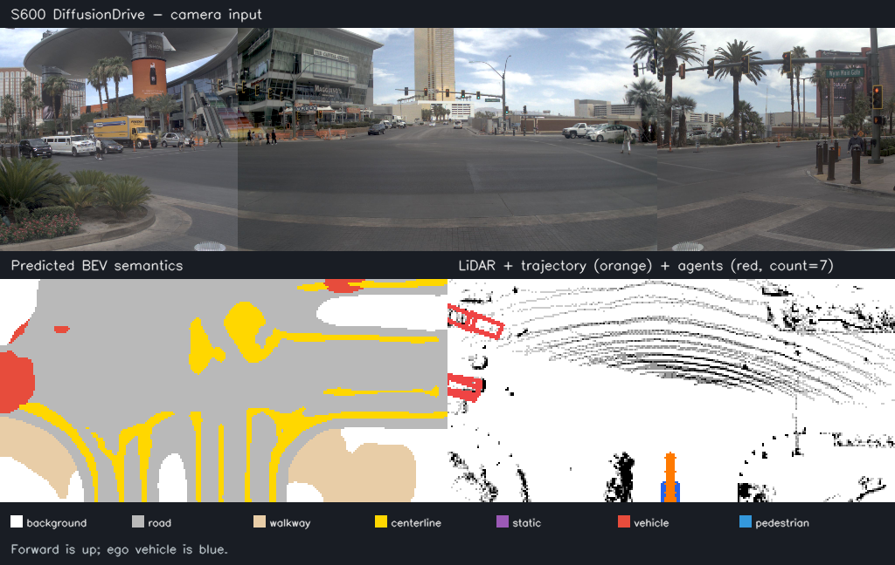

[English](./README.md) | 简体中文

# DiffusionDrive 模型示例

DiffusionDrive 是面向实时端到端自动驾驶的截断扩散策略。本示例在 RDK S100P 和 S600 上运行确定性的 NAVSIM 规划网络，并可视化规划轨迹、周围目标及七类 BEV 语义结果。

## 算法介绍

模型融合三路相机拼接图、LiDAR BEV histogram、ego 状态与显式扩散噪声。两步截断扩散解码器输出未来 8 个自车位姿，辅助头同时输出目标状态和语义 BEV。

- 官方项目：<https://github.com/hustvl/DiffusionDrive>
- 论文：<https://openaccess.thecvf.com/content/CVPR2025/html/Liao_DiffusionDrive_Truncated_Diffusion_Model_for_End-to-End_Autonomous_Driving_CVPR_2025_paper.html>
- NAVSIM：<https://github.com/autonomousvision/navsim>

## 目录结构

```text
.
|-- conversion/                 # OpenExplorer v3.7.0 INT16 优先的 BPU PTQ 配置
|-- evaluator/                  # 浮点与板端输出对比
|-- model/                      # S100P/S600 HBM 放置目录和下载脚本
|-- runtime/python/             # hbm_runtime 推理与可视化
|-- test_data/                  # 四输入 NAVSIM 样例和参考结果
|-- README.md                   # 英文说明
`-- README_cn.md                # 中文说明
```

## 快速体验

启动脚本会读取 `/sys/class/boardinfo/soc_name` 自动识别 S100P 或 S600，在缺少模型时下载对应 HBM，然后执行推理：

```bash
cd runtime/python
bash run.sh
```

脚本会一次加载模型，根据 HBM metadata 量化四路 float32 输入，在 BPU 上执行推理，并生成：

```text
runtime/python/diffusiondrive_outputs.npz
runtime/python/diffusiondrive_result.png
```

参数和二次集成说明见 [runtime/python/README_cn.md](runtime/python/README_cn.md)。

`test_data/case_*` 中额外提供了 5 个确定性 NAVSIM 场景，可一次运行：

```bash
cd runtime/python
bash run_all_cases.sh
```

| `case_017` | `case_042` |
| --- | --- |
|  |  |
| `case_073` | `case_099` |
|  |  |

## 模型转换

已提供 `nash-m`/S100P 和 `nash-p`/S600 两个 HBM。如需重新生成，请参考 [conversion/README_cn.md](conversion/README_cn.md)。两个模型都请求全图 INT16 激活 PTQ 和 max 校准；由于该工具链不支持 INT16 GridSample，HMCT 会把 GridSample 保持为 INT8。最终所有模型分段都在 BPU 上运行，不引入 CPU fallback。

## 模型评估

参考 [evaluator/README_cn.md](evaluator/README_cn.md) 对比板端解码结果与浮点参考输出。

下表精度统一使用 `case_000`，便于直接比较两个平台。性能使用真实 `case_017` 输入、单线程、固定 BPU 核心和 200 帧测得。

| 指标 | S100P | S600 |
| --- | ---: | ---: |
| 轨迹 cosine similarity | 0.999857 | 0.999833 |
| 目标状态 cosine similarity | 0.996879 | 0.997052 |
| BEV cosine similarity | 0.998913 | 0.998918 |
| BEV 像素一致率 | 0.943726 | 0.944061 |
| BEV mean IoU | 0.865501 | 0.868425 |
| 单线程时延 | 14.367 ms | 7.229 ms |
| 单线程吞吐 | 69.375 FPS | 138.060 FPS |
| CPU 推理耗时 | 0.0 ms | 0.0 ms |

在全部 5 个随附场景上，S100P 的轨迹、目标状态和 BEV cosine 均值分别为 `0.999785`、`0.997986`、`0.998799`；BEV 像素一致率均值为 `0.955664`，mean IoU 均值为 `0.819837`。

## 推理结果

结果图包括三路相机拼接输入、七类 BEV 语义、LiDAR histogram、规划轨迹和预测目标框。

| 类别 ID | 0 | 1 | 2 | 3 | 4 | 5 | 6 |
| --- | --- | --- | --- | --- | --- | --- | --- |
| 含义 | 背景 | 道路 | 人行道 | 中心线 | 静态物体 | 车辆 | 行人 |

道路类别显示为灰色。因此，如果画面几乎全灰，表示模型把绝大多数像素都预测成了道路，并不是调色板漏配。



## License

本示例遵循仓库顶层 Apache License 2.0；DiffusionDrive 和 NAVSIM 资源遵循各自原始许可证。
