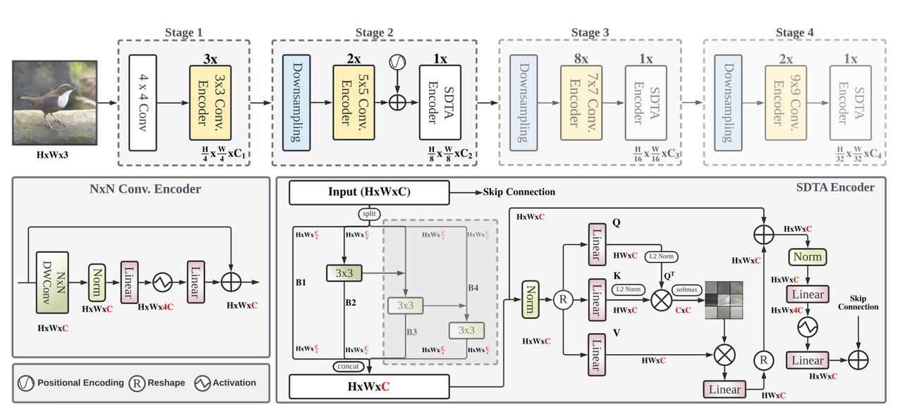
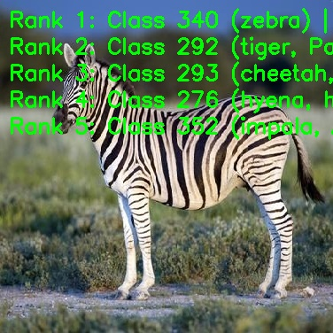

English | [简体中文](./README_cn.md)

# EdgeNeXt Model Description

This directory provides the complete usage guide for the EdgeNeXt sample in Model Zoo, including algorithm overview, model conversion, runtime inference, model file management, and evaluation notes.

## Algorithm Overview

EdgeNeXt is an efficient hybrid CNN-Transformer architecture designed for mobile vision applications. The network uses a four-stage pyramid structure and combines convolution encoders with SDTA encoders to balance classification accuracy, model size, and inference speed.

- **Paper**: [EdgeNeXt: Efficiently Amalgamated CNN-Transformer Architecture for Mobile Vision Applications](https://arxiv.org/abs/2206.10589)
- **Reference Implementation**: [mmaaz60/EdgeNeXt](https://github.com/mmaaz60/EdgeNeXt)

### Algorithm Functionality

EdgeNeXt supports the following task:

- ImageNet 1000-class image classification

### Algorithm Features

- **Hybrid CNN-Transformer Design**: Combines CNN inference efficiency with transformer-style global feature modeling.
- **Four-Stage Pyramid**: Uses a deployment-friendly hierarchical feature extraction structure.
- **SDTA Encoder**: Encodes multi-scale features through channel grouping and attention mechanisms.
- **Efficient Deployment**: Provides base, small, x-small, and xx-small RDK X5 deployment models using packed NV12 input.



## Directory Structure

```text
.
|-- conversion
|   |-- EdgeNeXt_base_config.yaml
|   |-- EdgeNeXt_small_config.yaml
|   |-- EdgeNeXt_x_small_config.yaml
|   |-- EdgeNeXt_xx_small_config.yaml
|   |-- README.md
|   `-- README_cn.md
|-- evaluator
|   |-- README.md
|   `-- README_cn.md
|-- model
|   |-- download.sh
|   |-- README.md
|   `-- README_cn.md
|-- runtime
|   `-- python
|       |-- main.py
|       |-- edgenext.py
|       |-- README.md
|       |-- README_cn.md
|       `-- run.sh
|-- test_data
|   |-- EdgeNeXt_architecture.png
|   |-- ImageNet_1k.json
|   |-- Zebra.jpg
|   `-- inference.png
|-- README.md
`-- README_cn.md
```

## QuickStart

### Python

- Go to [runtime/python/README.md](./runtime/python/README.md) for detailed Python usage.
- For a quick experience:

```bash
cd runtime/python
bash run.sh
```

## Model Conversion

- Prebuilt `.bin` model files are provided through the [model](./model/README.md) directory.
- Conversion guidance is provided in [conversion/README.md](./conversion/README.md).

## Runtime Inference

The maintained inference path for this sample is Python.

- Python runtime guide: [runtime/python/README.md](./runtime/python/README.md)

## Evaluator

Evaluation notes, performance data, and validation summary are provided in [evaluator/README.md](./evaluator/README.md).

## Performance Data

The following table shows the published EdgeNeXt performance on `RDK X5`.

| Model | Size | Classes | Params (M) | Float Top-1 | Quant Top-1 | Latency (ms) | FPS |
| --- | --- | --- | --- | --- | --- | --- | --- |
| EdgeNeXt-base | 224x224 | 1000 | 18.51 | 78.21% | 74.52% | 8.80 | 113.35 |
| EdgeNeXt-small | 224x224 | 1000 | 5.59 | 76.50% | 71.75% | 4.41 | 226.15 |
| EdgeNeXt-x-small | 224x224 | 1000 | 2.34 | 71.75% | 66.25% | 2.88 | 345.73 |
| EdgeNeXt-xx-small | 224x224 | 1000 | 1.33 | 69.50% | 64.25% | 2.47 | 403.49 |



## License

Follows the Model Zoo top-level License.
