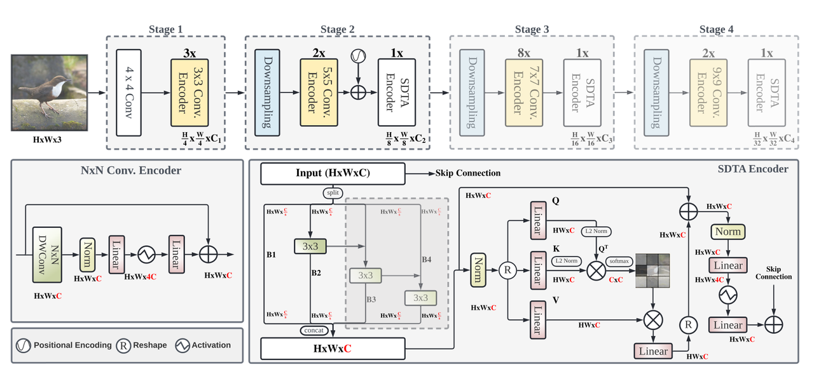

# EdgeNeXt 图像分类

EdgeNeXt 在 RDK X5 上的 ImageNet-1k 分类：输入一张 BGR 图像，输出稳定
的 Top-K `(类别 ID, 分数, 标签)`。X5 发布交付 base、small、x-small、
xx-small 四个变体（论文 [EdgeNeXt: Efficiently Amalgamated
CNN-Transformer Architecture for Mobile Vision
Applications](https://arxiv.org/abs/2206.10589)，参考实现
[mmaaz60/EdgeNeXt](https://github.com/mmaaz60/EdgeNeXt)）。[English](README.md)

<a id="overview"></a>

## 概述

EdgeNeXt 是面向移动视觉的高效 CNN-Transformer 混合架构：四级金字塔把
卷积编码器与 SDTA（Split Depth-wise Transpose Attention）编码器组合在
一起，在分类精度、模型体积与推理速度之间取得平衡，面向 ImageNet-1k
1000 类分类。四项核心特性：

- **CNN-Transformer 混合设计**——结合卷积的推理效率与 Transformer 风格
  的全局特征建模。
- **四级金字塔**——采用对部署友好的层级化特征提取结构。
- **SDTA 编码器**——通过通道拆分（拆分 3×3 分支）与转置注意力编码
  多尺度特征。
- **高效部署**——提供 base、small、x-small、xx-small 四个 RDK X5
  部署模型，使用打包 NV12 输入。



*图：EdgeNeXt 架构——四级金字塔（上）与 NxN 卷积编码器（左下）、含
拆分 3×3 分支和转置注意力的 SDTA 编码器（右下）。图中为上游训练结构，实际部署制品是
INT8 量化的 base/small/x_small/xx_small 变体（224×224 NV12，见
[支持范围](#support-matrix)）。*

本样例提供面向 X5 的 Python 运行时。`EdgeNeXtClassifier` 类执行由 `predict` 串联的 `preprocess → infer → postprocess` 流程：从平台发布 Manifest 解析唯一的制品引用，核验板卡身份，懒加载 `hbm_runtime`，返回带类型的 Top-K 结果（见
[runtime/python/README_cn.md](runtime/python/README_cn.md)）。

<a id="support-matrix"></a>
## 支持范围

| Target | 变体 | 语言 | 状态 |
| --- | --- | --- | --- |
| x5 | base、small、x_small、xx_small | python | supported |
| s100 / s100p / s600 | 任意 | python | not-supported（按支持矩阵选择目标与变体） |

<a id="prerequisites"></a>
## 环境前提

板端 Python 运行需要镜像中与板卡匹配的 `hbm_runtime`、NumPy 和
OpenCV-Python；只有真正执行模型时才导入 SDK（`--help`、`--list-models`、
`--dry-run` 与主机测试均不需要 SDK）。读取 Manifest 还需要 PyYAML。开发
主机可从 `requirements-host.txt` 安装用户态依赖：

```bash
# cwd：仓库根目录 — 成功判据：输出 "host dependencies: ok"
python3 -m venv .venv-edgenext
source .venv-edgenext/bin/activate
python3 -m pip install -r samples/vision/edgenext/requirements-host.txt
python3 -c "import cv2, numpy, yaml; print('host dependencies: ok')"
```

<a id="quickstart"></a>
## 快速体验

在 X5 板卡上的一条完整路径（命令在仓库根目录执行）。前置条件：带
`hbm_runtime` 的板卡镜像与可访问 Manifest 模型服务器的网络。

```bash
# 1. 准备制品（输入：Manifest 行 x5:edgenext:EdgeNeXt_base_224x224_nv12.bin）
#    输出：samples/vision/edgenext/model/EdgeNeXt_base_224x224_nv12.bin
#    成功判据：下载器退出码 0 并打印实测摘要
bash samples/vision/edgenext/model/download.sh x5 base

# 2. 运行分类（输入：上一步制品 + 随附测试图）
#    输出：stdout 上的 Top-5 类别 ID、分数、标签
#    成功判据：退出码 0 且打印 Top-5 列表
python3 samples/vision/edgenext/runtime/python/main.py \
  --target x5 \
  --asset-id x5:edgenext:EdgeNeXt_base_224x224_nv12.bin \
  --model-path samples/vision/edgenext/model/EdgeNeXt_base_224x224_nv12.bin \
  --test-img samples/vision/edgenext/test_data/Zebra.jpg \
  --label-file datasets/imagenet/imagenet_classes.names
```

`small`/`x_small`/`xx_small` 换用自己的引用与路径（见 `--list-models`）；缺省变体（未指定时）为 `base`。完整命令见
[runtime/python/README_cn.md](runtime/python/README_cn.md)。

<a id="expected-results"></a>
## 预期结果

Python 运行打印稳定的 Top-K（默认 5）类别 ID、分数与标签并退出 0；除非
指定 `--img-save-path`，不写任何输出文件。使用随附 `Zebra.jpg` 时
Top-5 含斑马相关 ImageNet 类别。按支持矩阵选择目标并准备对应制品；运行时会在加载模型前核验板卡身份。

下图为 X5 发布的参考运行效果：demo 将 Top-5 排名叠画在随附的
`Zebra.jpg` 上，rank 1 为 class 340（zebra）。


<a id="performance"></a>
## 性能数据

RDK X5 上的已发布数值（X5 发布 x5-v1.1.3；Float Top-1 为量化前 ONNX 结果，Quant Top-1 为部署模型结果，
延迟为单帧单线程单核，FPS 为多线程）：

| 模型 | 尺寸 | 参数量 (M) | Float Top-1 | Quant Top-1 | 延迟 (ms) | FPS |
| --- | --- | --- | --- | --- | --- | --- |
| EdgeNeXt-base | 224x224 | 18.51 | 78.21% | 74.52% | 8.80 | 113.35 |
| EdgeNeXt-small | 224x224 | 5.59 | 76.50% | 71.75% | 4.41 | 226.15 |
| EdgeNeXt-x-small | 224x224 | 2.34 | 71.75% | 66.25% | 2.88 | 345.73 |
| EdgeNeXt-xx-small | 224x224 | 1.33 | 69.50% | 64.25% | 2.47 | 403.49 |

<a id="directory"></a>
## 目录职责

- [model/](model/README_cn.md) — Manifest 驱动的制品下载，不检入二进制
- [runtime/python/](runtime/python/README_cn.md) — 统一 Python 入口与任务模块
- [conversion/](conversion/README_cn.md) — X5 PTQ 配置及模型所需准备步骤
- [evaluator/](evaluator/README_cn.md) — 发布的基准记录与功能检查
- `test_data/` — 随附测试图（[Zebra.jpg](test_data/Zebra.jpg) 及参考插图）
- `tests/` — 主机 unittest 套件

<a id="entry-points"></a>
## 入口

- 模型准备：[model/README_cn.md](model/README_cn.md)
- Python 运行时：[runtime/python/README_cn.md](runtime/python/README_cn.md)
- 转换：[conversion/README_cn.md](conversion/README_cn.md)
- 评估：[evaluator/README_cn.md](evaluator/README_cn.md)

<a id="license"></a>
## 许可

样例代码遵循仓库顶层 LICENSE（Apache-2.0）。源模型为上游
EdgeNeXt 发行版；模型/权重许可由上游发行版约束（见上方论文
链接）。已发布制品遵循平台发布 Manifest；Manifest 不含独立许可字段，
本文件不主张额外许可。
