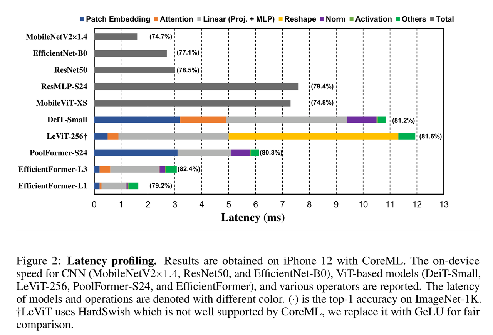
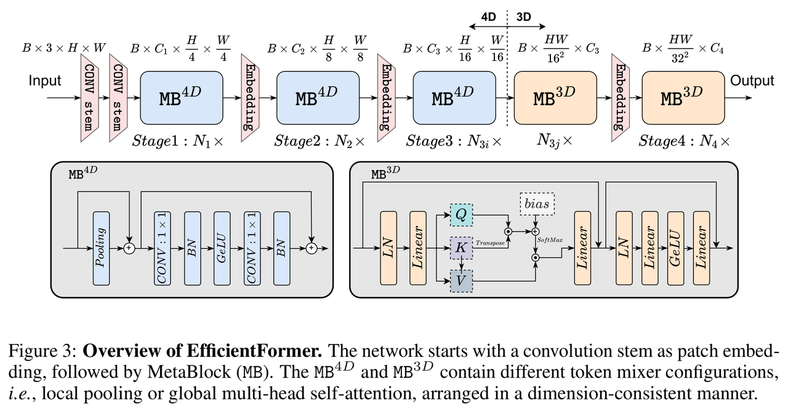

# EfficientFormer image classification

EfficientFormer is a vision Transformer designed for mobile inference.

Sources: [EfficientFormer: Vision
Transformers at MobileNet Speed](https://arxiv.org/abs/2206.01191)

[中文说明](README_cn.md)

<a id="overview"></a>

## Overview

Start with `runtime/python/main.py`; `classify.py` holds the model stages and `cli.py` handles options and results.
[runtime/python/README.md](runtime/python/README.md)

### Algorithm background

EfficientFormer is a vision-transformer family designed for mobile-speed
inference. The design starts from latency profiling of ViT-style networks
and removes the operators that run poorly on edge hardware;
dimension-consistent MetaBlocks keep 4D conv-style token mixing in the
early stages and move to 3D global attention only where it pays off,
which keeps transformer modeling while staying deployment-friendly
([paper](https://arxiv.org/abs/2206.01191),
[snap-research/EfficientFormer](https://github.com/snap-research/EfficientFormer)).

Feature summary:

- **Latency-driven design**: latency analysis removes inefficient ViT operations for mobile inference.
- **Dimension-consistent blocks**: deployment-friendly tensor layouts for efficient execution.
- **Edge deployment**: L1 and L3 RDK X5 deployment models with packed NV12 input.



*Latency profiling (Figure 2 of the paper): per-operator latency split
for CNNs and ViT-style models on iPhone 12/CoreML with ImageNet-1k top-1
in parentheses — the design study that motivates dimension-consistent
blocks. This is a paper measurement, not an RDK X5 number.*



*Architecture overview (Figure 3 of the paper): convolution stem as
patch embedding, 4D MetaBlocks with local pooling (stages 1–3i), then 3D
MetaBlocks with global MHSA (stages 3j–4), arranged in a
dimension-consistent manner.*

<a id="directory"></a>
## Directory structure

```text
efficientformer/
├── conversion/  # Export and quantization configuration
├── evaluator/  # Evaluation commands and metrics
├── model/  # Model files and download scripts
├── runtime/  # Python inference
├── test_data/  # Example inputs
├── tests/  # Automated tests
├── README.md  # English instructions
├── README_cn.md  # Chinese instructions
└── requirements-host.txt  # Python dependencies
```

<a id="support-matrix"></a>
## Support matrix

| Target | Variant | Language | Status |
| --- | --- | --- | --- |
| x5 | l1, l3 | python | supported |
| s100 / s100p / s600 | any | python | not-supported (the S manifest publishes no EfficientFormer asset; selection is an explicit error, no cross-platform fallback) |

<a id="prerequisites"></a>
## Prerequisites

Board Python execution needs the board image's matching `hbm_runtime`,
NumPy, and OpenCV-Python; the SDK is imported only when a model executes
(`--help`, `--list-models`, `--dry-run`, and host tests need no SDK).
Manifest reading also needs PyYAML. On a development host, install the
user-space dependencies from `requirements-host.txt`:

```bash
# cwd: repository root — success: "host dependencies: ok"
python3 -m venv .venv-efficientformer
source .venv-efficientformer/bin/activate
python3 -m pip install -r samples/vision/efficientformer/requirements-host.txt
python3 -c "import cv2, numpy, yaml; print('host dependencies: ok')"
```

<a id="quickstart"></a>
## Quick start

One complete path on an X5 board, commands run from the repository root.
Prerequisite: the board image with `hbm_runtime` and network access to the
manifest's model server.

```bash
# 1. Prepare the artifact (input: manifest row x5:efficientformer:EfficientFormer_l3_224x224_nv12.bin)
#    output: samples/vision/efficientformer/model/EfficientFormer_l3_224x224_nv12.bin
#    success: downloader exits 0 and prints the observed digest
bash samples/vision/efficientformer/model/download.sh x5 l3

# 2. Run classification (input: the artifact above plus the bundled test image)
#    output: Top-5 class ids, scores, labels on stdout
#    success: exit code 0 and a printed Top-5 list
python3 samples/vision/efficientformer/runtime/python/main.py \
  --target x5 \
  --asset-id x5:efficientformer:EfficientFormer_l3_224x224_nv12.bin \
  --model-path samples/vision/efficientformer/model/EfficientFormer_l3_224x224_nv12.bin \
  --test-img samples/vision/efficientformer/test_data/bittern.JPEG \
  --label-file datasets/imagenet/imagenet_classes.names
```

`l1` substitutes its own reference and path (see `--list-models`); the
default variant (when none is given) is `l3`. Full commands:
[runtime/python/README.md](runtime/python/README.md).

<a id="expected-results"></a>
## Expected results

The Python run prints a stable Top-K (default 5) of class IDs, scores, and
labels and exits 0; Pass `--img-save-path` to save a visualization; otherwise results are printed to stdout. With the bundled `bittern.JPEG` the Top-5 contains a
bittern-related ImageNet class. Select a target and variant listed in the [Support matrix](#support-matrix), prepare that exact manifest artifact with the model downloader, and run the sample on the matching board.

<a id="performance"></a>
## Performance data

Published performance on RDK X5 (X5 release x5-v1.1.3; Float Top-1
on the pre-quantization ONNX, Quant Top-1 on the deployment model, latency
single-frame single-thread single-core, FPS multi-threaded):

| Model | Size | Params (M) | Float Top-1 | Quant Top-1 | Single-thread Latency (ms) | Multi-thread Latency (ms) | FPS |
| --- | --- | --- | --- | --- | --- | --- | --- |
| EfficientFormer-L3 | 224x224 | 31.3 | 76.75% | 76.05% | 17.55 | 65.56 | 60.52 |
| EfficientFormer-L1 | 224x224 | 12.3 | 76.75% | 67.72% | 5.88 | 20.69 | 191.605 |


*Reference inference result from the X5 release: the bundled
[bittern.JPEG](test_data/bittern.JPEG) ranks `bittern` first, followed by
partridge, European gallinule, bustard, and coucal.*

<a id="entry-points"></a>
## Entry points

- Model preparation: [model/README.md](model/README.md)
- Python runtime: [runtime/python/README.md](runtime/python/README.md)
- Conversion: [conversion/README.md](conversion/README.md)
- Evaluation: [evaluator/README.md](evaluator/README.md)

<a id="license"></a>
## License

Sample code follows the repository top-level LICENSE (Apache-2.0). The
source models are the upstream EfficientFormer distribution; upstream
model/weights licensing is governed by that distribution (see the paper
link above). Published artifacts follow the platform release manifests;
Python code is licensed under Apache-2.0. Review applicable upstream model and weight license terms for those components.
