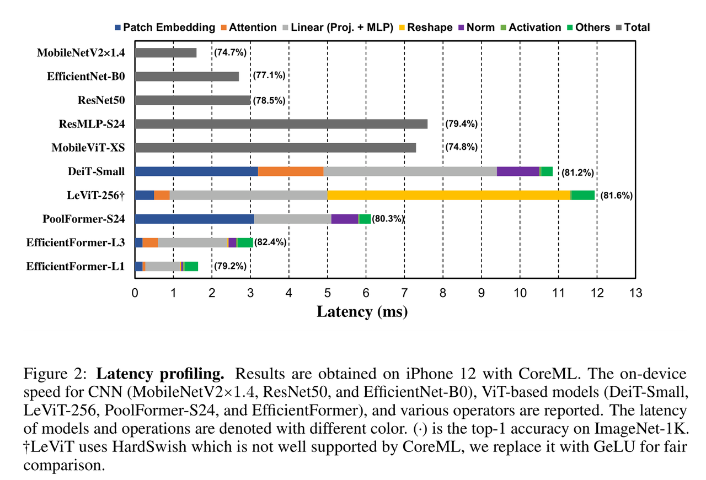
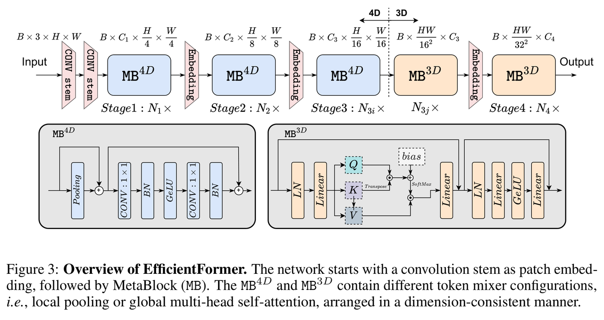

[English](./README.md) | 简体中文

# EfficientFormer 模型说明

本目录给出 EfficientFormer sample 在 Model Zoo 中的完整使用说明，包括算法概览、模型转换、运行时推理、模型文件管理和评测说明。

## 算法介绍

EfficientFormer 是面向移动端高速推理设计的视觉 Transformer 模型家族。该模型分析 ViT 类网络中的低效算子，并通过延迟驱动的结构设计，在保留 Transformer 风格建模能力的同时提升边缘设备部署效率。

- **论文**: [EfficientFormer: Vision Transformers at MobileNet Speed](https://arxiv.org/abs/2206.01191)
- **参考实现**: [snap-research/EfficientFormer](https://github.com/snap-research/EfficientFormer)

### 算法功能

EfficientFormer 支持以下任务：

- ImageNet 1000 类图像分类

### 算法特点

- **延迟驱动设计**：通过延迟分析移除不适合移动端推理的 ViT 低效操作。
- **维度一致性模块**：保持部署友好的张量布局，提升执行效率。
- **边缘部署**：提供 L1 和 L3 两个 RDK X5 部署模型，使用 packed NV12 输入。





## 目录结构

```text
.
|-- conversion
|   |-- EfficientFormer_l1_config.yaml
|   |-- EfficientFormer_l3_config.yaml
|   |-- README.md
|   `-- README_cn.md
|-- evaluator
|   |-- README.md
|   `-- README_cn.md
|-- model
|   |-- download.sh
|   |-- README.md
|   `-- README_cn.md
|-- runtime
|   `-- python
|       |-- main.py
|       |-- efficientformer.py
|       |-- README.md
|       |-- README_cn.md
|       `-- run.sh
|-- test_data
|   |-- EfficientFormer_architecture.png
|   |-- ImageNet_1k.json
|   |-- bittern.JPEG
|   |-- inference.png
|   `-- latency_profiling.png
|-- README.md
`-- README_cn.md
```

## 快速体验

### Python

- Python 详细说明请参考 [runtime/python/README_cn.md](./runtime/python/README_cn.md)。
- 快速体验命令：

```bash
cd runtime/python
bash run.sh
```

## 模型转换

- 预编译 `.bin` 模型通过 [model](./model/README_cn.md) 目录提供。
- 转换说明请参考 [conversion/README_cn.md](./conversion/README_cn.md)。

## 模型推理

本 sample 当前维护的推理路径为 Python。

- Python 推理说明: [runtime/python/README_cn.md](./runtime/python/README_cn.md)

## 模型评估

评测说明、性能数据和验证结果请参考 [evaluator/README_cn.md](./evaluator/README_cn.md)。

## 性能数据

下表为 `RDK X5` 上发布的 EfficientFormer 性能数据。

| 模型 | 尺寸 | 类别数 | 参数量 (M) | Float Top-1 | Quant Top-1 | 延迟 (ms) | FPS |
| --- | --- | --- | --- | --- | --- | --- | --- |
| EfficientFormer-L3 | 224x224 | 1000 | 31.3 | 76.75% | 76.05% | 17.55 | 60.52 |
| EfficientFormer-L1 | 224x224 | 1000 | 12.3 | 76.75% | 67.72% | 5.88 | 191.605 |


## License

遵循 Model Zoo 顶层 License。
