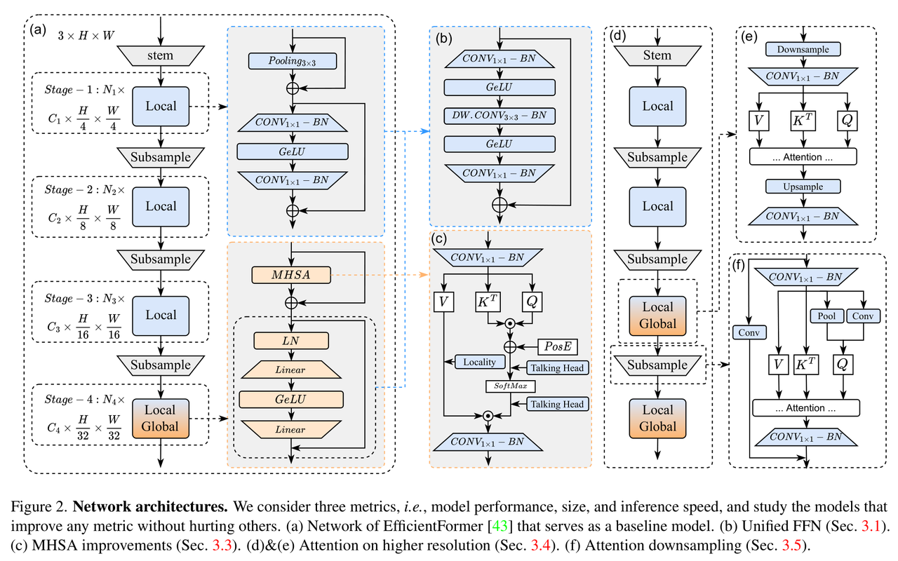
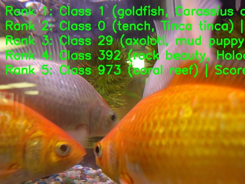

English | [简体中文](./README_cn.md)

# EfficientFormerV2 Model Description

This directory provides the complete usage guide for the EfficientFormerV2 sample in Model Zoo, including algorithm overview, model conversion, runtime inference, model file management, and evaluation notes.

## Algorithm Overview

EfficientFormerV2 is a mobile-oriented vision transformer family. It uses a hybrid visual backbone and a fine-grained joint search strategy to balance model size, latency, and accuracy for edge deployment.

- **Paper**: [EfficientFormerV2: Rethinking Vision Transformers for MobileNet Size and Speed](https://arxiv.org/abs/2212.08059)
- **Reference Implementation**: [snap-research/EfficientFormer](https://github.com/snap-research/EfficientFormer)

### Algorithm Functionality

EfficientFormerV2 supports the following task:

- ImageNet 1000-class image classification

### Algorithm Features

- **Mobile-Oriented Backbone**: Uses a hybrid backbone for efficient image classification on edge devices.
- **Joint Search Strategy**: Optimizes latency and parameter count together when selecting efficient architectures.
- **Hierarchical Design**: Uses a four-stage structure with feature sizes of `1/4`, `1/8`, `1/16`, and `1/32` of the input resolution.
- **Edge Deployment**: Provides S0, S1, and S2 RDK X5 deployment models using packed NV12 input.



## Directory Structure

```text
.
|-- conversion
|   |-- EfficientFormerv2_s0_config.yaml
|   |-- EfficientFormerv2_s1_config.yaml
|   |-- EfficientFormerv2_s2_config.yaml
|   |-- README.md
|   `-- README_cn.md
|-- evaluator
|   |-- README.md
|   `-- README_cn.md
|-- model
|   |-- download.sh
|   |-- README.md
|   `-- README_cn.md
|-- runtime
|   `-- python
|       |-- main.py
|       |-- efficientformerv2.py
|       |-- README.md
|       |-- README_cn.md
|       `-- run.sh
|-- test_data
|   |-- EfficientFormerV2_architecture.png
|   |-- ImageNet_1k.json
|   |-- goldfish.JPEG
|   `-- inference.png
|-- README.md
`-- README_cn.md
```

## QuickStart

### Python

- Go to [runtime/python/README.md](./runtime/python/README.md) for detailed Python usage.
- For a quick experience:

```bash
cd runtime/python
bash run.sh
```

## Model Conversion

- Prebuilt `.bin` model files are provided through the [model](./model/README.md) directory.
- Conversion guidance is provided in [conversion/README.md](./conversion/README.md).

## Runtime Inference

The maintained inference path for this sample is Python.

- Python runtime guide: [runtime/python/README.md](./runtime/python/README.md)

## Evaluator

Evaluation notes, performance data, and validation summary are provided in [evaluator/README.md](./evaluator/README.md).

## Performance Data

The following table shows the published EfficientFormerV2 performance on `RDK X5`.

| Model | Size | Classes | Params (M) | Float Top-1 | Quant Top-1 | Latency (ms) | FPS |
| --- | --- | --- | --- | --- | --- | --- | --- |
| EfficientFormerV2-S2 | 224x224 | 1000 | 12.6 | 77.50% | 70.75% | 6.99 | 152.40 |
| EfficientFormerV2-S1 | 224x224 | 1000 | 6.1 | 77.25% | 68.75% | 4.24 | 275.95 |
| EfficientFormerV2-S0 | 224x224 | 1000 | 3.5 | 74.25% | 68.50% | 5.79 | 198.45 |



## License

Follows the Model Zoo top-level License.
