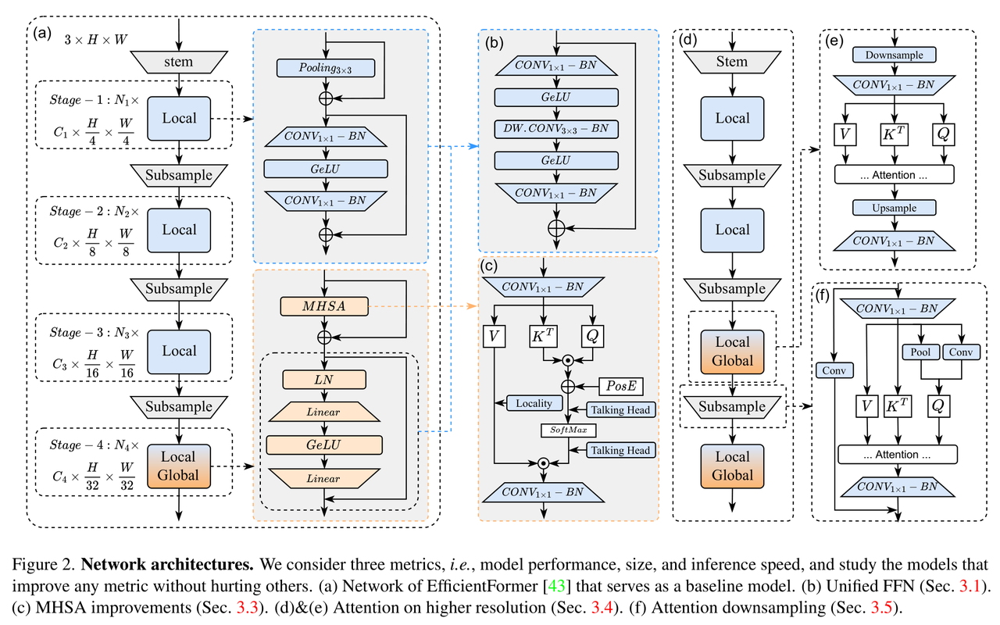
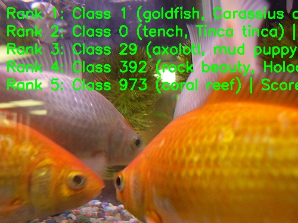

# EfficientFormerV2 图像分类

EfficientFormerV2 在 RDK X5 上的 ImageNet-1k 分类：输入一张 BGR 图像，
输出稳定的 Top-K `(类别 ID, 分数, 标签)`。X5 发布交付 S0、S1、S2 变体
（论文 [EfficientFormerV2: Rethinking Vision Transformers for MobileNet
Size and Speed](https://arxiv.org/abs/2212.08059)）。[English](README.md)

<a id="overview"></a>

## 概述

本样例提供面向 X5 的 Python 运行时。
`EfficientFormerV2Classifier` 类执行由 `predict` 串联的
`preprocess → infer → postprocess` 流程：从平台发布 Manifest 解析唯一
的制品引用，核验板卡身份，懒加载 `hbm_runtime`，返回带类型的 Top-K
结果（见 [runtime/python/README_cn.md](runtime/python/README_cn.md)）。

### 算法背景

EfficientFormerV2 以 MobileNet 的尺寸和速度重新审视视觉 Transformer：
细粒度联合搜索同时优化延迟、参数量与精度；统一 FFN、改进的 MHSA
（带 locality 的 talking-head 注意力），以及在高分辨率上的注意力与更低
开销的下采样，相对 EfficientFormer 基线降低了注意力与下采样开销，同时
保持 MobileNet 量级的尺寸和速度
（[论文](https://arxiv.org/abs/2212.08059)、
[snap-research/EfficientFormer](https://github.com/snap-research/EfficientFormer)）。

特性摘要：

- **面向移动端的骨干网络**：混合骨干结构，面向边缘侧高效图像分类。
- **联合搜索策略**：架构选择时同时优化延迟和参数量。
- **分层结构设计**：四阶段结构，特征尺寸分别为输入分辨率的 `1/4`、`1/8`、`1/16`、`1/32`。
- **边缘部署**：提供 S0、S1、S2 三个 RDK X5 部署模型，输入为 packed NV12。



*网络结构（论文图 2）：(a) EfficientFormer
基线网络，(b) 统一 FFN，(c) 改进的 MHSA，(d)(e) 更高分辨率上的注意力，
(f) 注意力下采样。*

<a id="directory"></a>
## 目录结构

```text
efficientformerv2/
├── conversion/  # 导出与量化配置
├── evaluator/  # 评估程序与指标
├── model/  # 模型文件与下载脚本
├── runtime/  # 推理程序
├── test_data/  # 示例输入
├── tests/  # 自动化测试
├── README.md  # 英文说明
├── README_cn.md  # 中文说明
└── requirements-host.txt  # 源码或数据文件
```

<a id="support-matrix"></a>
## 支持范围

| Target | 变体 | 语言 | 状态 |
| --- | --- | --- | --- |
| x5 | s0、s1、s2 | python | supported |
| s100 / s100p / s600 | 任意 | python | not-supported（按支持矩阵选择目标与变体） |

<a id="prerequisites"></a>
## 环境前提

板端 Python 运行需要镜像中与板卡匹配的 `hbm_runtime`、NumPy 和
OpenCV-Python；只有真正执行模型时才导入 SDK（`--help`、`--list-models`、
`--dry-run` 与主机测试均不需要 SDK）。读取 Manifest 还需要 PyYAML。开发
主机可从 `requirements-host.txt` 安装用户态依赖：

```bash
# cwd：仓库根目录 — 成功判据：输出 "host dependencies: ok"
python3 -m venv .venv-efficientformerv2
source .venv-efficientformerv2/bin/activate
python3 -m pip install -r samples/vision/efficientformerv2/requirements-host.txt
python3 -c "import cv2, numpy, yaml; print('host dependencies: ok')"
```

<a id="quickstart"></a>
## 快速体验

在 X5 板卡上的一条完整路径（命令在仓库根目录执行）。前置条件：带
`hbm_runtime` 的板卡镜像与可访问 Manifest 模型服务器的网络。

```bash
# 1. 准备制品（输入：Manifest 行 x5:efficientformerv2:EfficientFormerv2_s0_224x224_nv12.bin）
#    输出：samples/vision/efficientformerv2/model/EfficientFormerv2_s0_224x224_nv12.bin
#    成功判据：下载器退出码 0 并打印实测摘要
bash samples/vision/efficientformerv2/model/download.sh x5 s0

# 2. 运行分类（输入：上一步制品 + 随附测试图）
#    输出：stdout 上的 Top-5 类别 ID、分数、标签
#    成功判据：退出码 0 且打印 Top-5 列表
python3 samples/vision/efficientformerv2/runtime/python/main.py \
  --target x5 \
  --asset-id x5:efficientformerv2:EfficientFormerv2_s0_224x224_nv12.bin \
  --model-path samples/vision/efficientformerv2/model/EfficientFormerv2_s0_224x224_nv12.bin \
  --test-img samples/vision/efficientformerv2/test_data/goldfish.JPEG \
  --label-file datasets/imagenet/imagenet_classes.names
```

`s1`/`s2` 换用自己的引用与路径（见 `--list-models`）；缺省变体（未指定
时）为 `s0`。完整命令见
[runtime/python/README_cn.md](runtime/python/README_cn.md)。

<a id="expected-results"></a>
## 预期结果

Python 运行打印稳定的 Top-K（默认 5）类别 ID、分数与标签并退出 0；除非
指定 `--img-save-path`，不写任何输出文件。使用随附 `goldfish.JPEG` 时
Top-5 含金鱼相关 ImageNet 类别。按支持矩阵选择目标并准备对应制品；运行时会在加载模型前核验板卡身份。

<a id="performance"></a>
## 性能数据

RDK X5 上的已发布数值（X5 发布 x5-v1.1.3；Float Top-1 为量化前 ONNX 结果，Quant Top-1 为部署模型结果，
延迟为单帧单线程单核，FPS 为多线程）：

| 模型 | 尺寸 | 参数量 (M) | Float Top-1 | Quant Top-1 | 单线程延迟 (ms) | 多线程延迟 (ms) | FPS |
| --- | --- | --- | --- | --- | --- | --- | --- |
| EfficientFormerV2-S2 | 224x224 | 12.6 | 77.50% | 70.75% | 6.99 | 26.01 | 152.40 |
| EfficientFormerV2-S1 | 224x224 | 6.1 | 77.25% | 68.75% | 4.24 | 14.35 | 275.95 |
| EfficientFormerV2-S0 | 224x224 | 3.5 | 74.25% | 68.50% | 5.79 | 19.96 | 198.45 |



*X5 发布的参考推理结果：随仓 [goldfish.JPEG](test_data/goldfish.JPEG) 的
Rank-1 为 `goldfish`，其后依次为 tench、axolotl、rock beauty、
coral reef。*

<a id="entry-points"></a>
## 入口

- 模型准备：[model/README_cn.md](model/README_cn.md)
- Python 运行时：[runtime/python/README_cn.md](runtime/python/README_cn.md)
- 转换：[conversion/README_cn.md](conversion/README_cn.md)
- 评估：[evaluator/README_cn.md](evaluator/README_cn.md)

<a id="license"></a>
## 许可

样例代码遵循仓库顶层 LICENSE（Apache-2.0）。源模型为上游
EfficientFormerV2 发行版
（[snap-research/EfficientFormer](https://github.com/snap-research/EfficientFormer)）；
模型/权重许可由上游发行版约束。已发布制品遵循平台发布 Manifest；
已发布制品按平台发布 Manifest 提供。
