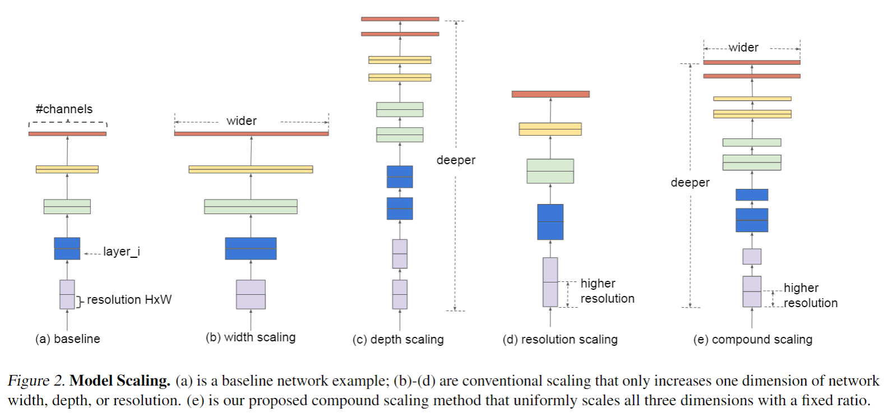

English | [简体中文](./README_cn.md)

# EfficientNet-Lite Model Description

EfficientNet-Lite is an image classification model family designed for efficient edge inference. This sample runs EfficientNet-Lite ImageNet classification with NV12 HBM models and prints Top-K results.



## Algorithm Overview

EfficientNet balances network depth, width, and input resolution through compound scaling. EfficientNet-Lite is optimized for edge inference.

- **Paper**: [EfficientNet: Rethinking Model Scaling for Convolutional Neural Networks](https://arxiv.org/abs/1905.11946)
- **Reference Implementation**: [tensorflow/tpu EfficientNet-Lite](https://github.com/tensorflow/tpu/tree/master/models/official/efficientnet/lite)

### Algorithm Capabilities

- ImageNet 1000-class image classification
- Lite0 to Lite4 model variants
- Top-K class ID and confidence output

### Algorithm Features

- **Compound scaling**: balances depth, width, and input resolution.
- **Edge-oriented variants**: Lite models are suitable for mobile and embedded inference.
- **NV12 input**: runtime feeds Y and UV planes as two HBM input tensors.

## Directory Structure

```text
efficientnet/
|-- conversion/
|   |-- README.md
|   |-- README_cn.md
|   |-- efficientnet_lite*_config.yaml
|   |-- get_efficientnet_lite*_onnx.py
|   |-- get_calibration_data.py
|   |-- timm2onnx_local.py
|   `-- x86_inference.py
|-- evaluator/
|   |-- README.md
|   `-- README_cn.md
|-- model/
|   |-- README.md
|   |-- README_cn.md
|   `-- download_model.sh
|-- runtime/
|   `-- python/
|       |-- README.md
|       |-- README_cn.md
|       |-- efficientnet.py
|       |-- main.py
|       `-- run.sh
|-- test_data/
|-- README.md
`-- README_cn.md
```

## Quick Start

Download the default model into the sample-local model directory:

```bash
cd samples/vision/efficientnet/model
bash download_model.sh s100 lite0
```

On S600:
```bash
bash download_model.sh s600 lite0
```

Run the Python sample:

```bash
cd ../runtime/python
bash run.sh
```

Run the entry script directly:

```bash
python3 main.py \
  --model-path /opt/hobot/model/s100/basic/efficientnet_lite0_224x224_nv12.hbm \
  --test-img ../../test_data/Scottish_deerhound.JPEG \
  --label-file ../../test_data/imagenet_classes.names \
  --top-k 5
```

On S600:
```bash
python3 main.py \
  --model-path /opt/hobot/model/s600/basic/efficientnet_lite0_224x224_nv12.hbm \
  --test-img ../../test_data/Scottish_deerhound.JPEG \
  --label-file ../../test_data/imagenet_classes.names \
  --top-k 5
```

## Model Conversion

- Prebuilt HBM models are provided through the [model](./model/README.md) directory.
- Conversion notes are available in [conversion/README.md](./conversion/README.md).

## Runtime

This sample currently maintains the Python runtime path. See [runtime/python/README.md](./runtime/python/README.md) for details.

| Variant | Input | Runtime input type | S100 download path | S600 download path |
| --- | --- | --- | --- | --- |
| EfficientNet-Lite0 | 224x224 | NV12 Y/UV planes | `model/s100/efficientnet_lite0_224x224_nv12.hbm` | `model/s600/efficientnet_lite0_224x224_nv12.hbm` |
| EfficientNet-Lite1 | 240x240 | NV12 Y/UV planes | `model/s100/efficientnet_lite1_240x240_nv12.hbm` | `model/s600/efficientnet_lite1_240x240_nv12.hbm` |
| EfficientNet-Lite2 | 260x260 | NV12 Y/UV planes | `model/s100/efficientnet_lite2_260x260_nv12.hbm` | `model/s600/efficientnet_lite2_260x260_nv12.hbm` |
| EfficientNet-Lite3 | 300x300 | NV12 Y/UV planes | `model/s100/efficientnet_lite3_300x300_nv12.hbm` | `model/s600/efficientnet_lite3_300x300_nv12.hbm` |
| EfficientNet-Lite4 | 380x380 | NV12 Y/UV planes | `model/s100/efficientnet_lite4_380x380_nv12.hbm` | `model/s600/efficientnet_lite4_380x380_nv12.hbm` |

This sample uses public S100 / S600 HBM models downloaded into the sample-local `model/<soc>` directory. The `run.sh` script auto-detects the device SoC and downloads the matching variant.

## Model Evaluation

Evaluation notes and result-check methods are available in [evaluator/README.md](./evaluator/README.md).

## Inference Result

Using `Scottish_deerhound.JPEG`, a correct run should include a Scottish deerhound-related class in the Top-5 results, with a reasonable non-zero confidence distribution.

## License

Follow the top-level Model Zoo License.
