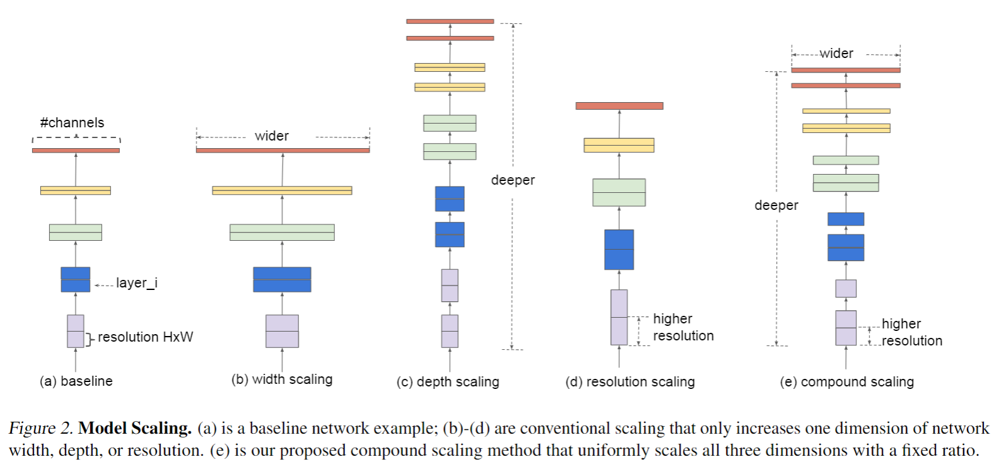
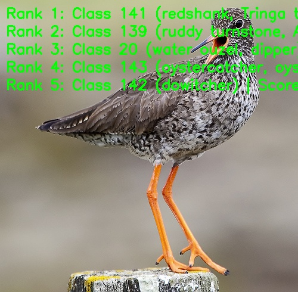

[English](./README.md) | 简体中文

# EfficientNet 模型说明

本目录给出 EfficientNet sample 在 Model Zoo 中的完整使用说明，包括算法概览、模型转换、运行时推理、模型文件管理和评测说明。

## 算法介绍

EfficientNet 是通过复合缩放方法平衡 CNN 输入分辨率、深度和宽度的图像分类模型家族。该方法在固定计算预算下同步缩放三个维度，而不是单独调整某一个维度，从而兼顾精度和效率。

- **论文**: [EfficientNet: Rethinking Model Scaling for Convolutional Neural Networks](https://arxiv.org/abs/1905.11946)
- **参考实现**: [EfficientNet-PyTorch](https://github.com/lukemelas/EfficientNet-PyTorch)

### 算法功能

EfficientNet 支持以下任务：

- ImageNet 1000 类图像分类

### 算法特点

- **复合缩放**：联合缩放分辨率、深度和宽度，平衡精度与效率。
- **AutoML 骨干搜索**：通过神经网络结构搜索获得高效基础网络。
- **高效部署**：提供 B2、B3、B4 三个 RDK X5 部署模型，使用 packed NV12 输入。



## 目录结构

```text
.
|-- conversion
|   |-- EfficientNet_B2_config.yaml
|   |-- EfficientNet_B3_config.yaml
|   |-- EfficientNet_B4_config.yaml
|   |-- README.md
|   `-- README_cn.md
|-- evaluator
|   |-- README.md
|   `-- README_cn.md
|-- model
|   |-- download.sh
|   |-- README.md
|   `-- README_cn.md
|-- runtime
|   `-- python
|       |-- main.py
|       |-- efficientnet.py
|       |-- README.md
|       |-- README_cn.md
|       `-- run.sh
|-- test_data
|   |-- EfficientNet_architecture.png
|   |-- ImageNet_1k.json
|   |-- inference.png
|   `-- redshank.JPEG
|-- README.md
`-- README_cn.md
```

## 快速体验

### Python

- Python 详细说明请参考 [runtime/python/README_cn.md](./runtime/python/README_cn.md)。
- 快速体验命令：

```bash
cd runtime/python
bash run.sh
```

## 模型转换

- 预编译 `.bin` 模型通过 [model](./model/README_cn.md) 目录提供。
- 转换说明请参考 [conversion/README_cn.md](./conversion/README_cn.md)。

## 模型推理

本 sample 当前维护的推理路径为 Python。

- Python 推理说明: [runtime/python/README_cn.md](./runtime/python/README_cn.md)

## 模型评估

评测说明、性能数据和验证结果请参考 [evaluator/README_cn.md](./evaluator/README_cn.md)。

## 性能数据

下表为 `RDK X5` 上发布的 EfficientNet 性能数据。

| 模型 | 尺寸 | 类别数 | 参数量 (M) | 浮点 Top-1 | 量化 Top-1 | 延迟 (ms) | FPS |
| --- | --- | --- | --- | --- | --- | --- | --- |
| EfficientNet-B4 | 224x224 | 1000 | 19.27 | 74.25% | 71.75% | 5.44 | 212.75 |
| EfficientNet-B3 | 224x224 | 1000 | 12.19 | 76.22% | 74.05% | 3.96 | 310.30 |
| EfficientNet-B2 | 224x224 | 1000 | 9.07 | 76.50% | 73.25% | 3.31 | 376.77 |



## License

遵循 Model Zoo 顶层 License。
