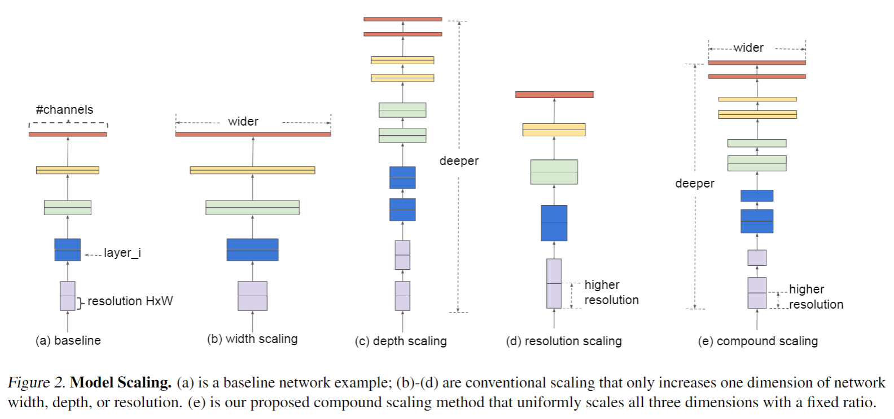
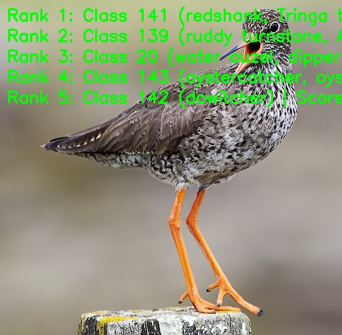

[English](README.md) | 简体中文

# EfficientNet 图像分类

EfficientNet 通过联合调整网络深度、宽度和输入分辨率完成图像分类。

来源：[EfficientNet: Rethinking Model Scaling for Convolutional Neural Networks](https://arxiv.org/abs/1905.11946) · [TensorFlow TPU EfficientNet-Lite](https://github.com/tensorflow/tpu/tree/master/models/official/efficientnet)

<a id="overview"></a>

## 概述

本样例为全部受支持目标提供同一个 Python 运行时。
`EfficientNetClassifier` 类执行由 `predict` 串联的
`preprocess → infer → postprocess` 流程：按检测到的板卡从平台发布
Manifest 解析唯一的制品引用，核验板卡身份，懒加载 `hbm_runtime`，
返回带类型的 Top-K 结果（见
[runtime/python/README_cn.md](runtime/python/README_cn.md)）。

### 算法背景

EfficientNet 通过复合缩放平衡输入分辨率、深度和宽度：不再单独调节某一
维度，而是用固定复合系数同时缩放三者，在固定计算预算下提升精度；神经
架构搜索提供高效的基础网络
（[论文](https://arxiv.org/abs/1905.11946)、
[EfficientNet-PyTorch](https://github.com/lukemelas/EfficientNet-PyTorch)）。
X5 部署提供 B2/B3/B4；S 侧提供面向边缘的 EfficientNet-Lite 系列
（lite0–lite4，TensorFlow TPU 实现），由同一 Python 流程按变体解析输入
几何（224/240/260/300/380）。

特性摘要：

- **复合缩放**：同时缩放分辨率、深度和宽度，平衡精度与效率。
- **AutoML 骨干搜索**：用神经架构搜索得到高效的基础网络。
- **高效部署**：提供 B2/B3/B4 三个 RDK X5 部署模型，输入为 packed NV12。



*复合缩放（论文图 2）：基础网络 (a)、传统单维缩放 (b)–(d)，以及按
固定比例统一缩放宽度、深度和分辨率的复合缩放 (e)。*

<a id="directory"></a>
## 目录结构

```text
efficientnet/
├── conversion/  # 导出与量化配置
├── evaluator/  # 评估程序与指标
├── model/  # 模型文件与下载脚本
├── runtime/  # 推理程序
├── test_data/  # 示例输入
├── tests/  # 自动化测试
├── README.md  # 英文说明
├── README_cn.md  # 中文说明
└── requirements-host.txt  # Python 依赖
```

<a id="support-matrix"></a>
## 支持范围

| Target | 变体 | 语言 | 状态 |
| --- | --- | --- | --- |
| x5 | b2、b3、b4 | python | supported |
| s100 | lite0..lite4 | python | supported |
| s600 | lite0..lite4 | python | supported |
| s100p | 任意 | python | not-supported（按支持矩阵选择目标与变体） |

<a id="prerequisites"></a>
## 环境前提

板端 Python 运行需要镜像中与板卡匹配的 `hbm_runtime`、NumPy 和
OpenCV-Python；只有真正执行模型时才导入 SDK（`--help`、`--list-models`、
`--dry-run` 与主机测试均不需要 SDK）。读取 Manifest 还需要 PyYAML。开发主机
可从 `requirements-host.txt` 安装用户态依赖：

```bash
# cwd：仓库根目录 — 成功判据：输出 "host dependencies: ok"
python3 -m venv .venv-efficientnet
source .venv-efficientnet/bin/activate
python3 -m pip install -r samples/vision/efficientnet/requirements-host.txt
python3 -c "import cv2, numpy, yaml; print('host dependencies: ok')"
```

<a id="quickstart"></a>
## 快速体验

在 X5 板卡上的一条完整路径（命令在仓库根目录执行）。前置条件：带
`hbm_runtime` 的板卡镜像与可访问 Manifest 模型服务器的网络。

```bash
# 1. 准备制品（输入：Manifest 行 x5:efficientnet:EfficientNet_B2_224x224_nv12.bin）
#    输出：samples/vision/efficientnet/model/EfficientNet_B2_224x224_nv12.bin
#    成功判据：下载器退出码 0 并打印实测摘要
bash samples/vision/efficientnet/model/download.sh x5 b2

# 2. 运行分类（输入：上一步制品 + 随附测试图）
#    输出：stdout 上的 Top-5 类别 ID、分数、标签
#    成功判据：退出码 0 且打印 Top-5 列表
python3 samples/vision/efficientnet/runtime/python/main.py \
  --target x5 \
  --asset-id x5:efficientnet:EfficientNet_B2_224x224_nv12.bin \
  --model-path samples/vision/efficientnet/model/EfficientNet_B2_224x224_nv12.bin \
  --test-img samples/vision/efficientnet/test_data/Scottish_deerhound.JPEG \
  --label-file datasets/imagenet/imagenet_classes.names
```

S100/S600 使用对应的 `s:efficientnet:s…` 引用（见 `--list-models`）与同一
根 `datasets/imagenet/` 标签；S 侧几何随变体（lite0..lite4 = 224/240/260/300/380）。完整命令见 [runtime/python/README_cn.md](runtime/python/README_cn.md)。

<a id="expected-results"></a>
## 预期结果

Python 运行打印稳定的 Top-K（默认 5）类别 ID、分数与标签并退出 0；除非
指定 `--img-save-path`，不写任何输出文件。使用随附 `Scottish_deerhound.JPEG`
时 Top-5 含鹿猎犬相关 ImageNet 类别；使用 `redshank.JPEG` 时含红脚鹬相关
类别。按支持矩阵选择目标并准备对应制品；S100P 需使用清单中对应目标的制品。

<a id="performance"></a>
## 性能数据

已发布性能记录。

X5（x5-v1.1.3）：

| 模型 | 尺寸 | 参数量 (M) | Float Top-1 | Quant Top-1 | 单线程延迟 (ms) | 多线程延迟 (ms) | FPS |
| --- | --- | --- | --- | --- | --- | --- | --- |
| EfficientNet-B4 | 224x224 | 19.27 | 74.25% | 71.75% | 5.44 | 18.63 | 212.75 |
| EfficientNet-B3 | 224x224 | 12.19 | 76.22% | 74.05% | 3.96 | 12.76 | 310.30 |
| EfficientNet-B2 | 224x224 | 9.07 | 76.50% | 73.25% | 3.31 | 10.51 | 376.77 |

S 系列（s-v1.1.2）：

| 变体 | 单线程延迟 | 单线程 FPS | 多线程延迟 | 多线程 FPS |
| --- | --- | --- | --- | --- |
| Lite0 | 0.448 ms | 2107.815 | 0.591 ms | 4827.886 |
| Lite1 | 0.489 ms | 1948.957 | 0.708 ms | 4086.470 |
| Lite2 | 0.565 ms | 1702.519 | 0.935 ms | 3123.682 |
| Lite3 | 0.668 ms | 1451.031 | 1.249 ms | 2345.518 |
| Lite4 | 0.915 ms | 1064.339 | 1.979 ms | 1487.055 |



*X5 发布的参考推理结果：随仓 [redshank.JPEG](test_data/redshank.JPEG)
的 Rank-1 为 `redshank`，其后依次为 ruddy turnstone、water ouzel、
oystercatcher、dowitcher。*

<a id="entry-points"></a>
## 入口

- 模型准备：[model/README_cn.md](model/README_cn.md)
- Python 运行时：[runtime/python/README_cn.md](runtime/python/README_cn.md)
- 转换：[conversion/README_cn.md](conversion/README_cn.md)
- 评估：[evaluator/README_cn.md](evaluator/README_cn.md)

<a id="license"></a>
## 许可

样例代码遵循仓库顶层 LICENSE（Apache-2.0）。源模型为上游 EfficientNet /
EfficientNet-Lite 发行版；模型/权重许可由上游发行版约束（见上方论文
链接）。已发布制品遵循平台发布 Manifest；Manifest 不含独立许可字段，
本文件不主张额外许可。
