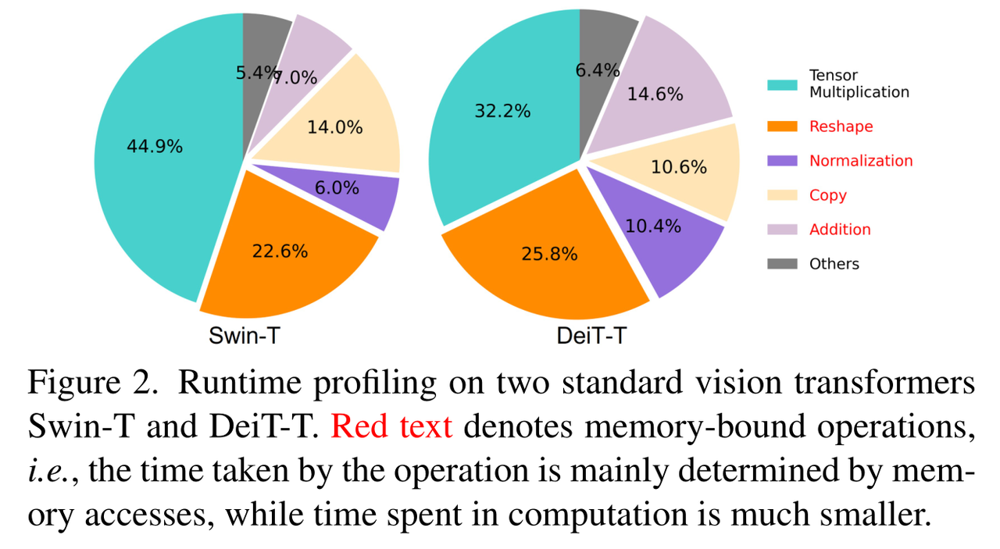
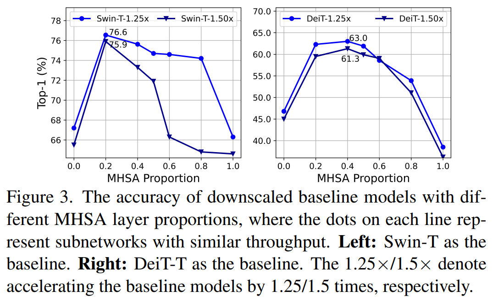
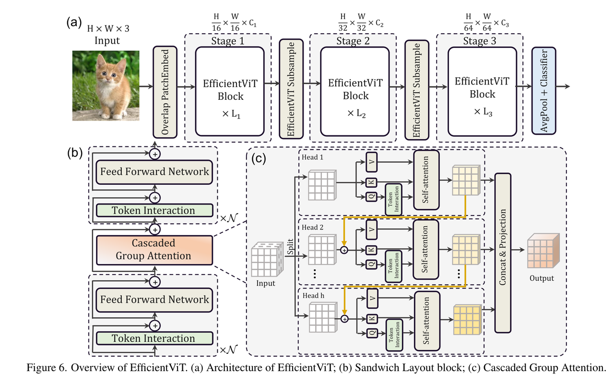

# EfficientViT 图像分类

EfficientViT（MSRA 级联组注意力系列）在 RDK X5 上的 ImageNet-1k 分类：
输入一张 BGR 图像，输出稳定的 Top-K `(类别 ID, 分数, 标签)`。X5 发布
交付 m5 变体（论文 [EfficientViT: Memory Efficient Vision Transformer
with Cascaded Group
Attention](https://arxiv.org/abs/2305.07027)，参考实现
[microsoft/Cream/EfficientViT](https://github.com/microsoft/Cream/tree/main/EfficientViT)）。
[English](README.md)

<a id="overview"></a>

## 概述

统一实现是一条 Python 流程（仅 X5；本 sample 无 S 分支交付，两个源分支
也都没有 C++ 运行时）。Python 从平台发布 Manifest 解析唯一的制品引用，
核验板卡身份，懒加载 `hbm_runtime`，执行
`pre_process → forward → post_process` 任务（见
[runtime/python/README_cn.md](runtime/python/README_cn.md)）。迁移前的平台
分支入口在收尾前仍以兼容 shim 形式保留在 `platforms/x5/` 下，其审计记录
在迁移文档中，不在本 README 展开。

### 算法背景

EfficientViT（MSRA）针对标准自注意力的访存受限开销：运行时剖析显示
reshape/归一化/拷贝等数据搬移占去 Swin/DeiT 相当比例的延迟（论文图 2），
而简单削减 MHSA 层会损失精度（论文图 3）。EfficientViT 改用级联组注意力
——每个注意力头接收前序头的级联输出，在提升表征能力的同时降低每头的
注意力开销——并使用批归一化以便推理侧融合
（[论文](https://arxiv.org/abs/2305.07027)、
[microsoft/Cream/EfficientViT](https://github.com/microsoft/Cream/tree/main/EfficientViT)）。

源版本特性摘要（rdk_x5 @ac11571，x5-v1.1.3）：

- **省内存的高效注意力**：降低限制标准 Transformer 推理效率的数据搬移开销。
- **级联组注意力**：在控制部署成本的同时提升表征能力。
- **部署友好的归一化**：使用批归一化简化推理侧融合。
- **分类输出**：输出 ImageNet-1k 类别的 Top-K 类别 ID 及对应置信度。



*运行时剖析，恢复自 X5 源版本
（`test_data/comparison_between_transformer_and_cnn.png`，rdk_x5
@ac11571，sha256 `be1e2e39…`；论文图 2）：访存受限算子（红色标注）在
Swin-T/DeiT-T 延迟中占比很大 — 正是 EfficientViT 要削减的开销。*



*（`test_data/mhsa_computation.jpg`，rdk_x5 @ac11571，sha256
`4dda6352…`；论文图 3）：降尺度的 Swin-T/DeiT-T 基线在不同 MHSA 层占比
下的 top-1 精度 — 单纯减少 MHSA 层并不能直接得到高效设计，这正是改用
级联组注意力的动机。*



*EfficientViT 总览，恢复自 X5 源版本
（`test_data/efficientvit_msra_architecture.png`，rdk_x5 @ac11571，
sha256 `403d1c63…`；论文图 6）：(a) 带重叠 patch embedding 的三阶段
网络，(b) 三明治布局块，(c) 逐头级联、拼接投影的级联组注意力。*

<a id="support-matrix"></a>
## 支持与实测矩阵

| Target | 变体 | 语言 | 状态 |
| --- | --- | --- | --- |
| x5 | m5 | python | supported（2026-09-21 x5-8g + x5-4g 板测通过，见下方说明） |
| s100 / s100p / s600 | 任意 | python | not-supported（S Manifest 未发布 EfficientViT 资产；选择时显式报错，无跨平台回退） |

源基线：X5 侧 rdk_x5 @ac11571 (x5-v1.1.3)。统一 sample 的主机测试（26
项）全部通过。板端冒烟（2026-09-21；同板、同制品字节、同输入图，旧
wrapper 对照统一入口）：x5-8g/x5-4g m5 Top-5 ids 全等（最大分差
≤1.9e-9）；`run.sh` CLI 双板 rc=0。raw tensor 等价、数据集精度与延迟
不在覆盖范围；已发布基准表仍为源分支记录。证据：[B2 板测](../../../docs/releases/unified-migration/evidence/2026-09-21-b2-board-smoke-evidence.json)。

<a id="prerequisites"></a>
## 环境前提

板端 Python 运行需要镜像中与板卡匹配的 `hbm_runtime`、NumPy 和
OpenCV-Python；只有真正执行模型时才导入 SDK（`--help`、`--list-models`、
`--dry-run` 与主机测试均不需要 SDK）。读取 Manifest 还需要 PyYAML。开发
主机可从 `requirements-host.txt` 安装用户态依赖：

```bash
# cwd：仓库根目录 — 成功判据：输出 "host dependencies: ok"
python3 -m venv .venv-efficientvit
source .venv-efficientvit/bin/activate
python3 -m pip install -r samples/vision/efficientvit/requirements-host.txt
python3 -c "import cv2, numpy, yaml; print('host dependencies: ok')"
```

<a id="quickstart"></a>
## 快速体验

在 X5 板卡上的一条完整路径（命令在仓库根目录执行）。前置条件：带
`hbm_runtime` 的板卡镜像与可访问 Manifest 模型服务器的网络。

```bash
# 1. 准备制品（输入：Manifest 行 x5:efficientvit:EfficientViT_m5_224x224_nv12.bin）
#    输出：samples/vision/efficientvit/model/EfficientViT_m5_224x224_nv12.bin
#    成功判据：下载器退出码 0 并打印实测摘要
bash samples/vision/efficientvit/model/download.sh x5

# 2. 运行分类（输入：上一步制品 + 随附测试图）
#    输出：stdout 上的 Top-5 类别 ID、分数、标签
#    成功判据：退出码 0 且打印 Top-5 列表
python3 samples/vision/efficientvit/runtime/python/main.py \
  --target x5 \
  --asset-id x5:efficientvit:EfficientViT_m5_224x224_nv12.bin \
  --model-path samples/vision/efficientvit/model/EfficientViT_m5_224x224_nv12.bin \
  --test-img samples/vision/efficientvit/test_data/hook.JPEG \
  --label-file datasets/imagenet/imagenet_classes.names
```

缺省变体（未指定时）为 `m5`——唯一已发布变体，保持源入口的默认模型。
完整命令见 [runtime/python/README_cn.md](runtime/python/README_cn.md)。

<a id="expected-results"></a>
## 预期结果

Python 运行打印稳定的 Top-K（默认 5）类别 ID、分数与标签并退出 0；除非
指定 `--img-save-path`，不写任何输出文件（源入口总会写
`test_data/result.jpg`——该副作用已移除）。使用随附 `hook.JPEG` 时 Top-5
含挂钩相关 ImageNet 类别。无法识别的板卡或无匹配制品的目标（全部 S
目标）会显式报错退出。

<a id="performance"></a>
## 性能数据

X5 源发布（rdk_x5 @ac11571，x5-v1.1.3）的已发布记录，未在本仓库重测
（源说明：Float Top-1 为量化前 ONNX 结果，Quant Top-1 为部署模型结果；
源表未声明延迟的线程条件）：

| 模型 | 尺寸 | 类别数 | 参数量 (M) | Float Top-1 | Quant Top-1 | 延迟 (ms) | FPS |
| --- | --- | --- | --- | --- | --- | --- | --- |
| EfficientViT_m5 | 224x224 | 1000 | 12.4 | 73.75% | 72.50% | 6.34 | 174.70 |


*X5 源版本的历史推理截图（rdk_x5 @ac11571，`test_data/inference.png`，
sha256 `2a23e138…`）：随仓 [hook.JPEG](test_data/hook.JPEG) 的 Rank-1
为 `hook`，其后依次为 crane、chain、seashore、dock。由源版本在其自身
运行入口记录 — 不是本仓库的新运行。*

<a id="directory"></a>
## 目录职责

- [model/](model/README_cn.md) — Manifest 驱动的制品下载，不检入二进制
- [runtime/python/](runtime/python/README_cn.md) — 统一 Python 入口与任务模块
- [conversion/](conversion/README_cn.md) — X5 参考 PTQ 配置（含已披露缺口）
- [evaluator/](evaluator/README_cn.md) — 发布的基准记录与功能检查
- `test_data/` — 随附测试图（[hook.JPEG](test_data/hook.JPEG) 及参考插图）
- `tests/` — 主机 unittest 套件

<a id="entry-points"></a>
## 入口

- 模型准备：[model/README_cn.md](model/README_cn.md)
- Python 运行时：[runtime/python/README_cn.md](runtime/python/README_cn.md)
- 转换：[conversion/README_cn.md](conversion/README_cn.md)
- 评估：[evaluator/README_cn.md](evaluator/README_cn.md)

<a id="license"></a>
## 许可

样例代码遵循仓库顶层 LICENSE（Apache-2.0）。源模型为上游 MSRA
EfficientViT 发行版
（[microsoft/Cream](https://github.com/microsoft/Cream/tree/main/EfficientViT)）；
模型/权重许可由上游发行版 govern。已发布制品遵循平台发布 Manifest；
Manifest 不含独立许可字段，本文件不主张额外许可。
