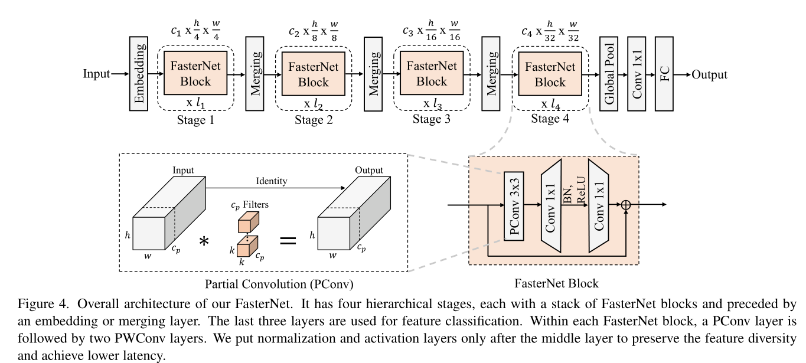
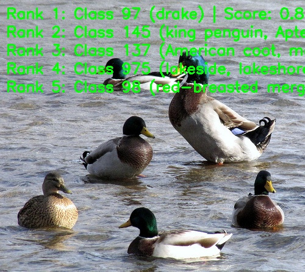

[English](./README.md) | 简体中文

# FasterNet 模型说明

本目录给出 FasterNet sample 在 Model Zoo 中的完整使用说明，包括算法概览、模型转换、运行时推理、模型文件管理和评测说明。

## 算法概述

FasterNet 是一类轻量级 CNN 模型，核心思路是提升实际可用 FLOPS，而不只是单纯降低理论 FLOPs。该模型通过部分卷积减少冗余访存和无效计算，从而提升边缘侧实际推理效率。

- **论文**：[Run, Don't Walk: Chasing Higher FLOPS for Faster Neural Networks](http://arxiv.org/abs/2303.03667)
- **参考实现**：[JierunChen/FasterNet](https://github.com/JierunChen/FasterNet)

### 算法功能

FasterNet 支持以下任务：

- ImageNet 1000 类图像分类

### 算法特点

- **高 FLOPS 设计**：强调实际计算效率，而不只关注理论 FLOPs 缩减。
- **部分卷积**：通过 PConv 减少冗余计算和访存开销。
- **轻量级 CNN 骨干**：保持适合板端部署的纯 CNN 结构。
- **高效部署**：提供 S、T0、T1、T2 四个 RDK X5 部署模型，输入格式为 packed NV12。




## 目录结构

```text
.
|-- conversion
|   |-- FasterNet_S_config.yaml
|   |-- FasterNet_T0_config.yaml
|   |-- FasterNet_T1_config.yaml
|   |-- FasterNet_T2_config.yaml
|   |-- README.md
|   `-- README_cn.md
|-- evaluator
|   |-- README.md
|   `-- README_cn.md
|-- model
|   |-- download.sh
|   |-- README.md
|   `-- README_cn.md
|-- runtime
|   `-- python
|       |-- main.py
|       |-- fasternet.py
|       |-- README.md
|       |-- README_cn.md
|       `-- run.sh
|-- test_data
|   |-- drake.JPEG
|   |-- FasterNet_architecture.png
|   |-- FLOPs of Nets.png
|   |-- ImageNet_1k.json
|   `-- inference.png
|-- README.md
`-- README_cn.md
```

## 快速开始

### Python

- 详细 Python 使用方式请参考 [runtime/python/README_cn.md](./runtime/python/README_cn.md)。
- 快速体验：

```bash
cd runtime/python
bash run.sh
```

## 模型转换

- 预编译 `.bin` 模型文件由 [model](./model/README_cn.md) 目录提供。
- 转换说明见 [conversion/README_cn.md](./conversion/README_cn.md)。

## 运行时推理

本 sample 维护的推理路径为 Python。

- Python 运行说明：[runtime/python/README_cn.md](./runtime/python/README_cn.md)

## 模型评测

评测说明、性能数据和验证摘要见 [evaluator/README_cn.md](./evaluator/README_cn.md)。

## 性能数据

下表为 FasterNet 在 `RDK X5` 上的公开性能数据。

| 模型 | 尺寸 | 类别数 | 参数量 (M) | Float Top-1 | Quant Top-1 | 延迟 (ms) | FPS |
| --- | --- | --- | --- | --- | --- | --- | --- |
| FasterNet-S | 224x224 | 1000 | 31.1 | 77.04% | 76.15% | 6.73 | 162.83 |
| FasterNet-T2 | 224x224 | 1000 | 15.0 | 76.50% | 76.05% | 3.39 | 342.48 |
| FasterNet-T1 | 224x224 | 1000 | 7.6 | 74.29% | 71.25% | 1.96 | 708.40 |
| FasterNet-T0 | 224x224 | 1000 | 3.9 | 71.75% | 68.50% | 1.41 | 1135.13 |



## 许可证

遵循 Model Zoo 顶层 License。
