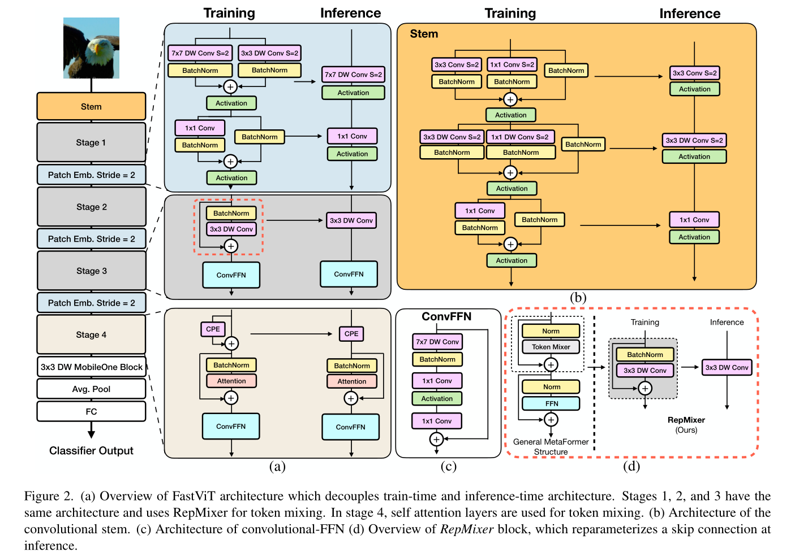

[English](./README.md) | 简体中文

# FastViT 模型说明

本目录给出 FastViT sample 在 Model Zoo 中的完整使用说明，包括算法概览、模型转换、运行时推理、模型文件管理和评测说明。

## 算法介绍

FastViT 是使用结构重参数化构建高效 token mixing 模块的混合视觉 Transformer 模型家族。模型结合卷积阶段和注意力模块，在保持 ImageNet 分类精度的同时提升推理效率。

- **论文**: [FastViT: A Fast Hybrid Vision Transformer using Structural Reparameterization](http://arxiv.org/abs/2303.14189)
- **参考实现**: [apple/ml-fastvit](https://github.com/apple/ml-fastvit)

### 算法功能

FastViT 支持以下任务：

- ImageNet 1000 类图像分类

### 算法特点

- **RepMixer Token Mixing**：使用结构重参数化降低访存开销。
- **混合架构**：结合卷积操作和注意力模块，平衡精度与效率。
- **高效部署**：提供 T8、T12、S12、SA12 四个 RDK X5 部署模型，使用 packed NV12 输入。



## 目录结构

```text
.
|-- conversion
|   |-- FastViT_S12_config.yaml
|   |-- FastViT_SA12_config.yaml
|   |-- FastViT_T12_config.yaml
|   |-- FastViT_T8_config.yaml
|   |-- README.md
|   `-- README_cn.md
|-- evaluator
|   |-- README.md
|   `-- README_cn.md
|-- model
|   |-- download.sh
|   |-- README.md
|   `-- README_cn.md
|-- runtime
|   `-- python
|       |-- main.py
|       |-- fastvit.py
|       |-- README.md
|       |-- README_cn.md
|       `-- run.sh
|-- test_data
|   |-- FastViT_architecture.png
|   |-- ImageNet_1k.json
|   |-- bucket.JPEG
|   `-- inference.png
|-- README.md
`-- README_cn.md
```

## 快速体验

### Python

- Python 详细说明请参考 [runtime/python/README_cn.md](./runtime/python/README_cn.md)。
- 快速体验命令：

```bash
cd runtime/python
bash run.sh
```

## 模型转换

- 预编译 `.bin` 模型通过 [model](./model/README_cn.md) 目录提供。
- 转换说明请参考 [conversion/README_cn.md](./conversion/README_cn.md)。

## 模型推理

本 sample 当前维护的推理路径为 Python。

- Python 推理说明: [runtime/python/README_cn.md](./runtime/python/README_cn.md)

## 模型评估

评测说明、性能数据和验证结果请参考 [evaluator/README_cn.md](./evaluator/README_cn.md)。

## 性能数据

下表为 `RDK X5` 上发布的 FastViT 性能数据。

| 模型 | 尺寸 | 类别数 | 参数量 (M) | Float Top-1 | Quant Top-1 | 延迟 (ms) | FPS |
| --- | --- | --- | --- | --- | --- | --- | --- |
| FastViT-SA12 | 224x224 | 1000 | 10.9 | 78.25% | 74.50% | 11.56 | 93.44 |
| FastViT-S12 | 224x224 | 1000 | 8.8 | 76.50% | 72.00% | 5.86 | 193.87 |
| FastViT-T12 | 224x224 | 1000 | 6.8 | 74.75% | 70.43% | 4.97 | 234.78 |
| FastViT-T8 | 224x224 | 1000 | 3.6 | 73.50% | 68.50% | 2.09 | 667.21 |


## License

遵循 Model Zoo 顶层 License。
