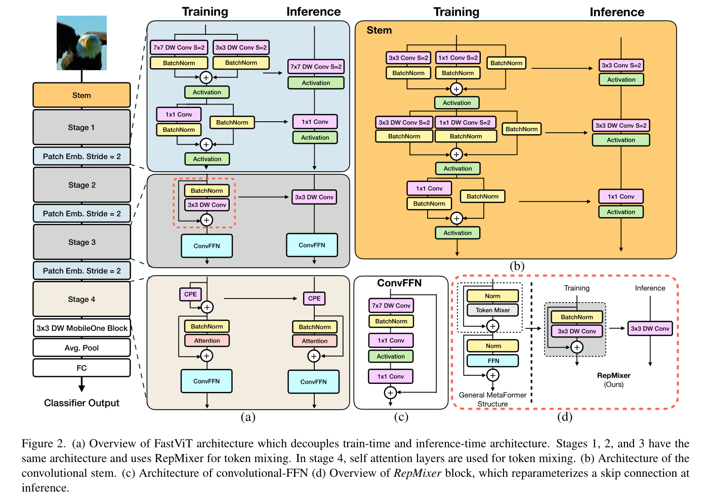

# FastViT 图像分类

FastViT 在 RDK X5 上的 ImageNet-1k 分类：输入一张 BGR 图像，输出稳定
的 Top-K `(类别 ID, 分数, 标签)`。X5 发布交付 S12、SA12、T12、T8 四个
变体（论文 [FastViT: A Fast Hybrid Vision Transformer using Structural
Reparameterization](https://arxiv.org/abs/2303.14189)）。[English](README.md)

<a id="overview"></a>

## 概述

FastViT 是使用结构重参数化构建高效 token 混合模块的混合视觉
Transformer 系列：训练期模块保留跳连与额外分支，推理期再把它们折叠成
普通卷积，降低访存开销。家族内 token 混合器并不一致：按上游模型定义，
已发布的 t8/t12/s12 四个 stage 全部使用 RepMixer token 混合，只有 sa12
在 stage 1–3 保持 RepMixer、仅 stage 4 使用自注意力（并带 RepCPE 位置
编码）——卷积/注意力混合设计即指此类配置。
ImageNet-1k 1000 类分类精度保持竞争力。核心特性：

- **RepMixer token 混合**——利用结构重参数化减少访存开销。
- **混合架构**——卷积运算与注意力结合，平衡精度与效率。
- **高效部署**——提供 T8、T12、S12、SA12 四个 RDK X5 部署模型，使用
  打包 NV12 输入。



*图（上游论文 Fig. 2）：(a) FastViT 总览，训练期与推理期结构解耦；
(b) 卷积 stem；(c) 卷积 FFN；(d) RepMixer——推理期把跳连重参数化。
论文图中的 stage 4 自注意力 token 混合器对应 SA12：其 stage 1–3 使用
RepMixer，stage 4 使用注意力；T8、T12 与 S12 的四个 stage 均使用 RepMixer
（见 apple/ml-fastvit 的 `models/fastvit.py`）。训练/推理双结构也解释了部署制品为何是已重参数化的 INT8
s12/sa12/t12/t8 变体（224×224 NV12，见[支持范围](#support-matrix)）。*

本样例提供面向 X5 的 Python 运行时。
`FastViTClassifier` 类执行由 `predict` 串联的
`preprocess → infer → postprocess` 流程：从平台发布 Manifest 解析唯一的
制品引用，核验板卡身份，懒加载 `hbm_runtime`，返回带类型的 Top-K 结果
（见
[runtime/python/README_cn.md](runtime/python/README_cn.md)）。

<a id="directory"></a>
## 目录结构

```text
fastvit/
├── conversion/  # 导出与量化配置
├── evaluator/  # 评估程序与指标
├── model/  # 模型文件与下载脚本
├── runtime/  # 推理程序
├── test_data/  # 示例输入
├── tests/  # 自动化测试
├── README.md  # 英文说明
├── README_cn.md  # 中文说明
└── requirements-host.txt  # 源码或数据文件
```

<a id="support-matrix"></a>
## 支持范围

| Target | 变体 | 语言 | 状态 |
| --- | --- | --- | --- |
| x5 | s12、sa12、t12、t8 | python | supported |
| s100 / s100p / s600 | 任意 | python | not-supported（按支持矩阵选择目标与变体） |

<a id="prerequisites"></a>
## 环境前提

板端 Python 运行需要镜像中与板卡匹配的 `hbm_runtime`、NumPy 和
OpenCV-Python；只有真正执行模型时才导入 SDK（`--help`、`--list-models`、
`--dry-run` 与主机测试均不需要 SDK）。读取 Manifest 还需要 PyYAML。开发
主机可从 `requirements-host.txt` 安装用户态依赖：

```bash
# cwd：仓库根目录 — 成功判据：输出 "host dependencies: ok"
python3 -m venv .venv-fastvit
source .venv-fastvit/bin/activate
python3 -m pip install -r samples/vision/fastvit/requirements-host.txt
python3 -c "import cv2, numpy, yaml; print('host dependencies: ok')"
```

<a id="quickstart"></a>
## 快速体验

在 X5 板卡上的一条完整路径（命令在仓库根目录执行）。前置条件：带
`hbm_runtime` 的板卡镜像与可访问 Manifest 模型服务器的网络。

```bash
# 1. 准备制品（输入：Manifest 行 x5:fastvit:FastViT_S12_224x224_nv12.bin）
#    输出：samples/vision/fastvit/model/FastViT_S12_224x224_nv12.bin
#    成功判据：下载器退出码 0 并打印实测摘要
bash samples/vision/fastvit/model/download.sh x5 s12

# 2. 运行分类（输入：上一步制品 + 随附测试图）
#    输出：stdout 上的 Top-5 类别 ID、分数、标签
#    成功判据：退出码 0 且打印 Top-5 列表
python3 samples/vision/fastvit/runtime/python/main.py \
  --target x5 \
  --asset-id x5:fastvit:FastViT_S12_224x224_nv12.bin \
  --model-path samples/vision/fastvit/model/FastViT_S12_224x224_nv12.bin \
  --test-img samples/vision/fastvit/test_data/bucket.JPEG \
  --label-file datasets/imagenet/imagenet_classes.names
```

`sa12`/`t12`/`t8` 换用自己的引用与路径（见 `--list-models`）；缺省变体（未指定时）为 `s12`。完整命令见
[runtime/python/README_cn.md](runtime/python/README_cn.md)。

<a id="expected-results"></a>
## 预期结果

Python 运行打印稳定的 Top-K（默认 5）类别 ID、分数与标签并退出 0；除非
指定 `--img-save-path`，不写任何输出文件。使用随附 `bucket.JPEG` 时
Top-5 含水桶相关 ImageNet 类别。按支持矩阵选择目标并准备对应制品；运行时会在加载模型前核验板卡身份。

下图为 X5 发布的参考运行效果：demo 将 Top-5 排名叠画在随附的
`bucket.JPEG` 上，rank 1 为 class 463（bucket）。


<a id="performance"></a>
## 性能数据

RDK X5 上的已发布数值（X5 发布 x5-v1.1.3；Float Top-1 为量化前 ONNX 结果，Quant Top-1 为部署模型结果，
延迟为单帧单线程单核，FPS 为多线程）：

| 模型 | 尺寸 | 参数量 (M) | Float Top-1 | Quant Top-1 | 延迟 (ms) | FPS |
| --- | --- | --- | --- | --- | --- | --- |
| FastViT-SA12 | 224x224 | 10.9 | 78.25% | 74.50% | 11.56 | 93.44 |
| FastViT-S12 | 224x224 | 8.8 | 76.50% | 72.00% | 5.86 | 193.87 |
| FastViT-T12 | 224x224 | 6.8 | 74.75% | 70.43% | 4.97 | 234.78 |
| FastViT-T8 | 224x224 | 3.6 | 73.50% | 68.50% | 2.09 | 667.21 |

已发布参数量 (M) 列与上游论文的模型尺寸并非全部吻合；按发布原样
记录。

<a id="entry-points"></a>
## 入口

- 模型准备：[model/README_cn.md](model/README_cn.md)
- Python 运行时：[runtime/python/README_cn.md](runtime/python/README_cn.md)
- 转换：[conversion/README_cn.md](conversion/README_cn.md)
- 评估：[evaluator/README_cn.md](evaluator/README_cn.md)

<a id="license"></a>
## 许可

样例代码遵循仓库顶层 LICENSE（Apache-2.0）。源模型为上游
FastViT 发行版；模型/权重许可由上游发行版约束（见上方论文
链接）。已发布制品遵循平台发布 Manifest；Manifest 不含独立许可字段，
本文件不主张额外许可。
