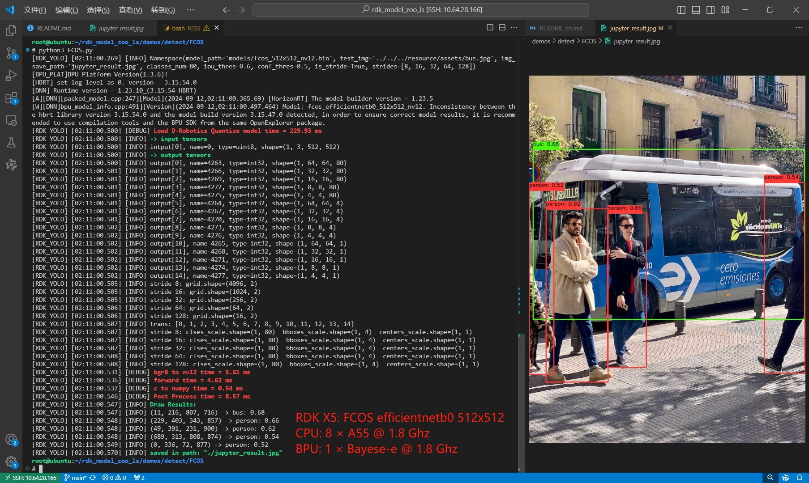

English | [简体中文](./README_cn.md)

# FCOS Model Description

This directory provides the complete usage guide for the FCOS sample in Model Zoo, including algorithm overview, model conversion, runtime inference, model file management, and evaluation notes.

## Algorithm Overview

FCOS is a classical one-stage anchor-free object detector that predicts class scores, box offsets, and center-ness directly on feature maps without predefined anchors.

- **Paper**: [Fully Convolutional One-Stage Object Detection](https://arxiv.org/pdf/1904.01355.pdf)
- **Official Reference**: [tianzhi0549/FCOS](https://github.com/tianzhi0549/FCOS)

## Directory Structure

```text
.
├── conversion
├── evaluator
├── model
├── runtime
├── test_data
├── README.md
└── README_cn.md
```

## QuickStart

```bash
cd runtime/python
bash run.sh
```

For runtime details, refer to [runtime/python/README.md](./runtime/python/README.md).

## Model Conversion

Model Zoo provides prebuilt `.bin` models for direct use. If you need to understand the conversion side, refer to [conversion/README.md](./conversion/README.md).

## Runtime Inference

This sample currently provides a Python runtime implementation on RDK X5.

- runtime entry: [runtime/python/main.py](./runtime/python/main.py)
- runtime guide: [runtime/python/README.md](./runtime/python/README.md)

## Evaluator

Benchmark and validation notes are provided in [evaluator/README.md](./evaluator/README.md).

## Performance Data

| Model | Size | Classes | BPU Throughput | Python Post-process |
| --- | --- | --- | --- | --- |
| `fcos_efficientnetb0` | 512x512 | 80 | `323.0 FPS` | `9 ms` |
| `fcos_efficientnetb2` | 768x768 | 80 | `70.9 FPS` | `16 ms` |
| `fcos_efficientnetb3` | 896x896 | 80 | `38.7 FPS` | `20 ms` |



## License

Follows the Model Zoo top-level license.
