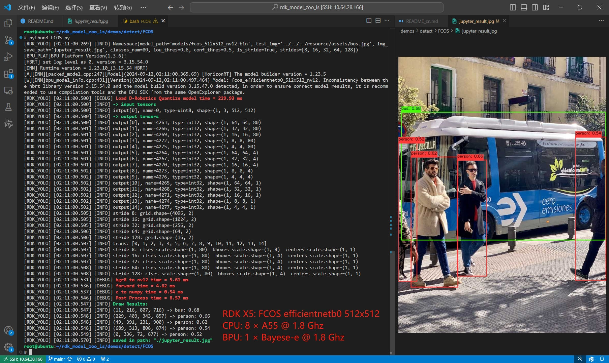

# FCOS Object Detection

English | [简体中文](README_cn.md)

<a id="overview"></a>
## Overview

FCOS is a one-stage, anchor-free detector that predicts class scores, left/top/right/bottom distances, and center-ness on five feature-map levels.

- Source: [FCOS paper](https://arxiv.org/abs/1904.01355), [official implementation](https://github.com/tianzhi0549/FCOS)
- Repository location: the X5 Python sample at `samples/vision/fcos`.
- Model protocol: packed NV12 input, 80 classes, five classification heads, five box heads, and five center-ness heads.

<a id="directory"></a>
## Directory structure

```text
fcos/
├── conversion/  # Export and quantization configuration
├── evaluator/  # Evaluation commands and metrics
├── model/  # Model files and download scripts
├── runtime/  # Python and native inference implementations
├── test_data/  # Example inputs
├── tests/  # Automated tests
├── README.md  # English instructions
├── README_cn.md  # Chinese instructions
├── __init__.py  # Python script
└── requirements-host.txt  # Source or data file
```

<a id="support-matrix"></a>
## Support Matrix

| Variant | x5 | s100 | s100p | s600 | Python | C++ |
| --- | --- | --- | --- | --- | --- | --- |
| efficientnetb0 / 512 | supported | not-supported | not-supported | not-supported | yes | no |
| efficientnetb2 / 768 | supported | not-supported | not-supported | not-supported | yes | no |
| efficientnetb3 / 896 | supported | not-supported | not-supported | not-supported | yes | no |

Board execution requires an X5 board whose image supplies `hbm_runtime`. Verify a prepared variant with the recorded X5 check conditions — `test_data/bus.jpg`, direct resize, `conf=0.5`, `IoU=0.6` — and compare the two implementations with the [evaluator](evaluator/README.md); loading prints an HBRT-library/model-build minor-version mismatch warning that does not affect the result.

<a id="prerequisites"></a>
## Prerequisites

- Board: RDK X5 with the board image supplying `hbm_runtime`.
- Host checks: Python 3.10+ with the packages in [requirements-host.txt](requirements-host.txt).
- Prepare exactly one manifest artifact before inference; publisher SHA-256 values are currently unknown.

<a id="quickstart"></a>
## Quick Start

```bash
# cwd: repository root; downloads the manifest-selected B0 artifact
bash samples/vision/fcos/model/download.sh --target x5 --variant efficientnetb0
# expect: samples/vision/fcos/model/fcos_efficientnetb0_detect_512x512_bayese_nv12.bin

# cwd: repository root; board image only; writes an annotated JPEG
python3 samples/vision/fcos/runtime/python/main.py \
  --target x5 \
  --asset-id x5:fcos:fcos_efficientnetb0_detect_512x512_bayese_nv12.bin \
  --test-img samples/vision/fcos/test_data/bus.jpg \
  --img-save-path /tmp/fcos-result.jpg
# success: exit 0, JSON includes boxes/scores/class_ids, and /tmp/fcos-result.jpg exists.
```

Use `--variant efficientnetb2` or `efficientnetb3` with the corresponding exact asset ID for 768 or 896 input. `--list-models` and `--dry-run --target x5` do not load the SDK.

<a id="expected-results"></a>
## Expected Results

The runtime prints JSON with `asset_id`, `boxes`, `scores`, `class_ids`, and `result_path`. Boxes are float32 `[x1,y1,x2,y2]` pixels in the original image; scores are FCOS confidence values; class IDs are zero-based COCO IDs. Detection values depend on the compiled artifact; the evaluator README records the published parity results. The bundled `demo_rdkx5_fcos_detect.jpg` is a demonstration image from the source record.

The source records list B0/B2/B3 BPU throughput of 323.0/70.9/38.7 FPS and Python post-process times of 9/16/20 ms under the source measurement conditions.



<a id="entry-points"></a>
## Entry Points

- [model/README.md](model/README.md) — three exact X5 assets and preparation.
- [runtime/python/README.md](runtime/python/README.md) — CLI and three-stage API (`preprocess`, `infer`, `postprocess`; `predict` composes them).
- [conversion/README.md](conversion/README.md) — source material and missing recipe boundaries.
- [evaluator/README.md](evaluator/README.md) — board comparison evaluator and evidence schema.

<a id="license"></a>
## License

Sample code follows the repository Apache-2.0 license. FCOS source and model-weight licensing must be checked against the official source release; the Model Zoo manifest does not publish a separate weight license or SHA-256 for these three artifacts.
