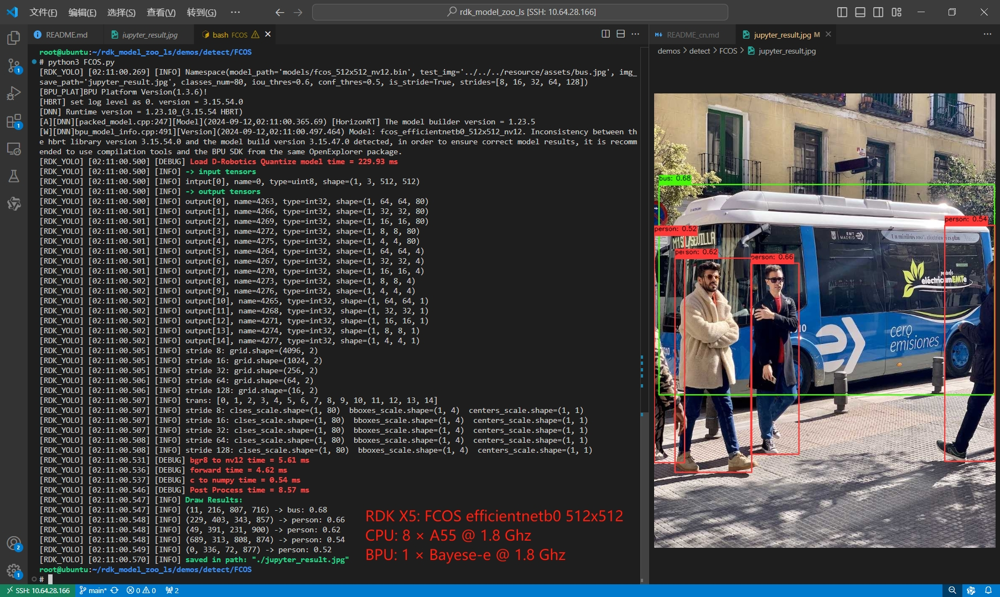

# FCOS 目标检测

[English](README.md) | 简体中文

<a id="overview"></a>
## 算法与来源

FCOS 是单阶段、无 anchor 的检测器，在五个特征层上预测类别分数、左上右下距离和 center-ness。

- 来源：[FCOS 论文](https://arxiv.org/abs/1904.01355)、[官方实现](https://github.com/tianzhi0549/FCOS)
- 本仓位置：`samples/vision/fcos` 的统一 X5 Python sample。
- 保留源 X5 协议：packed NV12 输入、80 类、5 个分类输出、5 个框回归输出和 5 个 center-ness 输出。

<a id="support-matrix"></a>
## 支持矩阵

| 变体 | x5 | s100 | s100p | s600 | Python | C++ |
| --- | --- | --- | --- | --- | --- | --- |
| efficientnetb0 / 512 | supported-not-run | not-supported | not-supported | not-supported | 是 | 否 |
| efficientnetb2 / 768 | supported-not-run | not-supported | not-supported | not-supported | 是 | 否 |
| efficientnetb3 / 896 | supported-not-run | not-supported | not-supported | not-supported | 是 | 否 |

`supported-not-run` 表示主机契约测试已通过，本次未连接 X5 板卡。证据见[主机记录](../../../docs/releases/unified-migration/evidence/2026-09-23-b7-fcos-host.json)。

<a id="prerequisites"></a>
## 环境前提

- 板卡：RDK X5；板端镜像提供 `hbm_runtime`，板测本轮 not-run。
- 主机检查：Python 3.10+，依赖见 [requirements-host.txt](requirements-host.txt)。
- 推理前必须准备一个 manifest 精确制品；发布记录当前没有 SHA-256。

<a id="quickstart"></a>
## 快速体验

```bash
# cwd：仓库根目录；准备 manifest 中的 B0 制品
bash samples/vision/fcos/model/download.sh --target x5 --variant efficientnetb0
# 预期：samples/vision/fcos/model/fcos_efficientnetb0_detect_512x512_bayese_nv12.bin

# cwd：仓库根目录；仅板端执行；写出标注 JPEG
python3 samples/vision/fcos/runtime/python/main.py \
  --target x5 \
  --asset-id x5:fcos:fcos_efficientnetb0_detect_512x512_bayese_nv12.bin \
  --test-img samples/vision/fcos/test_data/bus.jpg \
  --img-save-path /tmp/fcos-result.jpg
# 成功判断：退出码 0，JSON 含 boxes/scores/class_ids，且 /tmp/fcos-result.jpg 存在。
```

768、896 变体分别使用 `--variant efficientnetb2/efficientnetb3` 与对应精确 asset ID。`--list-models`、`--dry-run --target x5` 不加载 SDK。

<a id="expected-results"></a>
## 预期结果

运行时输出 JSON 字段 `asset_id`、`boxes`、`scores`、`class_ids`、`result_path`。框是原图像素坐标的 float32 `[x1,y1,x2,y2]`，分数为源 FCOS confidence，类别 ID 为从 0 开始的 COCO ID。具体值取决于编译制品，本迁移不虚构数值。`demo_rdkx5_fcos_detect.jpg` 是源历史示例图，不是本轮主机实测。

源历史记录给出 B0/B2/B3 BPU 吞吐 323.0/70.9/38.7 FPS、Python 后处理 9/16/20 ms。这些数字保留源条件，不是本迁移测量。



<a id="directory"></a>
## 目录职责

```text
fcos/
├── conversion/    # 源转换说明与 hb_perf 截图
├── evaluator/     # 板端/源对照及证据流程
├── model/         # 显式 manifest 制品下载器
├── runtime/python/# binding、runner、tensor IO、四阶段任务和 CLI
├── test_data/     # 源 bus 输入和历史演示图
├── tests/         # 主机契约与源数值回归测试
└── README*.md     # 中英文 sample 文档
```

<a id="entry-points"></a>
## 入口索引

- [model/README.md](model/README.md) — 三个精确 X5 制品与准备步骤。
- [runtime/python/README.md](runtime/python/README.md) — CLI 和三阶段 API（`pre_process`、`forward`、`post_process`；`predict` 负责串联）。
- [conversion/README.md](conversion/README.md) — 源材料与缺失配方边界。
- [evaluator/README.md](evaluator/README.md) — 同板 source/unified 评估器与完整证据格式。

<a id="license"></a>
## 许可

样例代码遵循仓库 Apache-2.0。FCOS 源码和模型权重许可需按官方发布核对；Model Zoo manifest 没有单独记录权重许可，也没有记录三个制品的 SHA-256。
