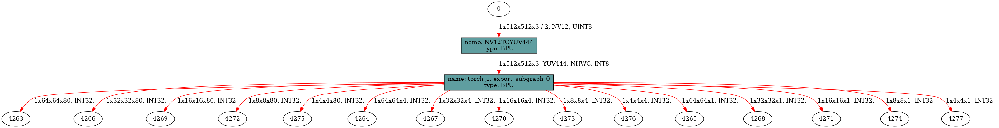
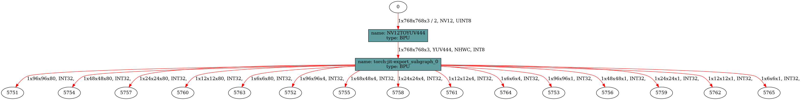
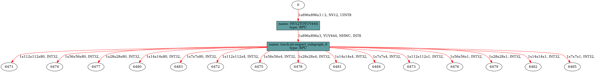

# FCOS 模型转换

本目录记录 FCOS 在 RDK X5 上的转换侧资产。

FCOS 模型的完整转换流程请直接参考 OE 包。

## 当前提供的资产

仓库当前提供：

- 已发布 X5 模型的 `hb_perf` 结果截图
- 发布模型名称与输入分辨率说明
- FCOS 运行时输出协议说明

仓库当前不提供完整的站内转换工具链。
如需重新生成 FCOS 模型，请直接参考 OE 包准备 ONNX 与转换配置。

## 支持的 X5 模型

| 模型 | 输入尺寸 | 运行格式 |
| --- | --- | --- |
| `fcos_efficientnetb0_detect_512x512_bayese_nv12.bin` | 512x512 | `.bin` |
| `fcos_efficientnetb2_detect_768x768_bayese_nv12.bin` | 768x768 | `.bin` |
| `fcos_efficientnetb3_detect_896x896_bayese_nv12.bin` | 896x896 | `.bin` |


## `hb_mapper makertbin`

生成可部署的 `.bin` 模型：

```bash
hb_mapper makertbin --model-type onnx --config your_fcos_config.yaml
```

## `hb_perf`

查看 `.bin` 模型结构：

```bash
hb_perf fcos_efficientnetb0_detect_512x512_bayese_nv12.bin
hb_perf fcos_efficientnetb2_detect_768x768_bayese_nv12.bin
hb_perf fcos_efficientnetb3_detect_896x896_bayese_nv12.bin
```

参考结果：





## `hrt_model_exec`

板端可使用下面命令查看模型输入输出：

```bash
hrt_model_exec model_info --model_file fcos_efficientnetb0_detect_512x512_bayese_nv12.bin
```

## 输出协议

X5 上的 FCOS 模型沿用原始 demo 的输出协议：

- 5 路分类输出
- 5 路框回归输出
- 5 路 center-ness 输出

Python runtime 会先按固定张量 shape 重排这些输出，再执行解码。
