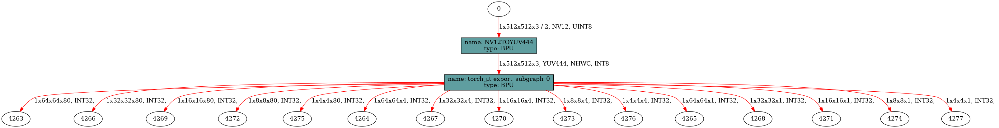
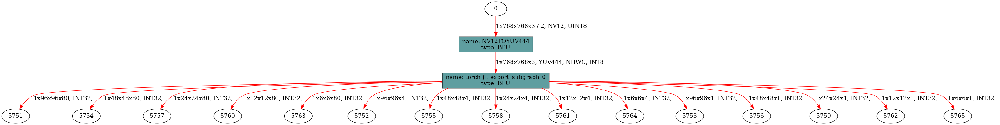
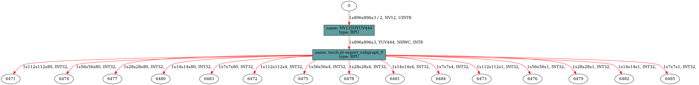

# FCOS 转换

<a id="source-model"></a>

## 源模型

- 框架：固定 X5 源记录了 FCOS EfficientNet-B0/B2/B3 部署制品，但没有训练 checkpoint 或导出脚本。
- 权重：`platforms/x5` 固定快照 `ac115717197920355fc390bb04299b20e6436864`。
- 对应关系：三个发布制品分别为 512、768、896 FCOS 变体；源 README 和截图没有给出 checkpoint 发布版或训练 commit。

<a id="toolchain-targets"></a>
## 工具链与目标

| target | march | OE 版本 | 配置 |
| --- | --- | --- | --- |
| x5 / B0 512 | bayes-e | 源未记录 | 源无 YAML |
| x5 / B2 768 | bayes-e | 源未记录 | 源无 YAML |
| x5 / B3 896 | bayes-e | 源未记录 | 源无 YAML |

目录中的三个 PNG 是源 `hb_perf` 截图副本，只能证明历史文档存在，不能当成本 checkout 的转换产物。每张图记录一个已发布变体的部署数据流：packed NV12 输入先经 BPU `NV12TOYUV444` 节点转成 `YUV444, NHWC, INT8`，再以 `torch-jit-export_subgraph_0` 在 BPU 上执行，输出 15 个 INT32 张量——5 个 stride 层级 × 3 个分支（80 通道分类分数、4 通道框回归、1 通道 center-ness）。这就是源输出协议：5 路分类、5 路框回归、5 路 center-ness 输出；Python runtime 会先按固定张量 shape 重排这些输出，再执行解码，解码语义见 [runtime 说明](../runtime/python/README_cn.md)。

参考图（逐字源快照，非本 checkout 产物）：



FCOS EfficientNet-B0，512×512 输入：64×64、32×32、16×16、8×8、4×4 五个层级（stride 8–128）上的分数/框/center-ness 头。



FCOS EfficientNet-B2，768×768 输入：同样三个分支位于 96×96 至 6×6 层级。



FCOS EfficientNet-B3，896×896 输入：同样三个分支位于 112×112 至 7×7 层级。

<a id="export"></a>
## 导出（ONNX）

```text
固定源没有导出配方。重建前必须补充 ONNX checkpoint、导出 commit、输入前处理来源和输出命名契约。
```

<a id="calibration"></a>
## 校准

- 数据集：源未记录；没有校准文件或样本数量。
- 配置：源树没有 FCOS YAML。
- 命令：固定源没有可复现校准命令。

<a id="compile"></a>
## 编译

```text
没有已验证的编译命令。源文档中的 `hb_mapper makertbin --model-type onnx --config your_fcos_config.yaml` 是占位示例，缺少输入和配置，不能重现制品。
```

<a id="validation"></a>
## 转换后验证

在匹配 X5 上，对提供的制品运行 `hrt_model_exec model_info --model_file <exact-file>`，再按 runtime README 执行。将命令输出、15 个 raw tensor metadata 和结果 JSON 保存到同一 UTC 证据目录。转换本身 not-run（没有配方，见已知缺口）；已发布制品已在 X5 8GB/4GB 板上由[评估器对照](../evaluator/README_cn.md#reference-results)执行，覆盖 runtime 一致性，但不覆盖 `hrt_model_exec` 检查或转换可复现性。

<a id="artifacts"></a>
## 产物

| 制品 | target | 落盘 |
| --- | --- | --- |
| `fcos_efficientnetb0_detect_512x512_bayese_nv12.bin` | x5 | `model/` |
| `fcos_efficientnetb2_detect_768x768_bayese_nv12.bin` | x5 | `model/` |
| `fcos_efficientnetb3_detect_896x896_bayese_nv12.bin` | x5 | `model/` |

<a id="known-gaps"></a>
## 已知缺口

- 没有 checkpoint、ONNX 导出、校准数据、量化 YAML、工具链版本或可复现源编译流程。
- manifest 发布 hash 未知；三个源截图不能证明 tensor 数值或数值等价。
- 因此重建不在已验证边界内；当前可复现的是 runtime 协议、主机 fixture，以及已发布制品的同板一致性（2026-09-24 证据见 sample README 链接）。
