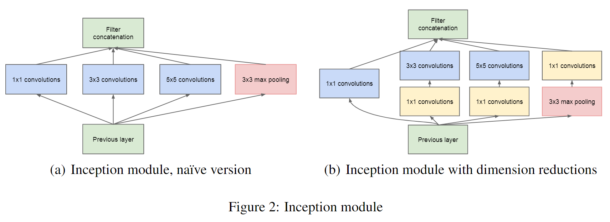
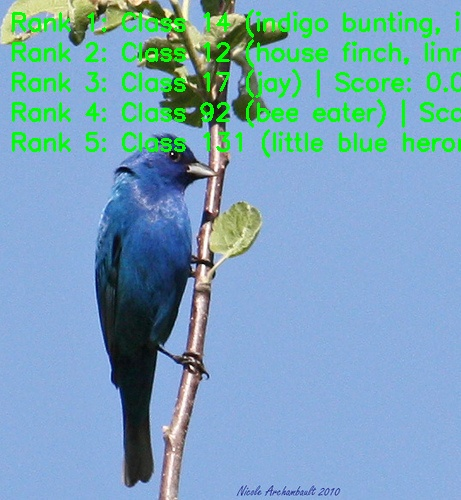

[English](./README.md) | 简体中文

# GoogLeNet 模型说明

本目录给出 GoogLeNet sample 在 Model Zoo 中的完整使用说明，包括算法概览、模型转换、运行时推理、模型文件管理和评测说明。

## 算法介绍

GoogLeNet 是基于 Inception 模块的图像分类网络，在 2014 年 ImageNet 分类竞赛中取得冠军，并提出了面向多感受野特征提取的多分支结构。

- **论文**: [Going Deeper with Convolutions](https://arxiv.org/abs/1409.4842)
- **参考实现**: [torchvision/models/googlenet.py](https://github.com/pytorch/vision/blob/main/torchvision/models/googlenet.py)

### 算法功能

GoogLeNet 支持以下任务：

- ImageNet 1000 类图像分类

### 算法特点

- **Inception 模块**：通过并行卷积和池化分支提取多尺度特征。
- **参数效率**：相比更宽的密集 CNN 结构减少了模型参数量。
- **深层结构**：使用 22 层分类骨干网络，并通过分支聚合提高计算效率。
- **嵌入式部署**：RDK X5 部署模型使用 packed NV12 输入和量化 `.bin` 模型文件。



## 目录结构

```text
.
|-- conversion
|   |-- README.md
|   `-- README_cn.md
|-- evaluator
|   |-- README.md
|   `-- README_cn.md
|-- model
|   |-- download.sh
|   |-- README.md
|   `-- README_cn.md
|-- runtime
|   `-- python
|       |-- main.py
|       |-- googlenet.py
|       |-- README.md
|       |-- README_cn.md
|       `-- run.sh
|-- test_data
|   |-- GoogLeNet_architecture.png
|   |-- ImageNet_1k.json
|   |-- indigo_bunting.JPEG
|   `-- inference.png
|-- README.md
`-- README_cn.md
```

## 快速体验

### Python

- Python 详细说明请参考 [runtime/python/README_cn.md](./runtime/python/README_cn.md)。
- 快速体验命令：

```bash
cd runtime/python
bash run.sh
```

## 模型转换

- 预编译 `.bin` 模型通过 [model](./model/README_cn.md) 目录提供。
- 转换说明请参考 [conversion/README_cn.md](./conversion/README_cn.md)。

## 模型推理

本 sample 当前维护的推理路径为 Python。

- Python 推理说明: [runtime/python/README_cn.md](./runtime/python/README_cn.md)

## 模型评估

评测说明、性能数据和验证结果请参考 [evaluator/README_cn.md](./evaluator/README_cn.md)。

## 性能数据

下表为 `RDK X5` 上发布的 GoogLeNet 性能数据。

| 模型 | 尺寸 | 类别数 | 参数量 (M) | 浮点 Top-1 | 量化 Top-1 | 延迟 (ms) | FPS |
| --- | --- | --- | --- | --- | --- | --- | --- |
| GoogLeNet | 224x224 | 1000 | 6.81 | 68.72% | 67.71% | 2.19 | 626.27 |



## License

遵循 Model Zoo 顶层 License。
