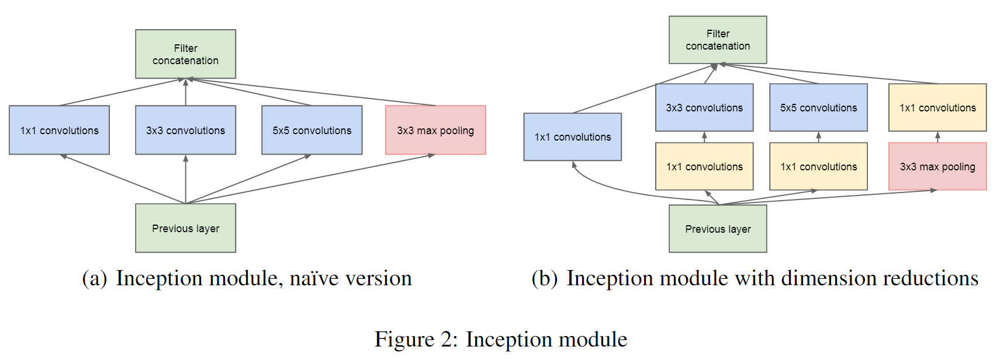

# GoogLeNet 图像分类

<a id="overview"></a>

## 概述

GoogLeNet 是基于 Inception 模块的图像分类网络，在 2014 年 ImageNet 分类竞赛中取得冠军，并提出了面向多感受野特征提取的多分支结构。

- **论文**: [Going Deeper with Convolutions](https://arxiv.org/abs/1409.4842)
- **参考实现**: [torchvision/models/googlenet.py](https://github.com/pytorch/vision/blob/main/torchvision/models/googlenet.py)

核心特性：

- **Inception 模块**——用并行的卷积与池化分支提取多尺度特征
  （1×1 / 3×3 / 5×5 卷积与 3×3 最大池化，每个模块内拼接）。
- **参数效率**——相比更宽的密集 CNN 设计减少模型参数。
- **深层结构**——22 层分类骨干，分支聚合高效。
- **嵌入式部署**——RDK X5 部署模型使用打包 NV12 输入与量化
  `.bin` 制品。



*图（上游论文 Fig. 2）：(a) 朴素 Inception 模块；(b) 带降维的 Inception
模块——3×3/5×5 分支前与池化后插入 1×1 卷积，使计算量在大规模下可控。
图中为上游训练结构，实际
部署制品是 INT8 量化的 `googlenet` 变体（224×224 NV12，见
[支持范围](#support-matrix)）。*

输入一张 BGR 图像，输出 ImageNet-1k Top-K 类别 ID、分数和可选标签。
`GoogLeNetClassifier` 类执行由 `predict` 串联的
`preprocess → infer → postprocess` 流程（标签读取、绘图和文件输出由
CLI 层负责，见 [runtime/python/README_cn.md](runtime/python/README_cn.md)）。

<a id="support-matrix"></a>
## 支持矩阵

| 目标 | 变体 | Python | C++ |
| --- | --- | --- | --- |
| x5 | googlenet | supported | not-supported |
| s100 | googlenet | not-supported | not-supported |
| s100p | googlenet | not-supported | not-supported |
| s600 | googlenet | not-supported | not-supported |

S 系列无对应制品，也按支持矩阵选择 Python 运行时与目标。CLI 小写 ID 映射到准确发布
文件名；文件名大小写保留。

<a id="prerequisites"></a>
## 前提

使用完整仓库检出。X5 推理需要匹配的板端镜像与 `hbm_runtime`；主机
依赖按下方装入虚拟环境。SciPy 仅用于主机对照测试，板端推理不依赖它。
原生推理不需要 OE 工具链；重新转换的工具链和数据前提见
[conversion](conversion/README_cn.md) 文档。

```bash
# cwd: repository root
python3 -m venv .venv-googlenet
source .venv-googlenet/bin/activate
python3 -m pip install -r samples/vision/googlenet/requirements-host.txt
python3 -c "import cv2, numpy, yaml; print('host dependencies: ok')"
```

<a id="quickstart"></a>
## 快速开始

在 X5 仓库根执行。下载成功时退出码 0 并打印观测哈希；推理成功时退出码 0 并打印五条结果。推理不会自动下载模型。

```bash
# cwd: repository root
bash samples/vision/googlenet/model/download.sh x5 googlenet
python3 samples/vision/googlenet/runtime/python/main.py \
  --target x5 --variant googlenet \
  --test-img samples/vision/googlenet/test_data/indigo_bunting.JPEG \
  --label-file datasets/imagenet/imagenet_classes.names
```

<a id="expected-results"></a>
## 预期结果

唯一发布变体为 `googlenet`，默认即选中它。推理打印 Top-5 ID、softmax 分数与标签。完全平局按 ID 升序排序。随附图片用于功能检查。仅指定 `--img-save-path` 才写文件。

下图为 X5 发布的参考运行效果：demo 将 Top-5 排名叠画在随附的
`indigo_bunting.JPEG` 上，rank 1 为 class 14（indigo bunting）。


<a id="performance"></a>
## 性能数据

已发布性能记录：完整列与计时条件见
[评测说明](evaluator/README_cn.md#reference-results)。单线程延迟与多线程 FPS 采用不同的并发方式，
二者不能直接互相取倒数。比较延迟与 FPS 时，应使用相同线程数、并发提交方式和 BPU 利用率。

<a id="directory"></a>
## 目录

`model/`：制品与下载；`runtime/python/`：原生 CLI、任务与运行器；
`conversion/`：不含 PTQ 配置（边界在该文档说明）；`evaluator/`：功能
检查与已发布基准；`test_data/`：`indigo_bunting.JPEG` 输入及随附资源；
`tests/`：主机 unittest 套件。

<a id="entry-points"></a>
## 入口

[Model](model/README_cn.md) · [Python](runtime/python/README_cn.md) ·
[Conversion](conversion/README_cn.md) · [Evaluation](evaluator/README_cn.md)

<a id="license"></a>
## 许可

Python 代码遵循 Apache-2.0。再分发前请遵循转换材料中的原始声明，并核对上游模型与权重许可。
